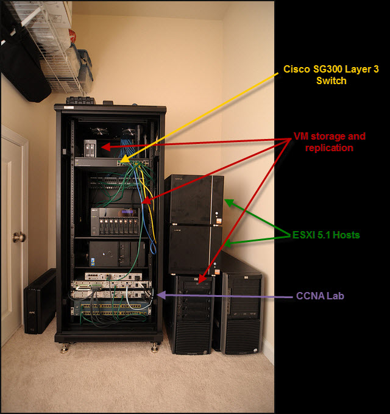
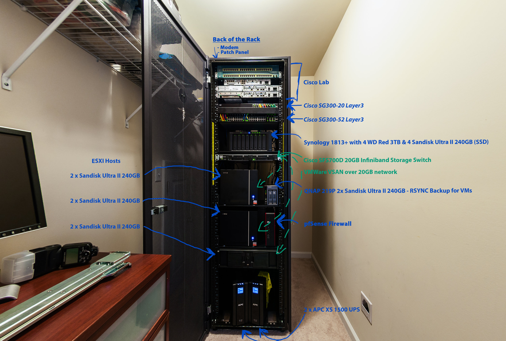
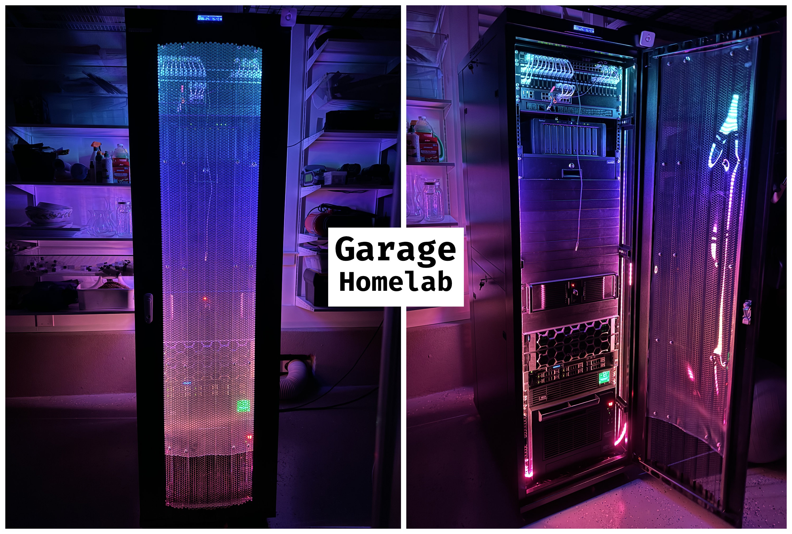

I'm a bit of a homelab junkie, I genuinely get excited about learning new technologies and testing them out hands-on. There's something incredibly satisfying about spinning up a new environment, watching it break (because it always does at first!), troubleshooting, and finally getting everything working beautifully. Over the years, my homelab has hosted countless projects from VMware and Proxmox virtualization to Kubernetes clusters, network simulations with EVE-NG and NSX, and IAC deployments using Terraform and Ansible. Many of my best lessons came from experiments that failed spectacularly before they succeeded. But you know what's become even more fulfilling? Sharing what I've learned with others and helping them on their own tech journeys.

### Version 1.0


  


### Version 2.0


  


### Version 3.0

VMware Nested VCF and Proxmox Lab.

  


### Version 4.0

Power efficient Redhat OpenShift Kubernetes Cluster. I plan to add two more additional HP mini PCs once RAM prices 💰📈 stabilize.

  

