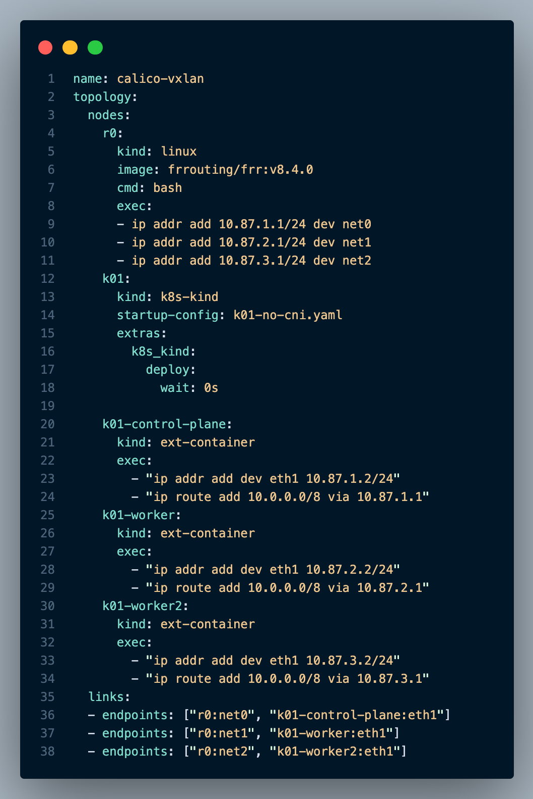
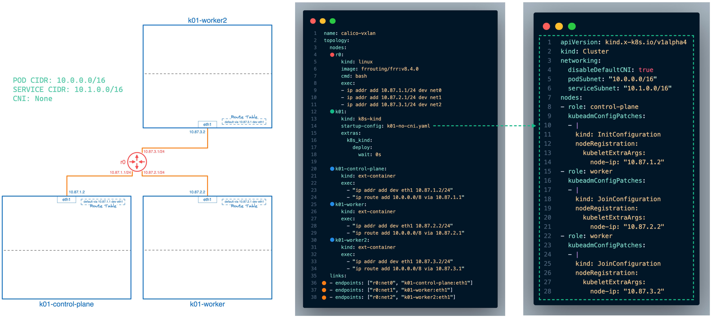
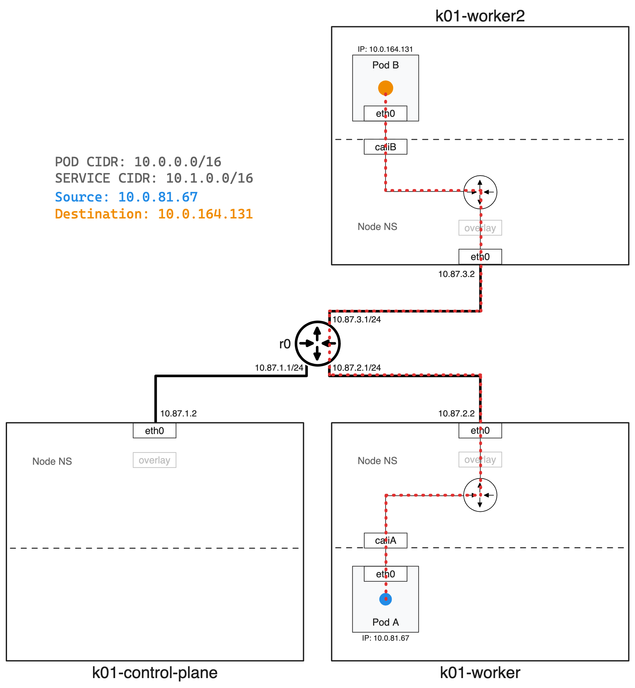

## Intro

Recently, my focus has shifted towards Kubernetes, where I've been assisting customers in designing resilient and scalable clusters. I'm on the lookout for a tool that can quickly set up test Kubernetes clusters with diverse network topologies. Ideally the solution would offer version control, rapid deployments, Kubernetes support, and ease of sharing.

### Use Cases

* Evaluate different CNIs like [Calico](https://www.tigera.io/project-calico/), [Cilium](https://cilium.io/), etc

* Customer Demos

* Knowledge Transfer (KT) Sessions

## ContainerLab

Enter ContainerLab an open-source tool that uses Docker and other container tech to make setting up, managing, and connecting virtual network labs a piece of cake! With ContainerLab, you can quickly sketch out network topologies in a simple YAML file. Once your topology is ready, ContainerLab works its magic, spinning up Docker containers to mimic those networks. This means you can test and play with network setups without needing physical gear or getting stuck in complex configurations.

### Topology Definition File



The above topology definition YAML file will deploy a kind cluster without a CNI. All Kubernetes nodes will be directly connected to the router called "r0". Once ContainerLab has deployed the topology I'll proceed with installing Calico CNI and deploying a couple test Pods into the cluster.

The "`nodes`" section tells ContainerLab how many nodes to deploy and its configuration. As you can see from the above example its pretty easy to understand what the topology definition file will do, as its written in YAML.

* The 1st node "`r0`" will deploy a FRR router and executes some bash commands to configure IP addresses.

* 2nd node is "`k01`" which points to a kind Kubernetes configuration file (see below diagram).

* 3rd, 4th, and 5th nodes (`k01-control-plane`, `k01-worker`, `k01-worker02`) let ContainerLab know there are external containers created by kind and configures their IP addresses and adds the route `10.0.0.0/8` to each respective node. This allows connectivity directly to the PODs running in the cluster.

The "`links`" section is responsible for connecting the nodes and is visualized in the below color coded diagram.



### Folder Structure

Before we begin let's review the folder structure before we execute commands.

```console
dave@dev:calico-vxlan$ tree
.
├── apps
│   ├── pod-a.yaml
│   └── pod-b.yaml
├── calico
│   ├── custom-resources.yaml
│   └── tigera-operator.yaml
├── containerlab
│   ├── k01-no-cni.yaml
│   └── topo.yaml
└── makefile

4 directories, 7 files
```

### ContainerLab Deploy

Now the fun part! Let's build the above ContainerLab topology by executing the following command:

```bash
dave@dev:calico-vxlan$ sudo containerlab -t containerlab/topo.yaml deploy
```

Output:

```console
INFO[0000] Containerlab v0.52.0 started
INFO[0000] Parsing & checking topology file: topo.yaml
INFO[0000] Creating docker network: Name="clab", IPv4Subnet="172.20.20.0/24", IPv6Subnet="2001:172:20:20::/64", MTU=1500
WARN[0000] errors during iptables rules install: not available
WARN[0000] Unable to init module loader: stat /lib/modules/6.7.10-orbstack-00140-g04c64cb35a2e/modules.dep: no such file or directory. Skipping...
INFO[0000] Creating lab directory: /Users/dave/Projects/myCLAB/Test/calico-vxlan/clab-calico-vxlan
INFO[0000] unable to adjust Labdir file ACLs: operation not supported
INFO[0000] Creating container: "r0"
INFO[0000] Creating cluster "k01" ...                    kind-cluster=k01
INFO[0000]  • Ensuring node image (kindest/node:v1.29.2) 🖼  ...  kind-cluster=k01
INFO[0000]  ✓ Ensuring node image (kindest/node:v1.29.2) 🖼  kind-cluster=k01
INFO[0000]  • Preparing nodes 📦 📦 📦   ...                kind-cluster=k01
INFO[0001]  ✓ Preparing nodes 📦 📦 📦                      kind-cluster=k01
INFO[0001]  • Writing configuration 📜  ...               kind-cluster=k01
INFO[0001]  ✓ Writing configuration 📜                    kind-cluster=k01
INFO[0001]  • Starting control-plane 🕹️  ...             kind-cluster=k01
INFO[0003] Created link: r0:net0 <--> k01-control-plane:eth1
INFO[0003] Created link: r0:net2 <--> k01-worker2:eth1
INFO[0003] Created link: r0:net1 <--> k01-worker:eth1
INFO[0011]  ✓ Starting control-plane 🕹️                  kind-cluster=k01
INFO[0011]  • Installing StorageClass 💾  ...             kind-cluster=k01
INFO[0012]  ✓ Installing StorageClass 💾                  kind-cluster=k01
INFO[0012]  • Joining worker nodes 🚜  ...                kind-cluster=k01
INFO[0032]  ✓ Joining worker nodes 🚜                     kind-cluster=k01
INFO[0032] Executed command "ip addr add 10.87.1.1/24 dev net0" on the node "r0". stdout:
INFO[0032] Executed command "ip addr add 10.87.2.1/24 dev net1" on the node "r0". stdout:
INFO[0032] Executed command "ip addr add 10.87.3.1/24 dev net2" on the node "r0". stdout:
INFO[0032] Executed command "ip addr add dev eth1 10.87.2.2/24" on the node "k01-worker". stdout:
INFO[0032] Executed command "ip route add 10.0.0.0/8 via 10.87.2.1" on the node "k01-worker". stdout:
INFO[0032] Executed command "ip addr add dev eth1 10.87.3.2/24" on the node "k01-worker2". stdout:
INFO[0032] Executed command "ip route add 10.0.0.0/8 via 10.87.3.1" on the node "k01-worker2". stdout:
INFO[0032] Executed command "ip addr add dev eth1 10.87.1.2/24" on the node "k01-control-plane". stdout:
INFO[0032] Executed command "ip route add 10.0.0.0/8 via 10.87.1.1" on the node "k01-control-plane". stdout:
INFO[0032] Adding containerlab host entries to /etc/hosts file
INFO[0032] Adding ssh config for containerlab nodes
+---+----------------------+--------------+----------------------------------------------------------------------------------------------+---------------+---------+----------------+--------------------------+
| # |         Name         | Container ID |                                            Image                                             |     Kind      |  State  |  IPv4 Address  |       IPv6 Address       |
+---+----------------------+--------------+----------------------------------------------------------------------------------------------+---------------+---------+----------------+--------------------------+
| 1 | k01-control-plane    | 9f2d07aac3c1 | kindest/node:v1.29.2@sha256:51a1434a5397193442f0be2a297b488b6c919ce8a3931be0ce822606ea5ca245 | ext-container | running | 172.18.0.3/16  | fc00:f853:ccd:e793::3/64 |
| 2 | k01-worker           | 6f15069075f3 | kindest/node:v1.29.2@sha256:51a1434a5397193442f0be2a297b488b6c919ce8a3931be0ce822606ea5ca245 | ext-container | running | 172.18.0.2/16  | fc00:f853:ccd:e793::2/64 |
| 3 | k01-worker2          | 8a59a3d8fd75 | kindest/node:v1.29.2@sha256:51a1434a5397193442f0be2a297b488b6c919ce8a3931be0ce822606ea5ca245 | ext-container | running | 172.18.0.4/16  | fc00:f853:ccd:e793::4/64 |
| 4 | clab-calico-vxlan-r0 | 7c077e09db1b | frrouting/frr:v8.4.0                                                                         | linux         | running | 172.20.20.2/24 | 2001:172:20:20::2/64     |
| 5 | k01-control-plane    | 9f2d07aac3c1 | kindest/node:v1.29.2@sha256:51a1434a5397193442f0be2a297b488b6c919ce8a3931be0ce822606ea5ca245 | k8s-kind      | running | 172.18.0.3/16  | fc00:f853:ccd:e793::3/64 |
| 6 | k01-worker           | 6f15069075f3 | kindest/node:v1.29.2@sha256:51a1434a5397193442f0be2a297b488b6c919ce8a3931be0ce822606ea5ca245 | k8s-kind      | running | 172.18.0.2/16  | fc00:f853:ccd:e793::2/64 |
| 7 | k01-worker2          | 8a59a3d8fd75 | kindest/node:v1.29.2@sha256:51a1434a5397193442f0be2a297b488b6c919ce8a3931be0ce822606ea5ca245 | k8s-kind      | running | 172.18.0.4/16  | fc00:f853:ccd:e793::4/64 |
+---+----------------------+--------------+----------------------------------------------------------------------------------------------+---------------+---------+----------------+--------------------------+
```

As you can see ContainerLab provides a nice output with all our containers!

## Kubernetes

Let's verify our Kubernetes cluster was successfully provisioned without a CNI by running the following commands:

```console
dave@dev:calico-vxlan$ kind export kubeconfig --name k01
Set kubectl context to "kind-k01"
```

As you can see some pods are in a “Pending” state because a CNI isn't available.

```console
dave@dev:calico-vxlan$ kubectl get pods -A
NAMESPACE            NAME                                        READY   STATUS    RESTARTS   AGE
kube-system          coredns-76f75df574-5cj5m                    0/1     Pending   0          13m
kube-system          coredns-76f75df574-fz822                    0/1     Pending   0          13m
kube-system          etcd-k01-control-plane                      1/1     Running   0          13m
kube-system          kube-apiserver-k01-control-plane            1/1     Running   0          13m
kube-system          kube-controller-manager-k01-control-plane   1/1     Running   0          13m
kube-system          kube-proxy-54kxp                            1/1     Running   0          13m
kube-system          kube-proxy-lh28s                            1/1     Running   0          13m
kube-system          kube-proxy-n9nmp                            1/1     Running   0          13m
kube-system          kube-scheduler-k01-control-plane            1/1     Running   0          13m
local-path-storage   local-path-provisioner-7577fdbbfb-9bjwz     0/1     Pending   0          13m
```

### Calico

Now that our Kubernetes Cluster is deployed we can proceed with installing Calico by running the following commands.

```bash
# Deploy Tigera Operator
kubectl create -f calico/tigera-operator.yaml
# Calico Installation Configuration
kubectl create -f calico/custom-resources.yaml
```

Let's confirm Calico CNI was successfully installed:

```console
dave@dev:calico-vxlan$ kubectl get pods -A
NAMESPACE            NAME                                        READY   STATUS    RESTARTS   AGE
calico-apiserver     calico-apiserver-b8ffd6b9b-rfkqb            0/1     Running   0          28s
calico-apiserver     calico-apiserver-b8ffd6b9b-rmmtb            0/1     Running   0          28s
calico-system        calico-kube-controllers-6c5f4987f-ftmr8     1/1     Running   0          73s
calico-system        calico-node-654r6                           1/1     Running   0          73s
calico-system        calico-node-cjqvv                           1/1     Running   0          73s
calico-system        calico-node-dgdvj                           1/1     Running   0          73s
calico-system        calico-typha-8975bb96d-6wbt8                1/1     Running   0          64s
calico-system        calico-typha-8975bb96d-n7k7d                1/1     Running   0          73s
calico-system        csi-node-driver-qfmx9                       2/2     Running   0          73s
calico-system        csi-node-driver-vw5v8                       2/2     Running   0          73s
calico-system        csi-node-driver-z4d4n                       2/2     Running   0          73s
kube-system          coredns-76f75df574-6rg4h                    1/1     Running   0          100s
kube-system          coredns-76f75df574-gqbqx                    1/1     Running   0          100s
kube-system          etcd-k01-control-plane                      1/1     Running   0          114s
kube-system          kube-apiserver-k01-control-plane            1/1     Running   0          114s
kube-system          kube-controller-manager-k01-control-plane   1/1     Running   0          114s
kube-system          kube-proxy-5psws                            1/1     Running   0          95s
kube-system          kube-proxy-9spdx                            1/1     Running   0          94s
kube-system          kube-proxy-tz97j                            1/1     Running   0          100s
kube-system          kube-scheduler-k01-control-plane            1/1     Running   0          114s
local-path-storage   local-path-provisioner-7577fdbbfb-4vmlm     1/1     Running   0          100s
tigera-operator      tigera-operator-748c69cf45-fgwqs            1/1     Running   0          77s
```

### Application

With our Calico CNI installed we can deploy some test application to verify connectivity.

```console
dave@dev:calico-vxlan$ kubectl get pods
NAME    READY   STATUS    RESTARTS   AGE    IP             NODE          NOMINATED NODE   READINESS GATES
pod-a   1/1     Running   0          14s   10.0.81.67     k01-worker    <none>           <none>
pod-b   1/1     Running   0          14s   10.0.164.131   k01-worker2   <none>           <none>
```

Lets exec into pod-a and ping pod-b.

```console
dave@dev:1calico-vxlan$ kubectl exec -it pod-a -- ping -c 3 10.0.164.131
PING 10.0.164.131 (10.0.164.131) 56(84) bytes of data.
64 bytes from 10.0.164.131: icmp_seq=1 ttl=62 time=0.110 ms
64 bytes from 10.0.164.131: icmp_seq=2 ttl=62 time=0.094 ms
64 bytes from 10.0.164.131: icmp_seq=3 ttl=62 time=0.061 ms

--- 10.0.164.131 ping statistics ---
3 packets transmitted, 3 received, 0% packet loss, time 2031ms
rtt min/avg/max/mdev = 0.061/0.088/0.110/0.020 ms
```

### End Result



## Tip: Makefile

To simplify the demo experience I use the below makefile.

```makefile
#      ____ ___  _   _ _____  _    ___ _   _ _____ ____  _       _    
#     / ___/ _ \| \ | |_   _|/ \  |_ _| \ | | ____|  _ \| | __ _| |__  
#    | |  | | | |  \| | | | / _ \  | ||  \| |  _| | |_) | |/ _` | '_ \ 
#    | |__| |_| | |\  | | |/ ___ \ | || |\  | |___|  _ <| | (_| | |_) |
#     \____\___/|_| \_| |_/_/   \_\___|_| \_|_____|_| \_\_|\__,_|_.__/ 

# Customize colors for make recipe begin/finish
_heading  ?= $(_lt_purple)
_reset    = \033[0m

_LEADER =   "================ ["
_FOLLOWER = "] ================"
_begin = "$(_heading)$(_LEADER) Begin $@ $(_FOLLOWER)$(_reset)"
_finish = "$(_heading)$(_LEADER) Completed $@ $(_FOLLOWER)$(_reset)"

# Deploy Containerlab Topology & Setup Kubeconfig to access kind cluster
.PHONY: deploy-up
deploy-up:
 @echo $(_begin)
 sudo containerlab -t containerlab/topo.yaml deploy
 kind export kubeconfig --name k01
 @echo $(_finish)

# Remove ContainerLab Toplogy
.PHONY: deploy-down
deploy-down:
 @echo $(_begin)
 sudo containerlab -t containerlab/topo.yaml destroy -c
 @echo $(_finish)

# Deploy Calico CNI
.PHONY: calico-up
calico-up:
 @echo $(_begin)
 kubectl create -f calico/tigera-operator.yaml
 @sleep 1
 kubectl create -f calico/custom-resources.yaml
 @echo $(_finish)

# Remove Calico CNI
.PHONY: calico-down
calico-down:
 @echo $(_begin)
 kubectl delete -f calico/custom-resources.yaml
 @sleep 1
 kubectl delete -f calico/tigera-operator.yaml
 @echo $(_finish)

# Deploy applications to kind cluster
.PHONY: app-up
app-up:
 @echo $(_begin)
 kubectl apply -f apps/.
 @echo $(_finish)

# Remove application from kind cluster
.PHONY: app-down
app-down:
 @echo $(_begin)
 kubectl delete -f apps/.
 @echo $(_finish)

# Show IP Routes on router "r0"
.PHONY: router-config
router-config:
 @echo $(_begin)
 docker exec -it clab-calico-vxlan-r0 bash -c "ip route"
 @echo $(_finish)
```

## Conclusion

ContainerLab stands out as an invaluable tool for those keen on experimenting with network configurations in a controlled, virtual environment. Its ability to rapidly deploy Kubernetes clusters and simulate various network topologies using simple YAML files makes it a must-have for developers, network engineers, and IT professionals. Whether for evaluating different CNIs, conducting customer demos, or facilitating knowledge transfer sessions, ContainerLab efficiently bridges the gap between theoretical design and practical implementation, streamlining the process of testing and sharing network setups. For more information on ContainerLab please check out their website [containerlab.dev](http://containerlab.dev) and for Calico details checkout [docs.tigera.io](https://docs.tigera.io/calico/latest/about/).
