After hearing good things about the Ubiquiti EdgeRouter. I decided to pull the trigger and order the [ERPOE-5](https://www.amazon.com/dp/B00HXT8EUE/?tag=virtual07e-20) to replace my aging pfSense box. The EdgeRouter is feature packed at a reasonable price point and perfect for most homelabbers.  For me the routing and POE capabilities was the selling point as I’ve been wanting to play with OSPF and NSX in the homelab for some time now and being able to power security cameras from the router is super convenient. I wanted to have the ability to mount this in my rack so I also splurged on a mount from [ebay](http://www.ebay.com/itm/282265586808?_trksid=p2060353.m2749.l2649&ssPageName=STRK%3AMEBIDX%3AIT).

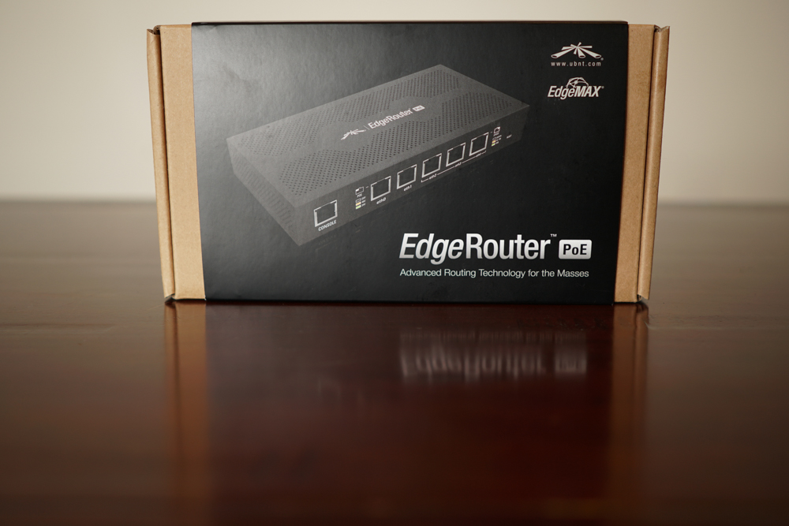

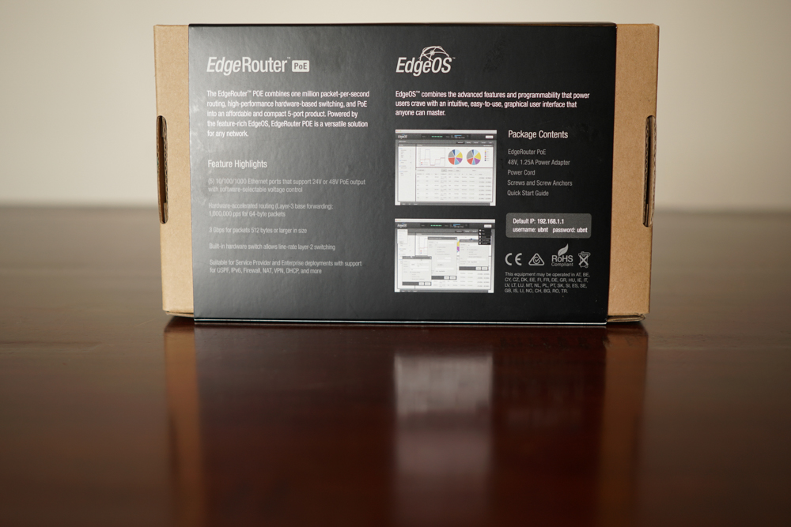

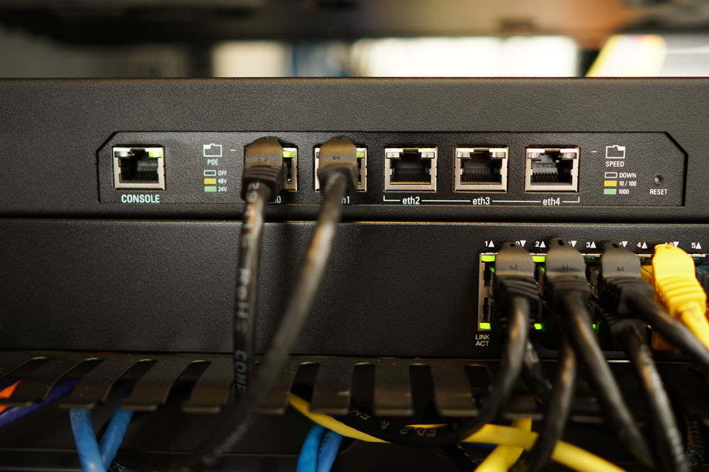

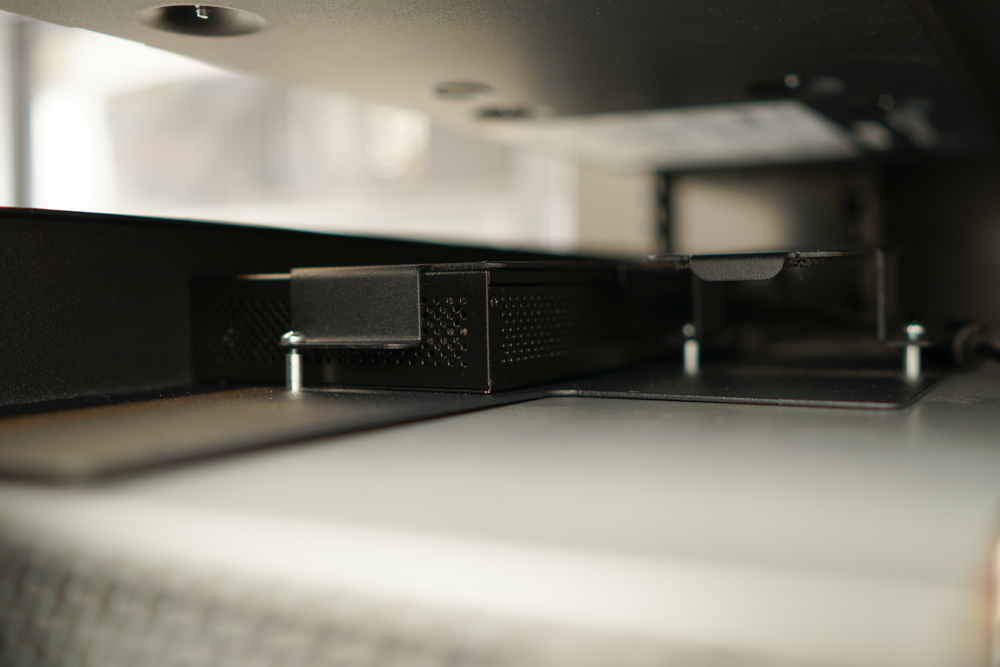

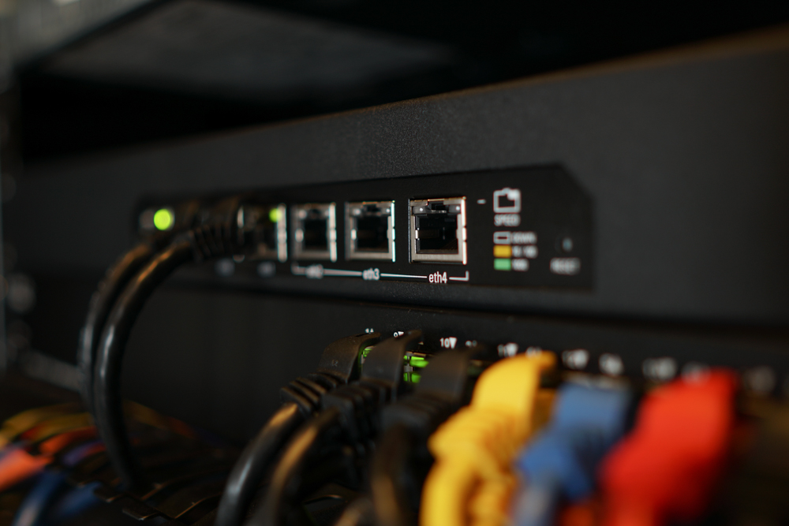

I decided to make some design changes with regards to the networking but before discussing those I need to first update the firmware.

## Updating Firmware on EdgeRouter

Upon receiving the device I noticed the firmware version was v1.2.0, *Figure-1.* Luckily Ubiquiti makes upgrading the firmware a breeze by providing the download link to the firmware from within the user interface, *Figure-2*.

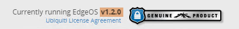

Figure-1

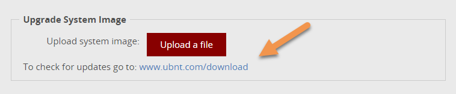

Figure-2

From the download page, select the correct device as seen in *Figure-3*:

Figure-3

1. Click **EdgeMAX**
    
2. Select **EdgeRouter POE**
    
3. Click **File Download Icon**
    

Ok, now that the firmware is downloaded time to upgrade the EdgeRouter as shown in *Figure-4*.

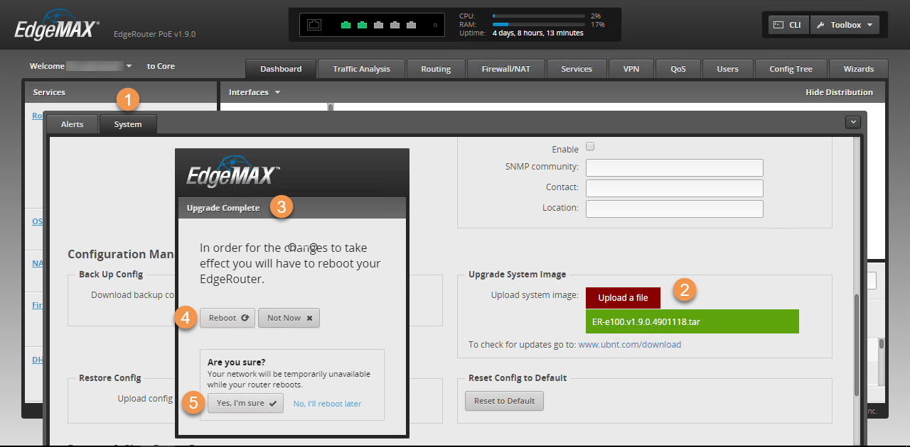

Figure-4

1. Click **System** tab
    
2. Click **Upload a file** (browse to file)
    
3. Once the update completes you will be presented with **Upgrade complete** dialog box
    
4. Click\*\* Reboot\*\*
    
5. Click **Yes, I’m sure**
    

Voila, firmware upgraded from v1.2.0 to 1.9.0, as shown on *Figure-5*, now too configuring the VLANs. Next up is to configure trunking on the SG-300-20.

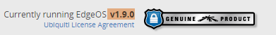

Figure-5

---

## Trunking VLANs on SG-300-20

In order for the EdgeRouter to provide DHCP to multiple VLANs, all necessary VLANs need to be tagged on the Cisco SG300-20 switch and sub-interfaces created for each VLAN on the EdgeRouter, see *Table-1*. Using interface *eth01* on the EdgeRouter and connecting it to interface *GE1* on the SG-300-20.

### VLANs & Sub-Interface IP Address:

To join and tag VLANs on the GE1 interface perform the following steps shown in *Figure-6*:

Figure-6

* Expand **VLAN Management**
    
* Select **Port VLAN Membership**
    
* Select **GE1**
    
* Click **Join VLAN…**
    
* Verify **GE1** is selected
    
* Ensure **Tagged** is selected
    
* **Select VLANs**: *30T, 50T, 55T* and using the right arrow move them into the box on the right side
    
* Click **Apply**
    

With trunking configure on the SG300-20 time to setup VLANs and sub-interfaces on the EdgeRouter.

---

## Creating VLANs and Sub-Interfaces on the EdgeRouter

Now that the VLANs are tagged from the SG300-20 it’s time to create VLANs on the EdgeRouter with sub-interfaces following the steps outlined below in *Figure-7* using the information from *Table-1*.

Figure-7

1. Select **Dashboard** tab
    
2. Click **VLAN**
    
3. Click **Add Interface**
    
4. Select **Add VLAN**
    
5. Provide **VLAN ID**: *55*
    
6. Select **eth01**
    
7. Enter **Description** (optional): *VM-WorkStations*
    
8. Select **Manually define IP address**: *192.168.55.1/24*
    
9. Click **Save**
    

**Note:** The newly created vlan enters a TBD state (red circle) above the IP address, as it validates configuration, once done TBD will disappear (green circle).

Lastly, is to move the DHCP server from the Synology to the EdgeRouter.

---

## Relocate DHCP server from Synology NAS to EdgeRouter

The Synology 1813+ is providing DHCP for the home network only and when I need to reboot or perform maintenance for an extended period of time this means the DHCP server won’t be available to the clients. So I decided it would be better to move DHCP Server to the EdgeRouter as this device will rarely be rebooted. *Figure-8* shows how to disable DHCP on the Synology while *Figure-9* shows the configuration on the EdgeRouter.

### Disable DHCP on Synology:

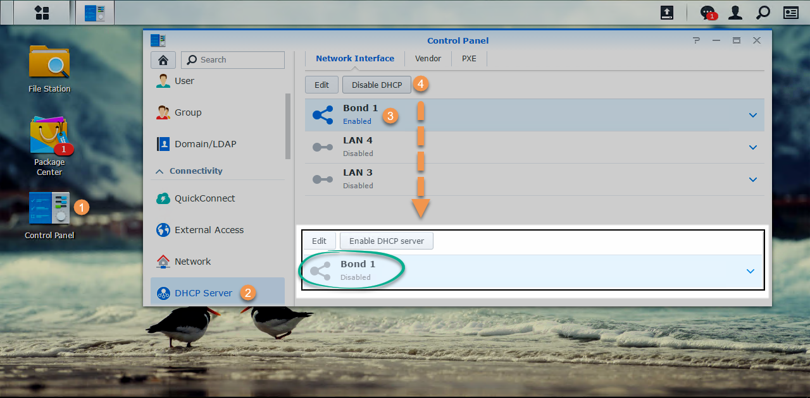

Figure-8

1. Click **Control Panel**
    
2. Select **DHCP Server**
    
3. Select Interface: **Bond1**
    
4. Click **Disable DHCP** button
    

### Configure DHCP on Edge Router:

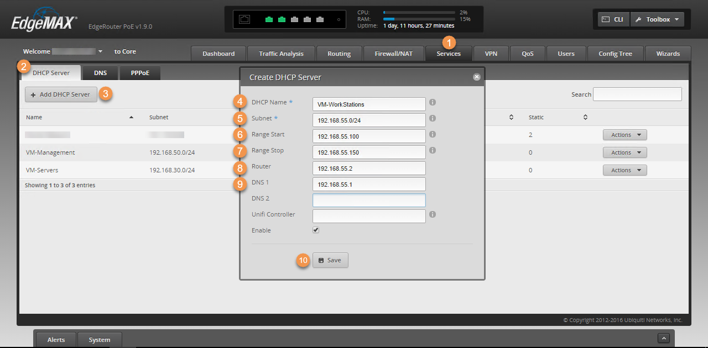

Figure-9

1. Select **Services** tab
    
2. Select **DHCP Server**
    
3. Click **Add DHCP Server**
    
4. **DHCP Name**: VM-WorkStations
    
5. **Subnet**: 192.168.55.0/24
    
6. **Range Start**: 192.168.55.100
    
7. **Range Stop**: 192.168.55.150
    
8. **Router**: 192.168.55.2
    
9. **DNS**: 192.168.55.1
    
10. Click **Save**
    

To ensure its working I disable and re-enable the network card for the VLAN 55 network as shown in *Figure-10* and it automagically gets an IP from the EdgeRouter.

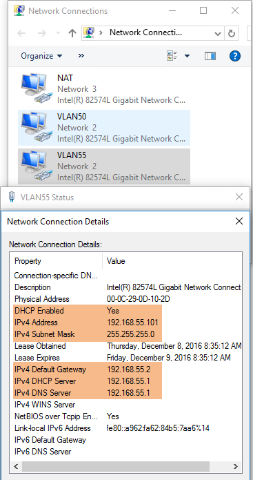

Figure-10

### Configure DNS Forwarding:

Oh, almost forgot…in order to successfully surf the internet the sub-interface for VLAN 55 must be added to the DNS Forwarder otherwise internet no-workie. Steps are shown in *Figure-11* below:

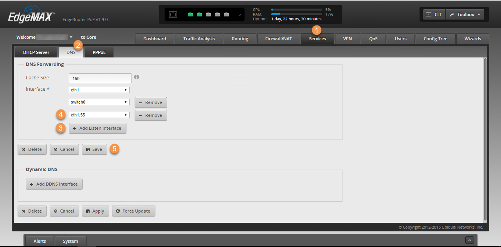

Figure-11

1. Click **Services** tab
    
2. Select **DNS** tab
    
3. Click **Add Listening Interface**
    
4. Select sub-interface: **eth1.55**
    
5. Click **Save**
    

Well that wraps up this post, stay tuned for a future post where I’ll will discuss the Netgear M4300-8X-8F and go over it’s feature set + configuration. *Figure-12* provides an overview of the progress made in this post in diagram format.

Figure-12
