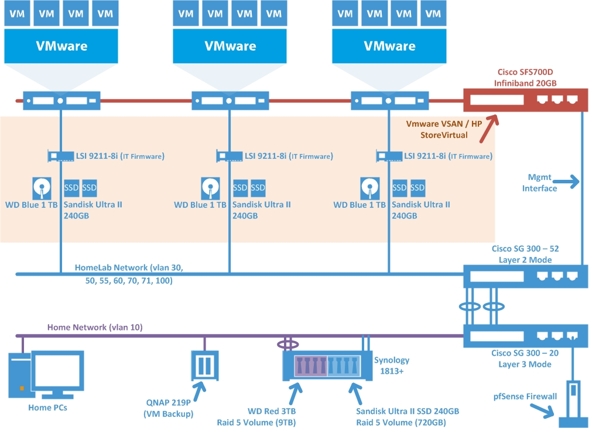

I would like to take a moment to say Thank you to my wife Jasia❤. I am lucky to have such a supporting and loving wife in my life. She understands my passion for technology, especially when it comes to virtualization and allows me to purchase different technologies to further my knowledge.

Now on to why I updated my homelab. I have been running the two Dell R710 in my lab now for a few months. When I decided to put rack mount servers in I knew there would be some obvious issues:

1. **Noise** –  Started to hear complaints from the wife and daughter.
    
2. **Cooling** – AC constantly running in order to keep that closet cool.
    
3. **Cost** – Increase in electric bill….DUH.
    

So to address these concerns I decided to build an energy efficient/quite host that would allow me to implement VSAN and have DVGA support. Before I could proceed I needed to get approval from the budget committee aka the wife. So after deliberations ended I was granted approval and set off to [www.newegg.com](http://www.newegg.com) to begin the process. A critical concern needed to be addressed and thats finding a suitable I/O controller from VMware HCL. I chose to go with LSI 9211-8i:

* ✓ **I/O Controller** – 9211-8i (IT Firmware) x 3
    
* ✓ **Infiniband 20GB Controller** – HP PCIe 4x DDR dual-port HCA x 3
    
* **DVGA Card** – Quadro K2200 (Not purchased yet) x 1
    

The other two hosts were built using [Chris Wahl's build](http://wahlnetwork.com/2012/03/13/building-esxi-5-whitebox-home-lab-servers/) with some minor tweaks; thanks Chris! I chose not to go with his build again as I needed x16 slots for the video card. The X10SAE-O fit the bill perfect but does have one drawback is **no IPMI support**. Since I seldom use this feature it wasn't a deal breaker.

Also checkout [Vladan Seget](http://www.vladan.fr/homelab-storage-network-speedup/) blog as he has an excellent post on the Cisco Topspin 120 Infiniband Switch!

Below are the components used to build this host.

| Qty. | Product Description |
| --- | --- |
| 1 | [iStarUSA IS-24 Industrial type of Ball Bearing Sliding Rails with Length 24](http://www.newegg.com/Product/Product.aspx?item=N82E16816215018) |
| 3 | [ICY DOCK FLEX-FIT Trio MB343SP 2 x 2.5” HDD/SSD to 5.25” Adapter/Bracket](http://www.newegg.com/Product/Product.aspx?item=N82E16817994163) |
| 1 | [iStarUSA 3U Stylish Zinc-Coated Steel Rackmount Server Chassis](http://www.newegg.com/Product/Product.aspx?item=N82E16811165083) |
| 1 | [SUPERMICRO MBD-X10SAE-O ATX](http://www.newegg.com/Product/Product.aspx?item=N82E16813182831) |
| 1 | [SeaSonic SS-520FL2 520W ATX12V / EPS12V 80 PLUS PLATINUM](http://www.newegg.com/Product/Product.aspx?item=N82E16817151122) |
| 1 | [Intel Xeon E3-1231V3 Haswell 3.4GHz LGA 1150 80W Server Processor BX80646E31231V3](http://www.newegg.com/Product/Product.aspx?item=N82E16819117316) |
| 1 | [Kingston 32GB (4 x 8GB) 240-Pin DDR3 SDRAM ECC Unbuffered DDR3 1600](http://www.newegg.com/Product/Product.aspx?item=N82E16820239371) |
| 1 | Noctua NF-R8-1800 80mm Case cooler |
| 2 | [Noctua A-Series NF-A6x25 60mm Blades](http://www.newegg.com/Product/Product.aspx?item=N82E16835608032) |

With the addition of the 3rd host I quickly ran out of ports on my [SG300-20](http://www.newegg.com/Product/Product.aspx?Item=N82E16833150090) so I went ahead and purchased another [SG300-52](http://www.newegg.com/Product/Product.aspx?Item=N82E16833150093) switch. These switches have a ton of features!

Those interested below is the logical layout of my environment:

