In this post we’ll go over how to add additional VIBs to an ESXi image and before we get started with the process let me provide the list of VIBs we are going to be adding:

1. *MLNX-OFED-ESX-1.8.2.4-10EM-500.0.0.472560.zip* (Infiniband Card)

2. *mlx4\_en-mlnx-1.6.1.2-offline\_bundle-471530.zip* (Infiniband Card)

3. *net-e1000e-2.3.2.x86\_64.vib* (onboard nic)

4. *net-e1001e-1.0.0.x86\_64.vib* (onboard nic)

5. *SYN-ESX-5.5.0-NasVAAIPlugin-1.0-offline\_bundle-2092790.zip*

Note: All VIBs including the software depots from Mellonox and Synology are located C:\\CustomISOs\\VIBs

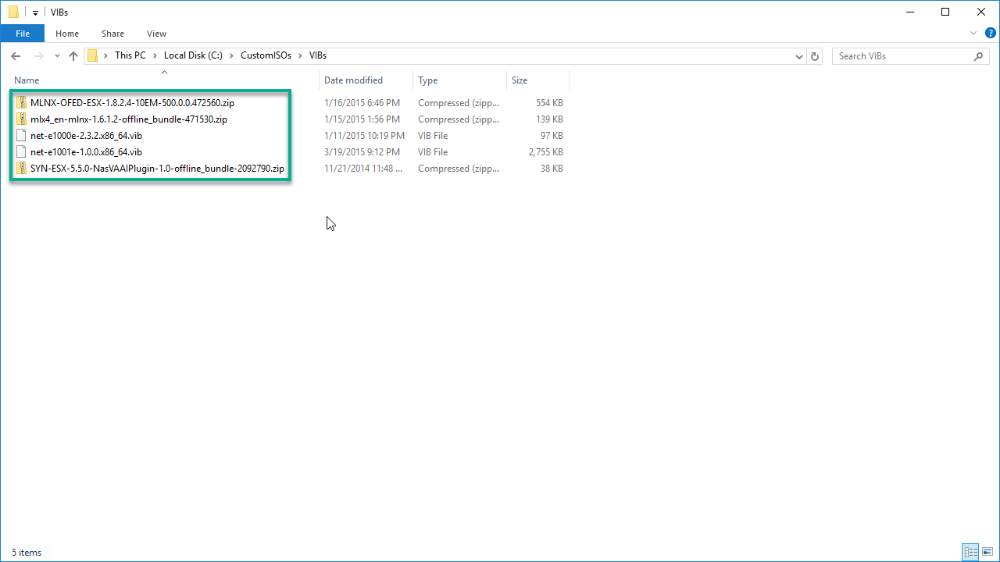

## Step1 – Install PowerCLI & Download ESXi Offline Bundle

1. We need to download and install PowerCli which can be found \[here\]\[1\] as this will provide the required PSSnapin (VMware.ImageBuilder).

2. Next is to download the ESXi Offline Bundle clicking \[here\]\[2\] and selecting Download Now. The *ESXi Offline Bundle* contains VIB packages, image profiles for ESXi and includes VMware Tools.

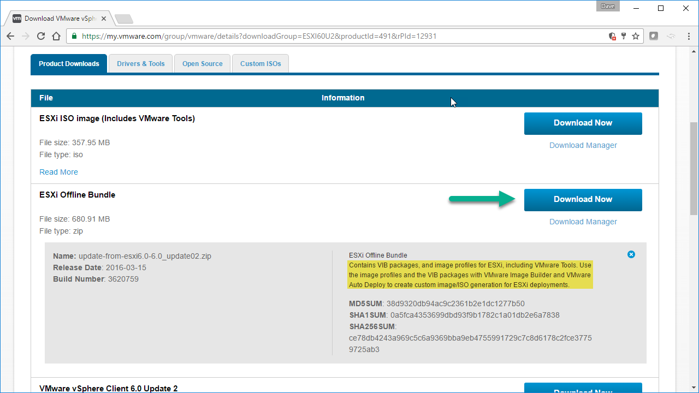

Once the ESXi Offline Bundle is downloaded lets copy it to C:\\CustomISOs\\SoftwareDepot\\

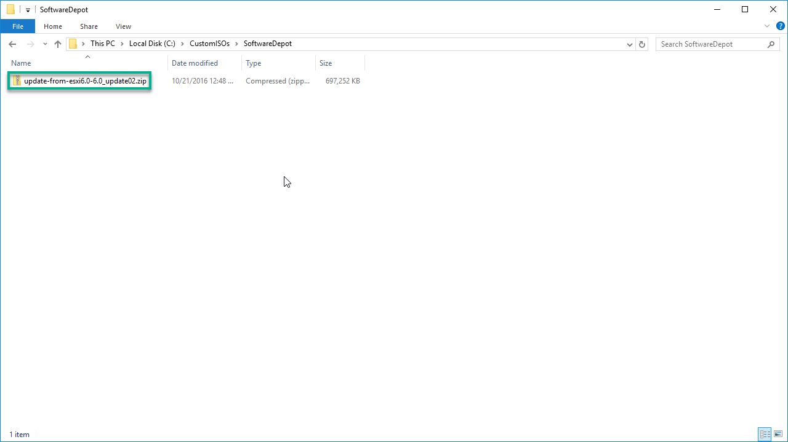

## Step2 – PowerShell

This can also be done in PowerCli but since I do a majority of my work in the PowerShell’s ISE we’ll use that.

1. The `Add-PSSnapin VMware.ImageBuilder` command will load the Cmdlets from the VMware.ImageBuilder snapin into the current Powershell session.

2. To get a list of all available Cmdlets we can run `Get-Command -PSSnapin VMware.ImageBuilder`

3. If we want more information about a particular Cmdlet we can run `Get-Help Add-EsxSoftwareDepot -Full`


## Step3 – Add Software Depot & Create a New Image Profile

1. We need to add the ESXi Offline Bundle to the depot by running the following command `Add-EsxSoftwareDepot C:\CustomISOs\SoftwareDepot\update-from-esxi6.0-6.0_update02.zip`

2. To list the available ImageProfiles we run `Get-EsxImageProfile | ft -AutoSize`

3. Next its best to create a new profile by cloning an existing one by running `New-EsxImageProfile -CloneProfile ESXi-6.0.0-20160302001-standard -Name “ESXI6U2-HomeLab” -Vendor VirtualizeStuff`

4. In order to add Community VIBs to the Image we need to set the Acceptance Level to CommunitySupported by running `Set-EsxImageProfile -ImageProfile ESXI6U2-HomeLab -AcceptanceLevel CommunitySupported`


## Step4 – Removing VIBs from the ESXi Offline Bundle (Optional)

In order for the Infiniband VIBs to work properly some VIBs need to be removed:

1. Lets list all VIB objects inside the Image Profile ESXI6U2-HomeLabbundle by running `Get-EsxImageProfile -Name ESXI6U2-HomeLab | Select-Object -ExpandProperty Viblist | Sort-Object`.  
    The VIBs we need to remove are highlighted in red. Note the order net-mlx4-en must be removed before net-mlx4-core because it has a dependency to net-mlx4-core.

    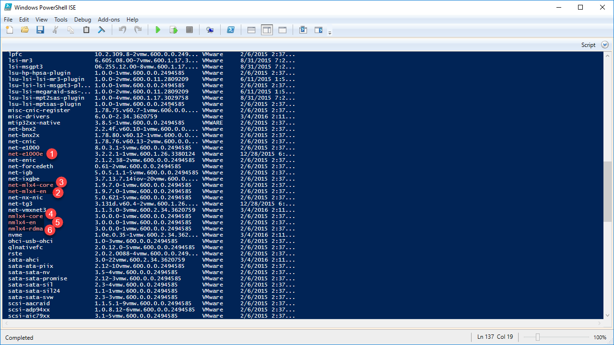

    If your wondering how I knew property Viblist existed I pipped Get-EsxImageProfile to Get-Member (gm) using the following command  `Get-EsxImageProfile -Name ESXI6U2-HomeLab | gm`

    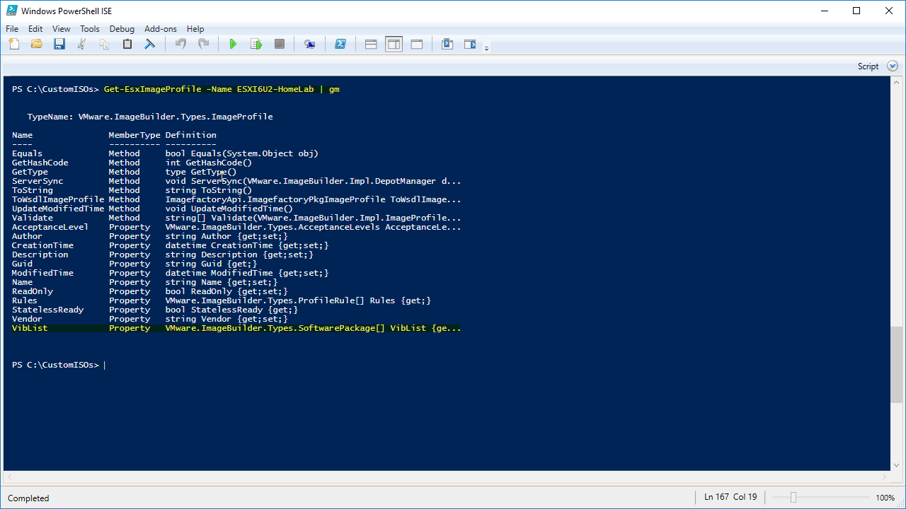

2. To remove the above VIBs we need to run:

    ```powershell
    Remove-EsxSoftwarePackage -ImageProfile ESXI6U2-HomeLab -SoftwarePackage net-e1000e
    Remove-EsxSoftwarePackage -ImageProfile ESXI6U2-HomeLab -SoftwarePackage net-mlx4-en
    Remove-EsxSoftwarePackage -ImageProfile ESXI6U2-HomeLab -SoftwarePackage net-mlx4-core
    Remove-EsxSoftwarePackage -ImageProfile ESXI6U2-HomeLab -SoftwarePackage nmlx4-core
    Remove-EsxSoftwarePackage -ImageProfile ESXI6U2-HomeLab -SoftwarePackage nmlx4-en
    Remove-EsxSoftwarePackage -ImageProfile ESXI6U2-HomeLab -SoftwarePackage nmlx4-rdma
    ```


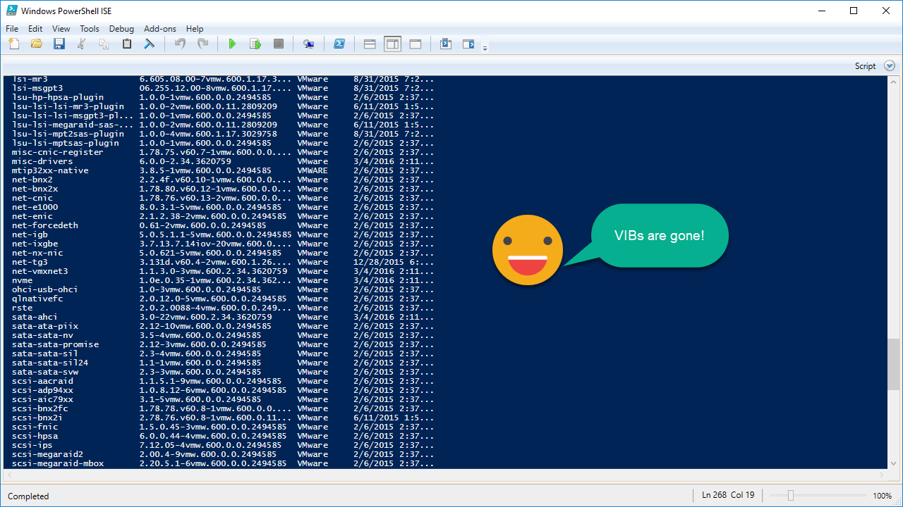

## Step5 – Add VIBs to Custom Image Profile

1. We need add the net-e1000e and net-e1001e VIB by running:

```powershell
Get-EsxSoftwarePackage -PackageUrl C:\CustomISOs\VIBs\net-e1000e-2.3.2.x86_64.vib
Get-EsxSoftwarePackage -PackageUrl C:\CustomISOs\VIBs\net-e1001e-1.0.0.x86_64.vib
```

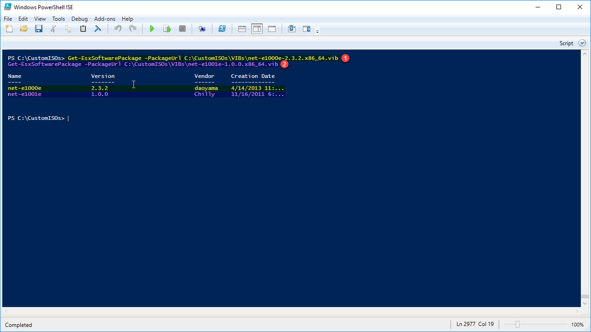

1. If we run `Get-EsxSoftwarePackage | Sort` notice how the VIBs are shown in the list of VIBs. The Get-EsxSoftwarePackage returns a list of VIBs from all the connected depots think of it as a repository.


1. Next we need to add the above VIBs to the ESXI6U2-HomeLab Image Profile by running:

```powershell
Add-EsxSoftwarePackage -ImageProfile ESXI6U2-HomeLab -SoftwarePackage net-e1001e
Add-EsxSoftwarePackage -ImageProfile ESXI6U2-HomeLab -SoftwarePackage "net-e1000e 2.3.2"
```

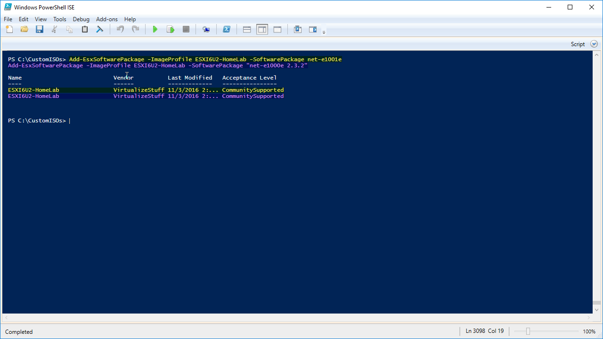

1. If we look at the VIBs contained in the image profile by using `Get-EsxImageProfile -Name ESXI6U2-HomeLab | Select-Object -ExpandProperty Viblist | Sort-Object`. You will notice they now show up in the ESXI6U2-HomeLab image profile

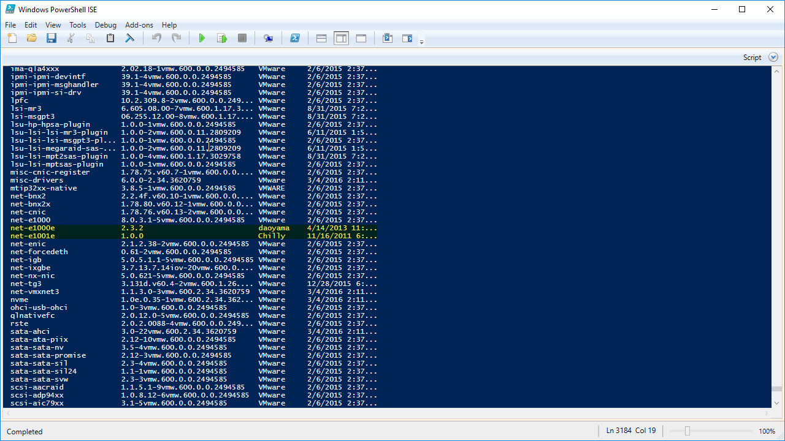

1. Next we need to import the software depot from Mellanox and Synology into the repository by running:

```powershell
Add-EsxSoftwareDepot -DepotUrl C:\CustomISOs\VIBs\mlx4_en-mlnx-1.6.1.2-offline_bundle-471530.zip
Add-EsxSoftwareDepot -DepotUrl C:\CustomISOs\VIBs\MLNX-OFED-ESX-1.8.2.4-10EM-500.0.0.472560.zip
Add-EsxSoftwareDepot -DepotUrl C:\CustomISOs\VIBs\SYN-ESX-5.5.0-NasVAAIPlugin-1.0-offline_bundle-2092790.zip
```

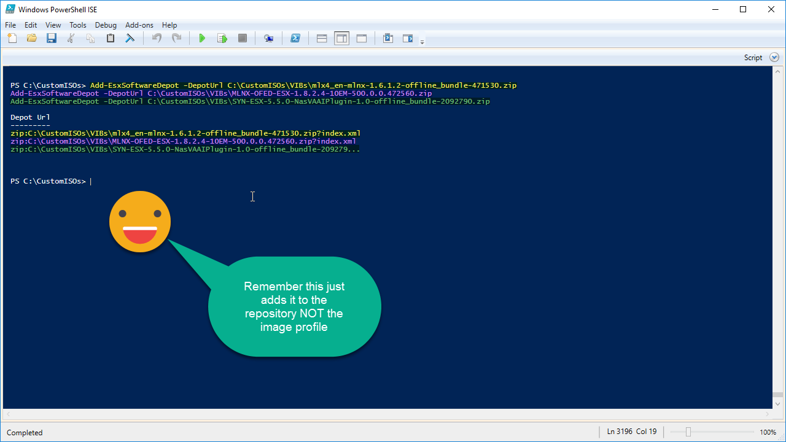

1. If we run `Get-EsxSoftwarePackage | Sort -Property` Vendor We see it in the repository.

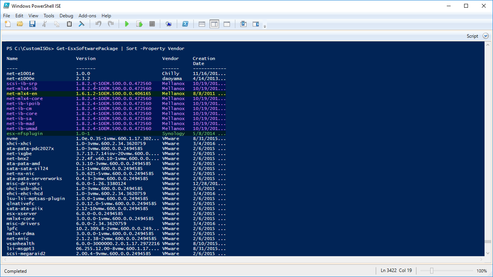

1. To view the VIBs inside a specific software depot(s) run:

```powershell
Get-EsxSoftwarePackage -SoftwareDepot C:\CustomISOs\VIBs\mlx4_en-mlnx-1.6.1.2-offline_bundle-471530.zip
Get-EsxSoftwarePackage -SoftwareDepot C:\CustomISOs\VIBs\MLNX-OFED-ESX-1.8.2.4-10EM-500.0.0.472560.zip
Get-EsxSoftwarePackage -SoftwareDepot C:\CustomISOs\VIBs\SYN-ESX-5.5.0-NasVAAIPlugin-1.0-offline_bundle-2092790.zip
```


1. To add the VIBs from the software depot(s) to the ESXI6U2-HomeLab image profile run:

```powershell
Add-EsxSoftwarePackage -ImageProfile ESXI6U2-HomeLab -SoftwarePackage "net-mlx4-en 1.6.1.2-1OEM.500.0.0.406165", "net-mlx4-core 1.8.2.4-1OEM.500.0.0.472560", net-ib-core, net-ib-mad, net-ib-sa, net-ib-cm, net-mlx4-ib, net-ib-umad, scsi-ib-srp, net-ib-ipoib
Add-EsxSoftwarePackage -ImageProfile ESXI6U2-HomeLab -SoftwarePackage "esx-nfsplugin"
```

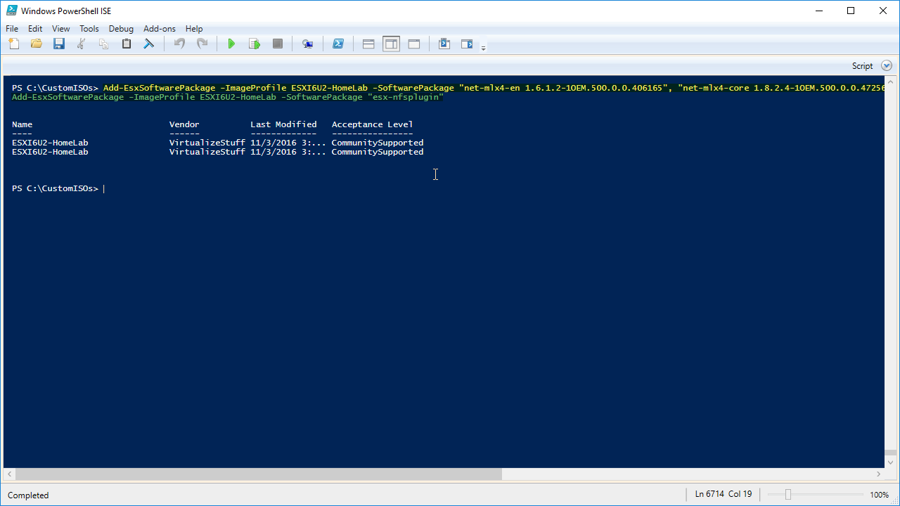

Using the -ExpandProperty trick we can look at all non-VMware VIBs from our ESXI6U2-HomeLab image profile by running `Get-EsxImageProfile -Name ESXI6U2-HomeLab | Select-Object -ExpandProperty VibList | Where-Object {$_.Vendor -notlike “VMware”} | Sort-Object`

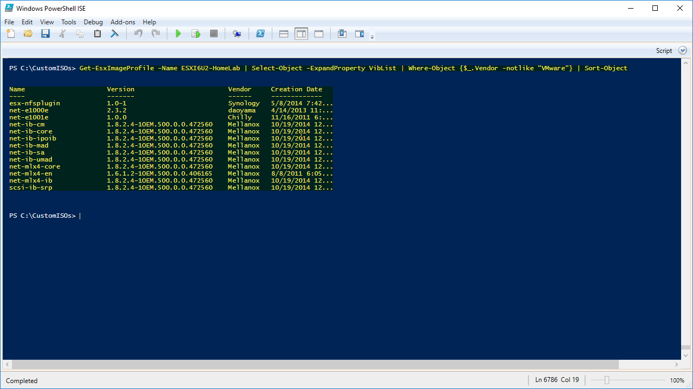

## Step6 – Final Step… I Promise

1. Now that our ESXI6U2-HomeLab image profile is perfect its time to export it out as an ISO by running  `Export-EsxImageProfile -ImageProfile ESXI6U2-HomeLab -ExportToIso -FilePath C:\CustomISOs\ESXI6U2-HomeLab.iso`.

2. We can also export our image profile out as a bundle by running `Export-EsxImageProfile -ImageProfile ESXI6U2-HomeLab -ExportToBundle -FilePath C:\CustomISOs\`[`ESXI6U2-HomeLab.zip`](http://ESXI6U2-HomeLab.zip)

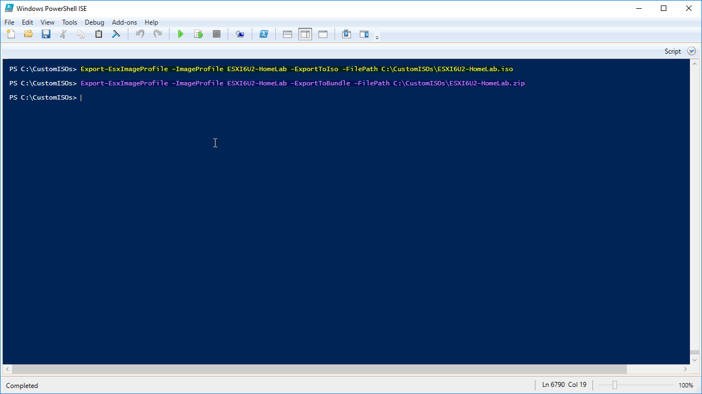

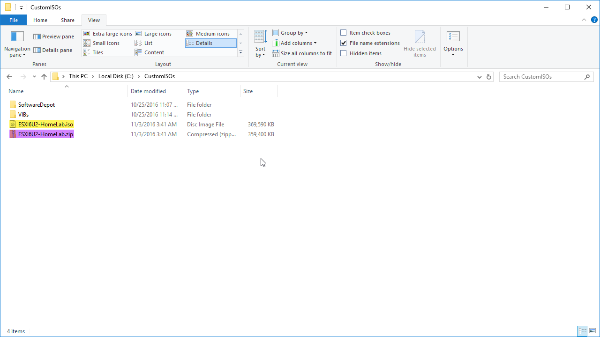

## Below is the list of all commands used in this post

```powershell
Add-PSSnapin VMware.ImageBuilder
#Get-Command -PSSnapin VMware.ImageBuilder
#Get-Help Add-EsxSoftwareDepot -Full
Add-EsxSoftwareDepot C:\CustomISOs\SoftwareDepot\update-from-esxi6.0-6.0_update02.zip
#Get-EsxImageProfile | ft -AutoSize
New-EsxImageProfile -CloneProfile ESXi-6.0.0-20160302001-standard -Name "ESXI6U2-HomeLab" -Vendor VirtualizeStuff
Set-EsxImageProfile -ImageProfile ESXI6U2-HomeLab -AcceptanceLevel CommunitySupported
#Get-EsxImageProfile -Name ESXI6U2-HomeLab | gm
#Get-EsxImageProfile -Name ESXI6U2-HomeLab | Select-Object -ExpandProperty Viblist | Sort-Object
Remove-EsxSoftwarePackage -ImageProfile ESXI6U2-HomeLab -SoftwarePackage net-e1000e
Remove-EsxSoftwarePackage -ImageProfile ESXI6U2-HomeLab -SoftwarePackage net-mlx4-en
Remove-EsxSoftwarePackage -ImageProfile ESXI6U2-HomeLab -SoftwarePackage net-mlx4-core
Remove-EsxSoftwarePackage -ImageProfile ESXI6U2-HomeLab -SoftwarePackage nmlx4-core
Remove-EsxSoftwarePackage -ImageProfile ESXI6U2-HomeLab -SoftwarePackage nmlx4-en
Remove-EsxSoftwarePackage -ImageProfile ESXI6U2-HomeLab -SoftwarePackage nmlx4-rdma
Get-EsxSoftwarePackage -PackageUrl C:\CustomISOs\VIBs\net-e1000e-2.3.2.x86_64.vib
Get-EsxSoftwarePackage -PackageUrl C:\CustomISOs\VIBs\net-e1001e-1.0.0.x86_64.vib
#Get-EsxSoftwarePackage | Sort -Property Vendor
Add-EsxSoftwarePackage -ImageProfile ESXI6U2-HomeLab -SoftwarePackage net-e1001e
Add-EsxSoftwarePackage -ImageProfile ESXI6U2-HomeLab -SoftwarePackage "net-e1000e 2.3.2"
#Get-EsxImageProfile -Name ESXI6U2-HomeLab | Select-Object -ExpandProperty Viblist | Sort-Object
Add-EsxSoftwareDepot -DepotUrl C:\CustomISOs\VIBs\mlx4_en-mlnx-1.6.1.2-offline_bundle-471530.zip
Add-EsxSoftwareDepot -DepotUrl C:\CustomISOs\VIBs\MLNX-OFED-ESX-1.8.2.4-10EM-500.0.0.472560.zip
Add-EsxSoftwareDepot -DepotUrl C:\CustomISOs\VIBs\SYN-ESX-5.5.0-NasVAAIPlugin-1.0-offline_bundle-2092790.zip
Get-EsxSoftwarePackage -SoftwareDepot C:\CustomISOs\VIBs\mlx4_en-mlnx-1.6.1.2-offline_bundle-471530.zip
Get-EsxSoftwarePackage -SoftwareDepot C:\CustomISOs\VIBs\MLNX-OFED-ESX-1.8.2.4-10EM-500.0.0.472560.zip
Get-EsxSoftwarePackage -SoftwareDepot C:\CustomISOs\VIBs\SYN-ESX-5.5.0-NasVAAIPlugin-1.0-offline_bundle-2092790.zip
Add-EsxSoftwarePackage -ImageProfile ESXI6U2-HomeLab -SoftwarePackage "net-mlx4-en 1.6.1.2-1OEM.500.0.0.406165", "net-mlx4-core 1.8.2.4-1OEM.500.0.0.472560", net-ib-core, net-ib-mad, net-ib-sa, net-ib-cm, net-mlx4-ib, net-ib-umad, scsi-ib-srp, net-ib-ipoib
Add-EsxSoftwarePackage -ImageProfile ESXI6U2-HomeLab -SoftwarePackage "esx-nfsplugin"
#Get-EsxImageProfile -Name ESXI6U2-HomeLab | Select-Object -ExpandProperty VibList | Where-Object {$_.Vendor -notlike "VMware"} | Sort-Object
Export-EsxImageProfile -ImageProfile ESXI6U2-HomeLab -ExportToIso -FilePath C:\CustomISOs\ESXI6U2-HomeLab.iso
Export-EsxImageProfile -ImageProfile ESXI6U2-HomeLab -ExportToBundle -FilePath C:\CustomISOs\ESXI6U2-HomeLab.zip
```

## Conclusion

Now that we have a custom image with all required VIBs we are ready to deploy the image to our ESXi hosts. Stay tuned for the next post where we go through the installation of ESXi.
