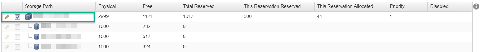
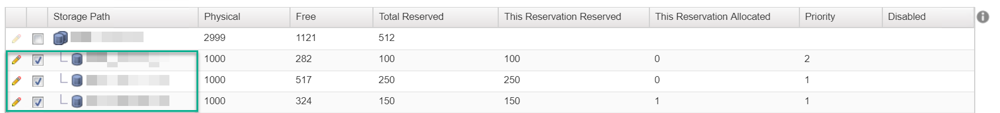

When attempting to deploy On-Demand NAT / LB within vRA. I came across this lovely error message:

![A status table showing different deployment tasks. "DemoNATNetwork" and "NSX Edge" have a successful status. Another "NSX Edge" task is marked as failed, with a message saying "Failed to deploy edge appliance Edge-DemoWebNAT." "WebNAT" has a successful status, while "WebNAT[0]" is marked as aborted with a message about a preceding component request failure.](image-01.png)

After scratching my head and reviewing the DEM logs nothing was jumping out at me. The error message seemed generic enough, so I googled “*failed to deploy edge appliance* vra”. Sure enough, the first hit I get is a [VMware KB](https://kb.vmware.com/s/article/2097379) article and it mentions the following:

> *” When trying to create a multimachine blueprint in VMware vRealize Automation (formerly known as VMware vCloud Automation Center) with NSX 6.0.1 using a single datastore cluster, the Edge deployment fails. “*

**Note:** I didn’t see a similar error message in the DEM logs as described in the article.

In our environment, we are running vRA 7.3 and NSX 6.3.3 so I began to check the Reservations and noticed the storage was indeed pointing to a single datastore cluster as shown below:

After selecting the individual datastores within the cluster I was able to successfully deploy an On-Demand NSX blueprint within vRA!  😉

