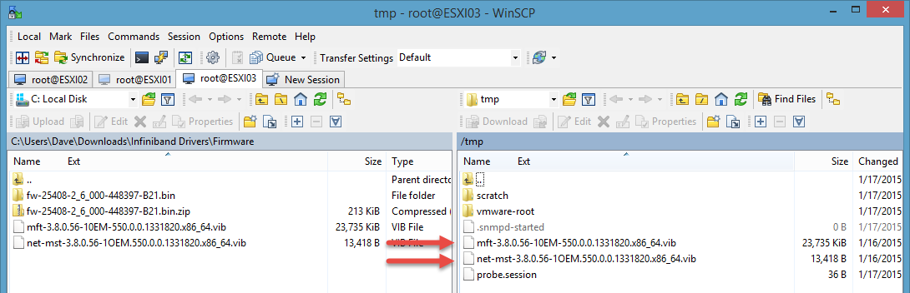
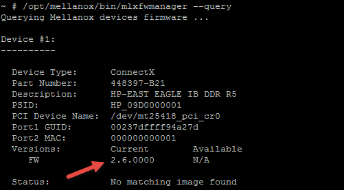
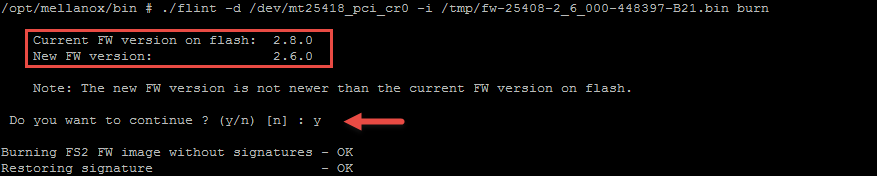
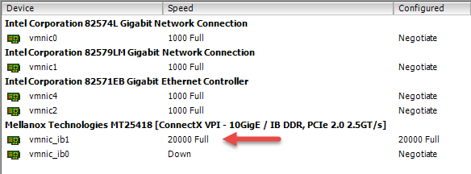

Today I spent a couple hours trying to figure out why my 3rd host from previous blog "[Homelab – Upgrade Time!](https://virtualizestuff.com/homelab-upgrade-time)" won't connect to the Cisco SFS700D 20GB infiniband switch. vCenter (version 5.5.0 Update 2) was reporting the connection as down:

I am using the HP Connect X cards *(Part Number:448397-B21)* in all my host machines. My other two hosts connected without any issues. So this seems to be specific to this card. Possibly a firmware issue? In order to check firmware versions I needed to install Mellanox Firmware Tool (MFT) on the Host(s) found [here](http://www.mellanox.com/page/management_tools).

#### Installing MFT on ESXI Host and check Firmware versions:

1. Uploaded both vib files to ESXI01 and ESXI03 and put them in the tmp directory using WinSCP
    
    
    
2. Installed both vibs by running (will require a reboot):
    
    * `esxcli software vib install -v /tmp/mft-3.8.0.56-10EM 550.0.0.1331820.x86_64.vib`
        
    * `esxcli software vib install -v /tmp/net-mst-3.8.0.56-1OEM.550.0.0.1331820.x86\_64.vib`
        
3. I checked HP ConnectX card in ESXI03 using the below commands and noticed its using v2.8.0000:
    
    * `cd /opt/mellanox/bin`
        
    * `./mst start`
        
    * `./mlxfwmanager --query`
        
    
    
    
4. While ESXI01’s HP ConnectX card is using v2.6.0000:
    
    
    

#### Downgrading Firmware Version on ESXI03 with MFT:

I decided to downgrade the firmware on ESXI03 to v2.6.0 using the below steps:

1. cd to the following directory before running the below commands:  
    `/opt/mellanox/bin`
    
2. Then needed to find out the PSID by running:  
    `./mlxfwmanager --query`
    

3. Copied older version firmware (v2.6.0000) to Location on ESXI03:  
    `/tmp/fw-25408-2_6_000-448397-B21.bin`
    
4. We need to get the “PCI Device Name: `/dev/mt25418_pci_cr0`”. Which we can get using the command from step 2 above.
    
5. Apply the firmware downgrade to ESXI03 with the below command:  
    `./flint -d /dev/mt25418_pci_cr0 -i /tmp/fw-25408-2_6_000-448397-B21.bin burn`
    
    
    
6. Reboot and VOILA!!! We have successfully downgraded the firmware from v2.8.0 to v2.6.0 date was applied. You can run the following command to confirm as well:  
    `./mlxfwmanager –query`
    
7. Now, if we jump back to vCenter we can see “20000 Full”:
    
    
