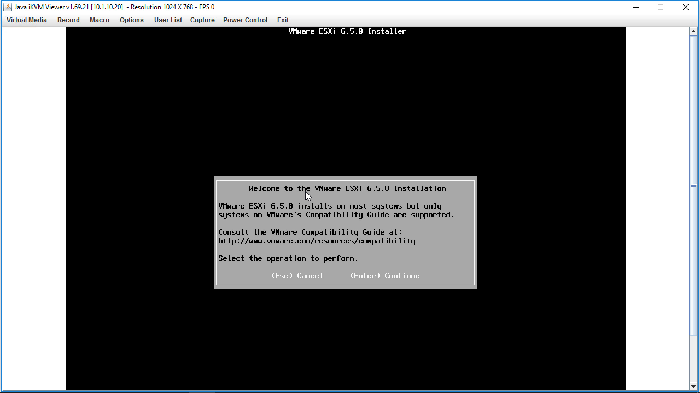
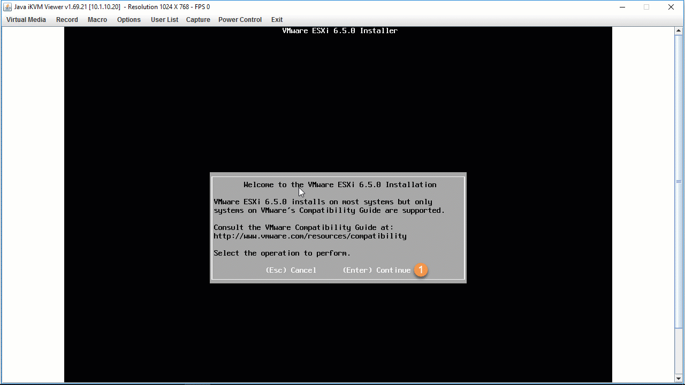

In the previous post found [here]() we created a custom ESXi image. The steps in that post were written for vSphere 6.0 however the steps hasn’t changed much from vSphere 6.0 to vSphere 6.5, just make sure to install PowerCLI 6.5. I recently upgraded to the [Netgear M4300-8X8F](http://amzn.to/2htTMa4) (review coming soon) as my infiniband switch is no long supported with vSphere 6.5. This has made creating a custom ESXi 6.5 image a much simpler process by adding a single VIB from Synology to support VAAI (hardware acceleration) for NFS datastores.

But before we jump into the installation process it’s important to understand the requirements for ESXi. VMware’s documentation center for vSphere 6.5 found [here](https://pubs.vmware.com/vsphere-65/index.jsp#com.vmware.vsphere.install.doc/GUID-E170469F-9C33-4950-8672-9825501557AE.html) provides all the necessary requirements / recommendations needed to successfully run ESXi on x86 hardware.

### Installation Options

When it comes to installing ESXi there are a few ways of doing it:

* **Interactive Installation**
    
* Scripted
    
* Autodeploy
    

The next thing to consider is, how are you going to boot the ESXi image? Just like the previous example there are a few options:

* CD / DVD
    
* USB / SD
    
* PXE Boot
    
* **Remote Management Application** (**IPMI**, iLO, DRAC, etc)
    

We’ll do an **interactive installation** using the **Remote Management Application: IPMI** and mount our custom ESXi image.

**Note:** IPMI has been pre-configured on all the hosts.

## Launching IPMI Console

*Figure-1*, shows the steps need to launch the iKVM Viewer Console:

Figure-1

1. Type in IP Address or FQDN of your IPMI interface. In my case it’s 10.1.10.20.
    
2. Click on the small Remote Console Preview window to begin the download of the Java application.
    
3. Launch the Java application
    
4. Click Run
    
5. The Console window will appear
    

## Mounting ESXi ISO Image

Now that the iKVM Viewer console window is up let’s mount the custom iso, as shown in *Figure-2*:

Figure-2

1. Click Virtual Media
    
2. Select Virtual Storage
    
3. Click CDROM&ISO
    
4. Select ISO File
    
5. Browse to ESXi ISO image
    
6. Click Plug in
    
    * Ensure the Connection Status History changes to “*VM Plug-In OK!!”*
        
7. Click OK
    

## Selecting Boot Device

Power On or in my case Power Reset the host and select the IPMI Virtual CDROM 3000 from the boot menu as seen in *Figure-3* below:

Figure-3

1. Click Power Control
    
2. Select Power On or in my Case since host was already powered on Power Reset
    
3. Press F11 to enter boot device menu
    
4. Select IPMI Virtual CDROM 3000
    

## Interactive Installation

Once we boot from the Virtual CDROM 3000 (ESX image) the ESXi Installer is loaded. This process can take a few minutes but once done the installer will begin to load various VIBs and Services. When done we’ll be presented with the “Welcome to the VMware ESXi 6.5.0 Installation” screen as shown in *Figure-4* and can begin following the prompts as shown in *Figure-5*:

Figure-4

Figure-5

1. Press Enter.
    
2. Press F11 to accept EULA.
    
3. Select the USB Drive to install ESXi on.
    
4. Select Install.
    
5. Select keyboard layout: US Default.
    
6. Type in Root password twice.
    
7. Press F11 to Install.
    
8. Press Enter to Reboot.
    
9. Plug Out mounted ISO Image.
    
10. Click OK
    

After the reboot, time to configure the management interface as this will allow access the ESXi Embedded Host Client from a web browser. We’ll use the information below to configure the host, *Figure-6* shows the steps necessary to configure the management interface:

* Host Name: ESXi-02
    
* IP Address: 192.168.50.20
    
* IP Gateway: 192.168.50.2
    
* DNS Server: 192.168.50.3 (Future DC / DNS Server)
    

Figure-6

That’s it! Basic configuration of the ESXi host is complete and now we have access to manage the host. In the next post we’ll perform additional configurations like:

* Configure scratch & syslog location
    
* Configure management interface with redundant uplinks
    
* Enable SSH
    
* Setup NTP Server
    
* Configure NFS Datastore
    
* Configure iSCSI with port binding
