I finally had time to attempt configuring vSAN in my lab. I want to compare to HP StoreVirtual. I know its like comparing apples to oranges as they operate completely different:

* VMware’s vSAN – Operates at the kernel level in each host
    
* HP’s StoreVirtual – Requires VM appliances in each host
    

Performance wise vSAN should have the upper hand as it runs directly in the kernel but still want to compare the two and see the IOPS difference running in kernel vs in an appliance. At my job we leverage HP’s StoreVirtual (All flash 10TB) for our VDI environment which we haven’t had any issues with.

## Installing vSAN

Before jumping in I checked the vSAN HCL to ensure the cards I plan to purchase were supported.

I went with *LSI 9211-8i (3)* HBA controller. After receiving the cards I flashed them with the latest ***IT firmware/bios (P20)*** and each host has two *Sandisk Ultra II 240GB.* With all required components lets begin configuring vSAN:

One additional requirement for vSAN to work is having at least one SSD and one HDD in each host. Since I have all SSDs we need to tag one as a HDD by running the following commands:

1. Identify SSD to tag by running the following command:  
    `esxcli storage nmp device list | grep “Local ATA Disk`
    
    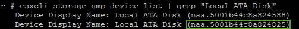
    
2. Next we apply rule to disable SSD (no feed back = success):  
    `esxcli storage nmp satp rule add -s VMW_SATP_LOCAL -d naa.5001b44c8a824825 -o disable_ssd`
    
3. Then we reclaim the device in order for rule to take effect (reboot required):  
    `esxcli storage core claiming reclaim -d naa.5001b44c8a824825`
    
    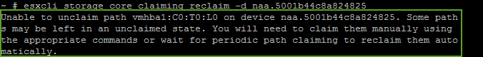
    
4. Confirm SSD has been tagged as a HDD:  
    `esxcli storage core device list -d naa.5001b44c8a824825 | grep SSD`
    
    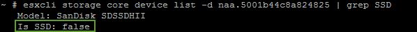
    

## vSAN Configuration:

1. Enable Virtual SAN traffic on vmkernel interface:
    
    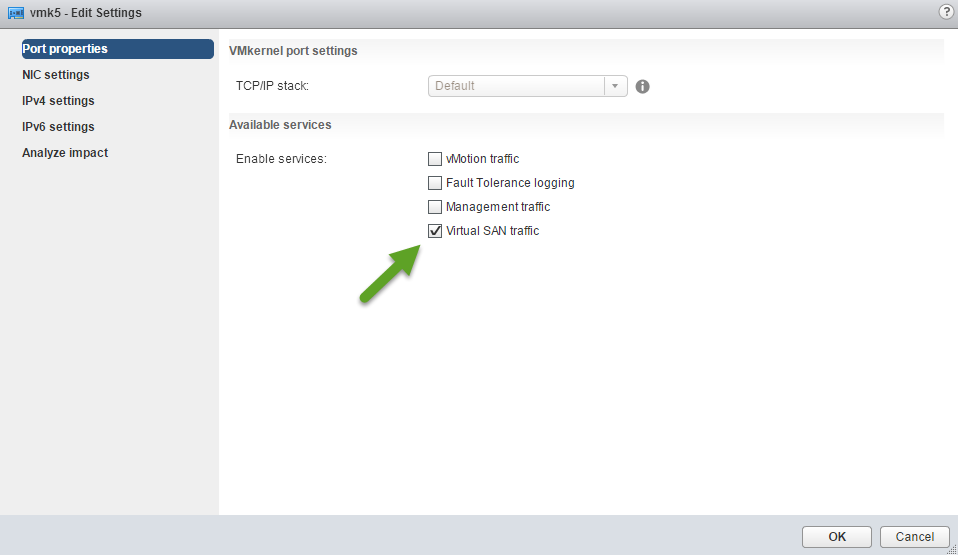
    
2. Setup vSwitch or vDS. I chose to go with vSwitch and attached the HP ConnectX card to it:
    
    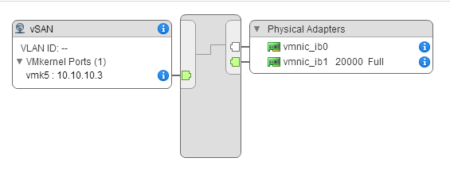
    
3. Enable Virtual SAN (vSAN):
    
    1. Select Cluster (Homelab)
        
    2. Manage tab
        
    3. Settings
        
    4. Virtual SAN – General
        
    5. Edit…
        
    6. Turn ON Virtual SAN
        
    7. Manual
        
    8. OK
        
    
    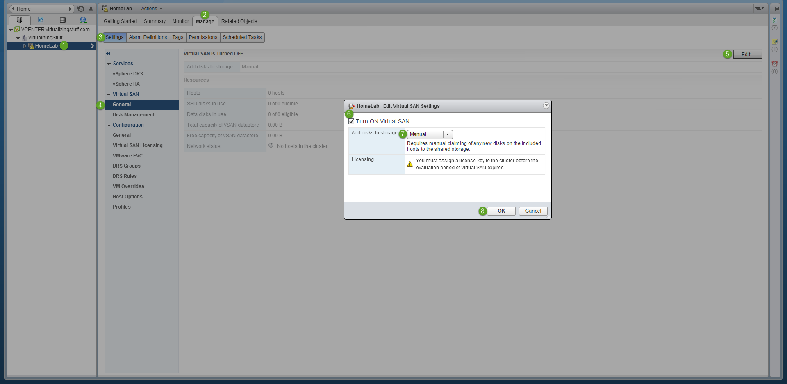
    
4. I chose Manual to show the issue I am experiencing normally I would go with Automatic.
    
    1. Select Disk Management
        
    2. Select Host (ESXI01)
        
    3. Click on “Create Disk Group” icon
        
    4. Select SSD
        
    5. Select HDD
        
    6. OK
        
    7. Repeat for all remaining hosts
        
        
        
5. Verified Disk Group Status and Resources:
    
    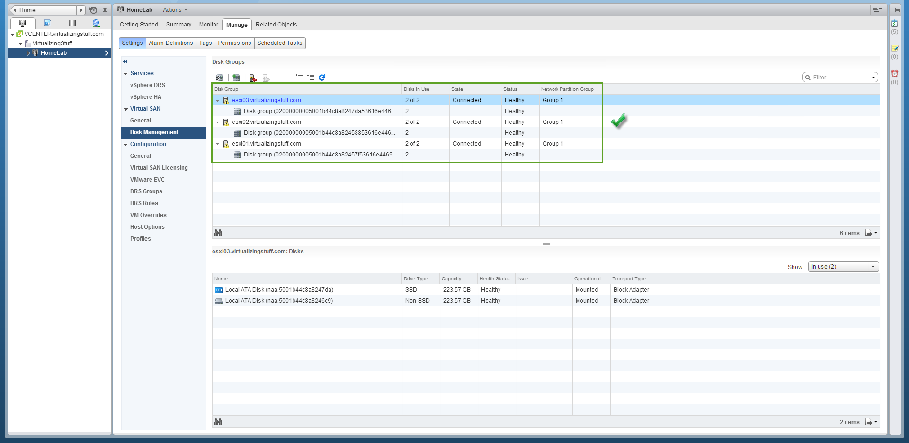
    

## Unhealthy Disk Groups in vSAN

During the creation of a VM or any I/O on the HBAs the disk groups suddenly become unhealthy:

Deleting the groups and recreating them restores the status of healthy. Checking the Hardware Status page show all drives and controller are OK:

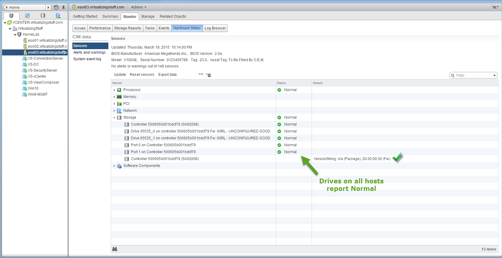

## Troubleshooting

I plan to continue troubleshooting this week by performing the following:

1. Disable onboard AHCI controller and test
    
2. Remove HP ConnectX cards (show up as Storage adapters & Network adapters) reconfigure vSAN network and test
    
3. Roll back firmware to v19 and test
    
4. Upgrade to vSphere 6 and test
    

*(03/28/2015) 9:28PM:*  
DOH!! Just noticed Sandisk Ultra II is not on the HCL supported list. Thats a bummer….but would think it should still work. Going to attempt the above and see if things workout.

## Resolution

After upgrading my homelab from 5.5 to 6 and tagging one SSD in each host with the capacityFlash. The unhealthy SSD disk issue is resolved. During the upgraded I also cleaned up and removed the old vibs.

Removed all Mellanox drivers before the upgrade:  
`esxcli software vib remove -n net-ib-cm -n net-ib-core -n net-ib-ipoib -n net-ib-mad -n net-ib-sa -n net-ib-umad -n net-mlx4-en -n net-mlx4-core -n net-mlx4-ib -n scsi-ib-srp`

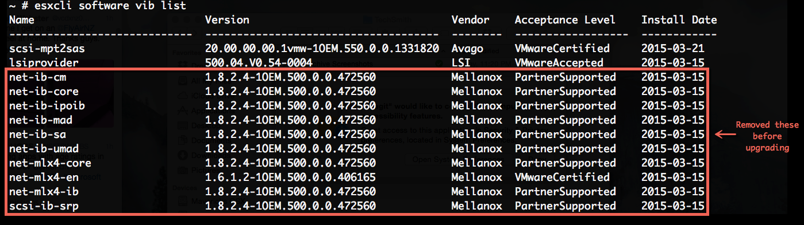

After upgrading to vSphere 6 removed the nmlx4 drivers:  
`esxcli software vib remove -n nmlx4-en -n nmlx4-core -n nmlx4-rdma`

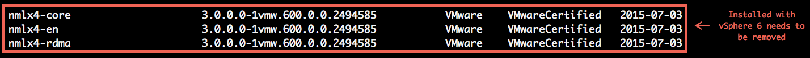

Then reinstalled the Mellanox 1.8.2.4:

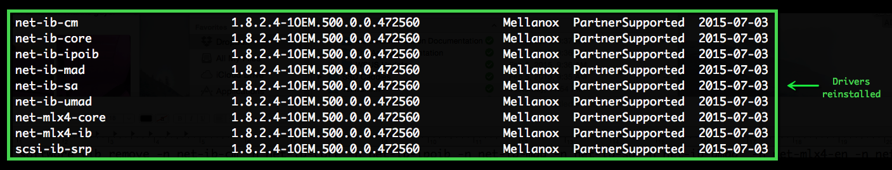

## **vSAN is working!**

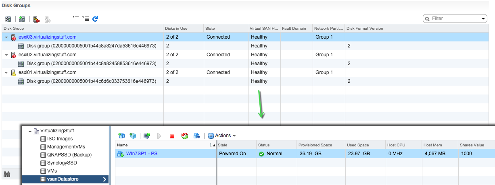
