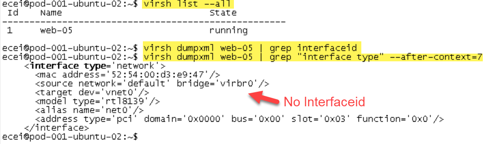
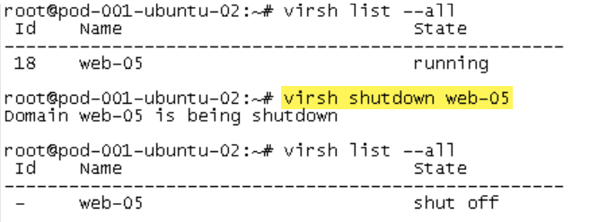
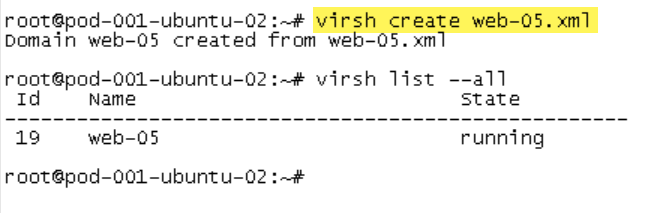
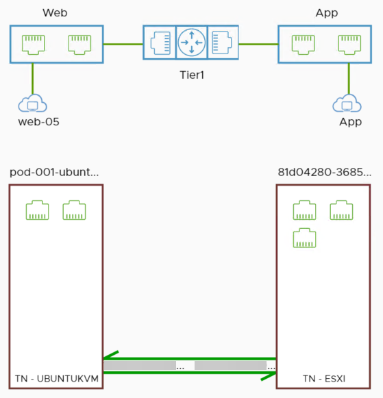
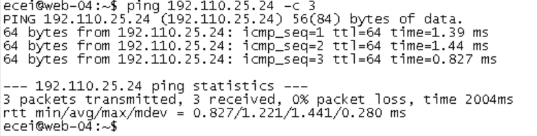
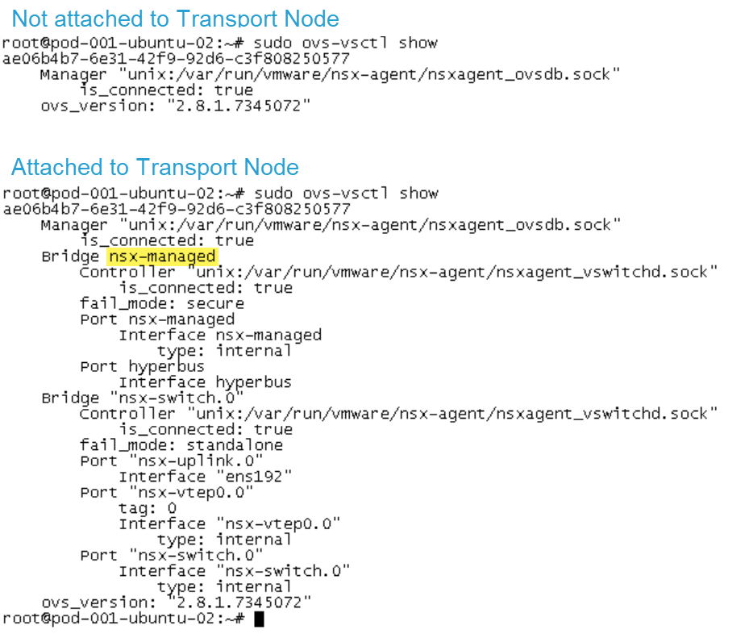
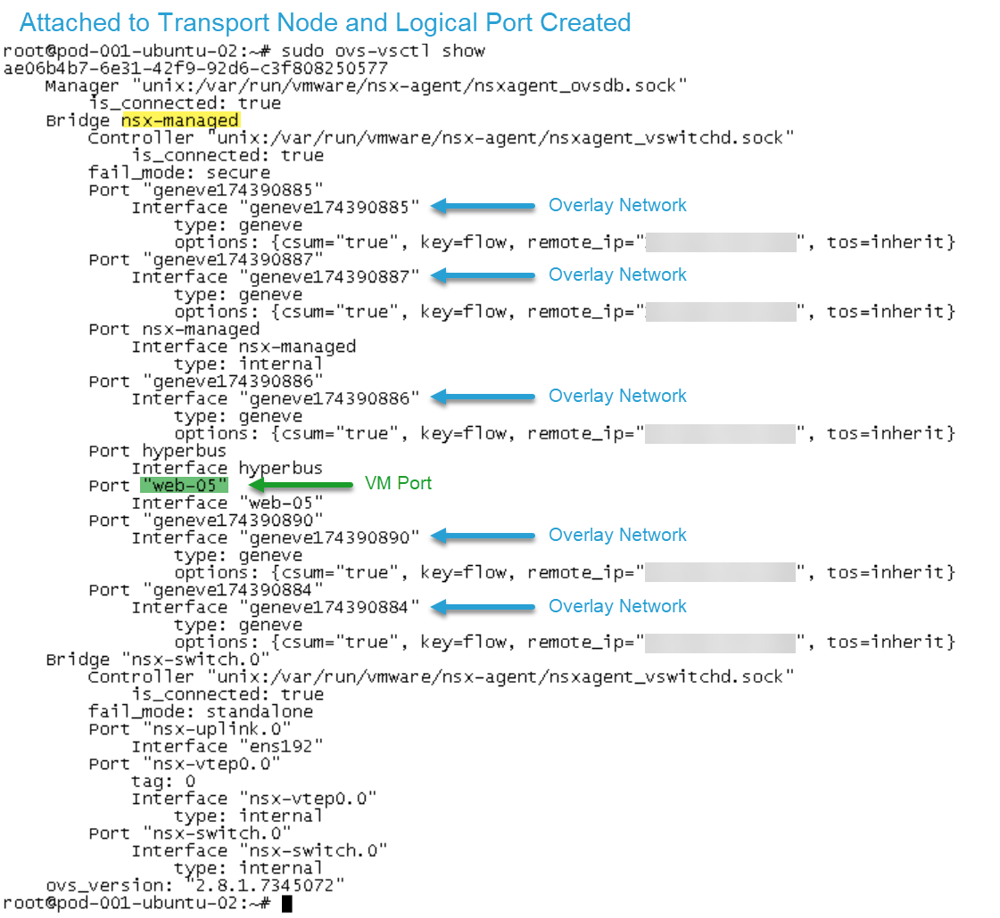

## Introduction

Having recently deployed NSX-T in our environment, I can say the deployment and configuration were straightforward using the installation docs. When it came time to attach a VM hosted on the KVM host it was a bit unclear how to accomplish this. VMware’s documentation mentions the following command `virsh dumpxml | grep interfaceid`.

As you can see from the screenshot above I have no interfaceid, what gives??? Admittedly, when it comes to KVM and Openvswitch I’m a bit of a novice. The purpose of this post is to provide additional details around VM configuration on a KVM host for those in a similar situation.

After reviewing VMware’s documentation I decided to jump into VMware’s NSX-T Hands-on-labs to see how the VMs on the KVM hosts were configured:

### Reconfigure web-05 Virtual Machine

1. Excellent, now the first thing to do is to dump the XML configuration of *web-05* to file with the following command:  `virsh dumpxml web-05 > web-05.xml`. After editing the XML to match that of VMware’s hands-on-labs we can proceed with shutting down web-05.
    
    
    
2. Shutdown web-05 using: `virsh shutdown web-05`
    
    
    
3. Create a domain from the XML file with: virsh create web-05.xml
    
    
    
4. Confirm interfaceid with: `virsh dumpxml web-05 | grep “interface type” –after-context=10` Awesome we now have an interfaceid 😉
    
    
    
5. Proceed with creating a new logical port with the interfaceid:
    
    
    
    
    
6. Below demonstrates successful communication from web-04 (192.110.25.23) to web-05 (192.110.25.24):
    
    
    
    
    

### Transport Node & OVS-VSCTL Show

Make sure the KVM host is part of the Transport Node as we will be using the “*nsx-manged*” bridge. If the host is not part of the Transport Node, `ovs-vsctl show` you will not see NSX-T bridges:

Thanks for viewing! If you found this post helpful share it with the community. 😄
