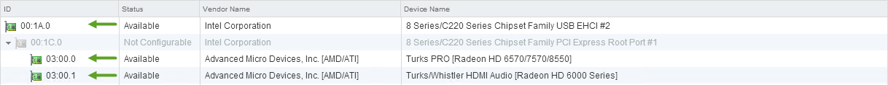
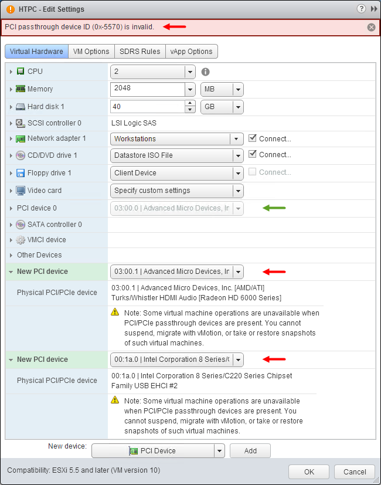

Decided to remove my physical plex PC (old and power hungry) and try to virtualize it in my homelab. This will give me a change to play with passthrough mode.

## Host Configuration

ESXI03:

* AMD HD6570 (VM Passthrough Device)
    
* Nvidia GeForce 9500 GT (Host GPU)
    
* Logitech diNovo Mini (VM USB Passthrough)
    

To begin I need to passthrough the AMD HD6570 and USB EHCI #2 (diNovo USB dongle). From the vCenter web client *Select ESXI03 -&gt; Click Manage tab -&gt; Settings -&gt; Hardware -&gt; PCI Devices -&gt; Click Pencil (edit) -&gt; Select devices -&gt; Reboot ESXI03*:

## VM Configuration

* Add PCI devices
    
* Memory Reservation
    

When passing through devices to a virtual machine vSphere will reserve all the guest’s memory. Everything appeared to be going well until I went to apply the configuration. I would get error 0x-73d3 or 0x-5570 depending on the order I selected:

## Workaround

Attach the PCI devices to the VM using the C# client instead of the web client:

Now I can remove the old physical HTPC and enjoy HD content from my virtual machine!
