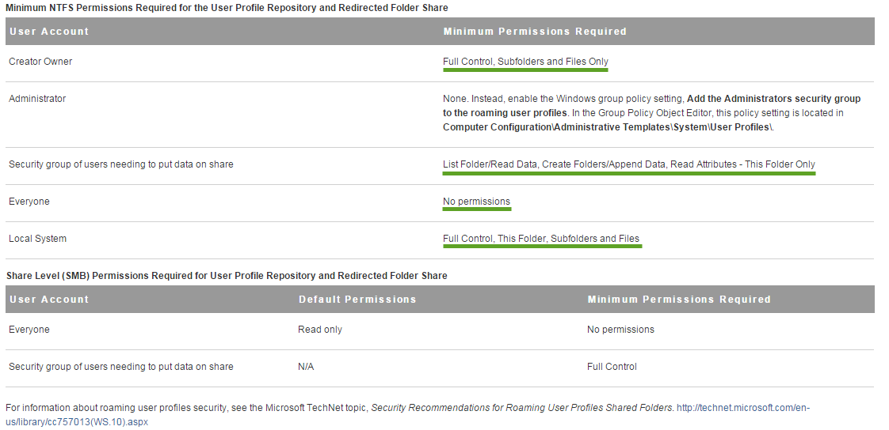
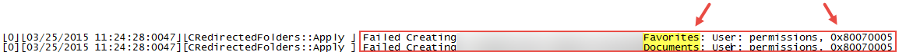
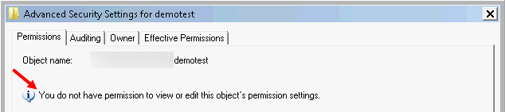

Last week a user would save a document to her Documents folder and noticed it wasn’t in her I: drive (AD Home Folder) which point to the same location. I checked her persona profile and saw Documents and Favorites folders, which was odd because they should be redirected to \\server\\UserDocs%USERNAME% location.

### Environment:

* Horizon View 6.0.1
    
* Persona Profiles and Redirected folders are being saved to a 2012 R2 server on separate drives:
    
    * Persona Profile location: \\server\\Persona%USERNAME%
        
        * All other folders (i.e. Pictures, Videos, etc) are excluded from roaming
            
    * Redirected folders location:
        
        * Desktop – \\server\\UserDocs%USERNAME%\\Desktop
            
        * Favorites – \\server\\UserDocs%USERNAME%\\Favorites
            
        * Documents – \\server\\UserDocs%USERNAME%\\Documents
            
* Set permissions per VMware/Microsofts documentation found [here](https://pubs.vmware.com/horizon-view-60/index.jsp?topic=%2Fcom.vmware.horizon-view.desktops.doc%2FGUID-8DA2B3DC-028F-4A0A-9AB0-DCABE72B802C.html)
    
    
    

Persona Management created the Desktop folder inside of my test user’s redirected location without any issues. It would not create the Favorites or Documents folder.

I checked the **VMWVvp.txt** log file located: *C:\\ProgramData\\VMware\\VDM\\logs*. I opened the log file with notepad performed a search for Documents and came across this error:

The *0x80070005* is typically an access denied aka a permissions issue. I called VMware support to discuss this issue further and they also confirmed permissions were indeed set correctly per their documentation.

## Resolution

Granting the Security Group for our VDI users ***Full Control – This Folder only*** instead of *List Folder/Read Data, Create Folders/Append Data, Read Attributes – This Folder Only*. After the permission change tested again and Poof! Like magic all folders were now being redirected without any issues.

Granting Full Control to the UserDocs folder brought up concerns that a savvy user could easily change permissions / take ownership of other user’s folders and gain access to their files.

I logged into the pool and tested by trying to change permissions and take ownership of Demotest:

