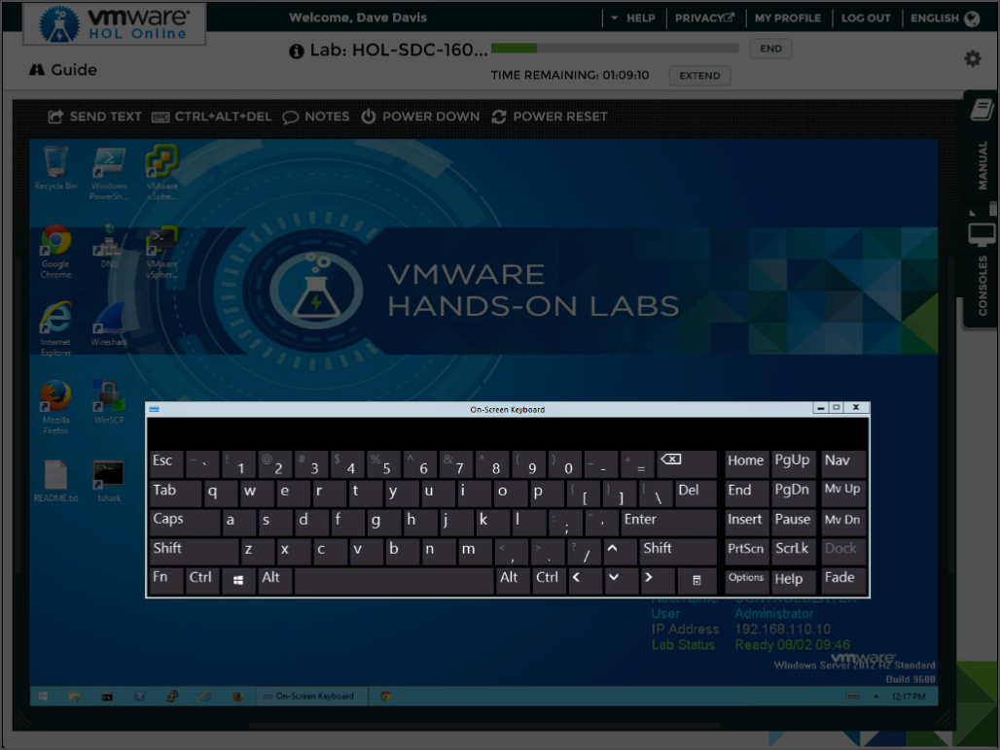
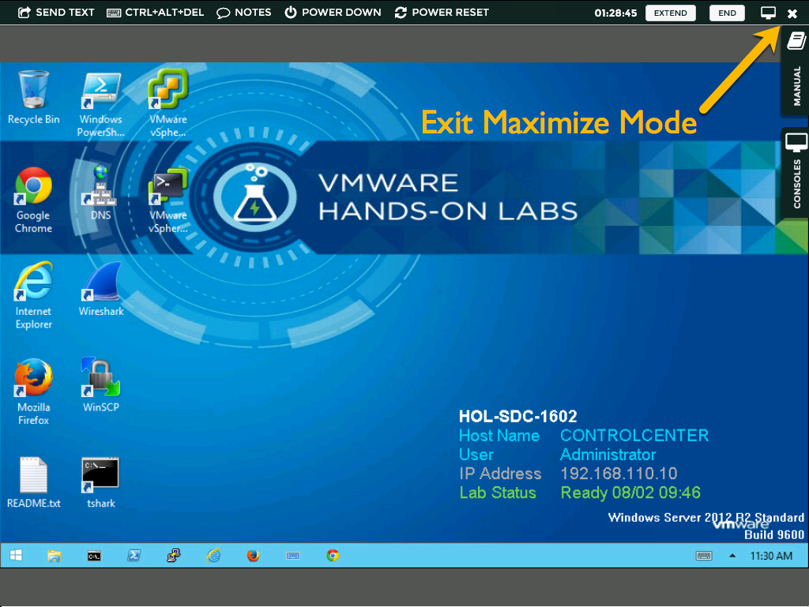

Now that [VCAP6-DTM](https://mylearn.vmware.com/mgrReg/plan.cfm?plan=88780&ui=www_cert) Deployment Exam is GA, I thought it would be helpful to provide some tips & tricks using the *VMware Certification Platform*. VMware provides an *Exam UI Guide* found [here](https://mylearn.vmware.com/lcms/web/portals/certification/VMware%20Certification%20Platform%20Interface.pdf) to assist candidates with optimizing the exam interface while also addressing some of the current restrictions. The *VCAP6* exams uses the same platform that *Hands on Labs* (HOL) is delivered on. Once you have scheduled your exam I highly recommend heading over to [*HOL*](http://labs.hol.vmware.com/) and get familiar with the interface and apply the suggestions found in the guide. The delivery of the exam is currently limited to a resolution of *1024×768*.

[**Tip#1**](https://www.youtube.com/watch?v=4JIX4n9vP0I#) *&lt;- Click me to view section in video*

Use the *HOL* environment to get familiar with the interface.

* Set your computer resolution to *1024×768*.
    
* Launch *Internet Explorer* and press *F11* to enter full screen mode.
    
* Use the VMware Certification Platform Interface Guide to make the suggested UI changes.
    

After all you don’t want to be doing this for the first time during the exam.  😉

#### Current restrictions:

* Keyboard shortcuts not available in the exam:
    
    * *Copy (Ctrl+c)*
        
    * *Paste (Ctrl+v)*
        
    * *Undo (Ctrl+z)*
        
* Keys not available in the exam:
    
    * *Backspace*
        
    * *Ctrl*
        
    * *Alt*
        
    * *Function Keys (F1 – F12)*
        
* Resolution limited to *1024×768*
    

Ouch, No Backspace!….No Copy/Paste! Unfortunately security features in the delivery system prevents access to these functions. We are working with Pearson for a future enhancement to address these concerns. That said, below are some workarounds:

**Tip#2**

* Use the ***Left / Right Arrow*** keys with the ***Delete*** key instead of the *Backspace* key.
    

**Tip#3**

* Use the ***On-Screen*** keyboard to copy / paste within the environment.
    
    
    
    On-Screen Keyboard
    

**Tip#4**

* *Maximize* the console window using the
    
    
    
    button.
    
    
    
    Enter Maximize Mode
    
    
    
    Exit Maximize Mode
    

**Tip#5**

* ***Multi-task*!** If you find yourself waiting for a particular task to complete. Quickly write that question number on your scribble sheet and move on to the next question making sure to circle back verifying the task completed successfully.
    

[**Trick#1**](http://www.youtube.com/watch?v=4JIX4n9vP0I&t=1m35s) *&lt;- Click me to view section in video*

* Using the
    
    
    
    to pass credential information into the Exam session.
    

[**Trick#2**](http://www.youtube.com/watch?v=4JIX4n9vP0I&t=2m13s) *&lt;- Click me to view section in video*

* If there is text in the manual you would like to copy. Simply select the text icon will change to a
    
    
    
    Drag the text to where you would like it copied and release.  
    **Important:** Be careful when selecting text! If you accidentally select all the text on the page and drag it over you will have to wait for all the text to copy over. There is no way to interrupt the transfer once it starts.
