In preparation for the VCIX-NV exam I wanted to setup NSX in the homelab and migrate from vSphere’s Standard Switches (vSS) to a single Distributed Switch (vDS). The migration was going smoothly with the following VMkernel adapters being migrated to the vDS without issue: Management, vMotion, iSCSI-A, iSCSI-B. Then the fun began, I migrated the last physical adapter from the iSCSI/NFS vSS to the vDS and forgot to migrate the NFS VMkernel (DOH!). Leaving the NFS VMkernel stranded on the vSS with no physical adapter to communicate with thus cutting off access to VMs on that datastore. The connection issue was quickly resolved by logging into the ESXI Hosts and reconnecting the physical adapter back to the iSCSI/NFS vSS. Then I jumped into the console for the VCSA and noticed it was frozen so I rebooted the VM. When it came back up I was greeted with the following error and troubleshooting began:

I provided the root password and was presented with this error:

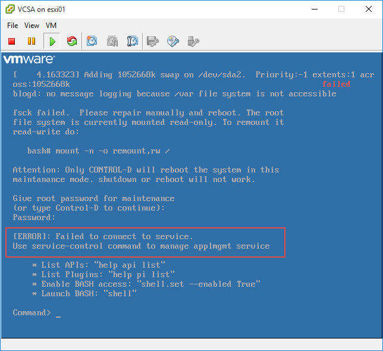

When trying to launch BASH using the shell and shell.set –enabled True commands:

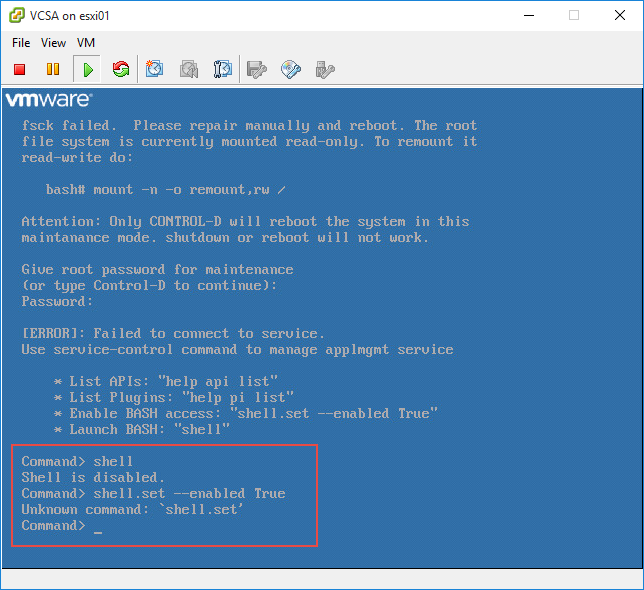

Using VMware’s [KB2069041](http://kb.vmware.com/selfservice/microsites/search.do?language=en_US&cmd=displayKC&externalId=2069041) article was able to gain access to the shell:

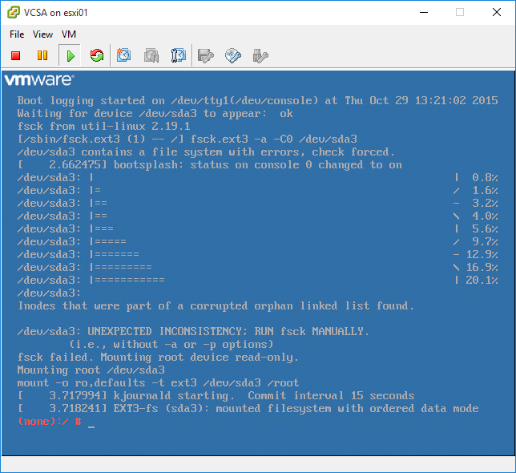

With shell access I ran the `mount – n -o remount,rw /` command which returned:

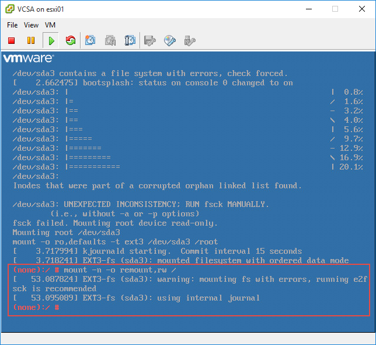

The error message is recommending to use the `e2fsck` command:

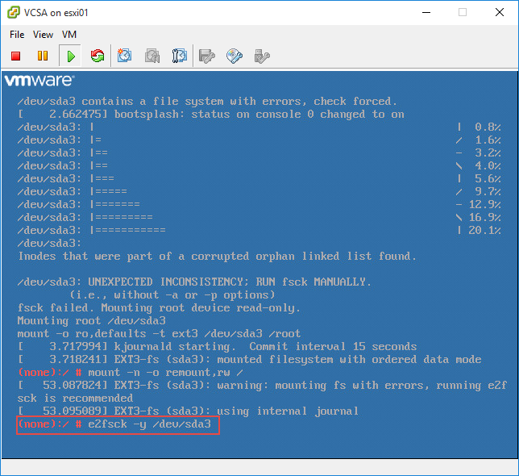

<mark>A WARNING!!! is presented asking if you want to continue:</mark>

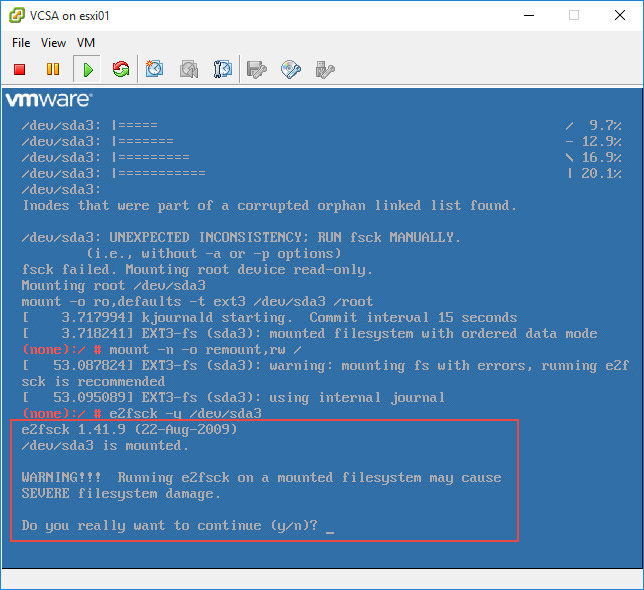

After pressing ‘*y*’ the command began fixing errors:

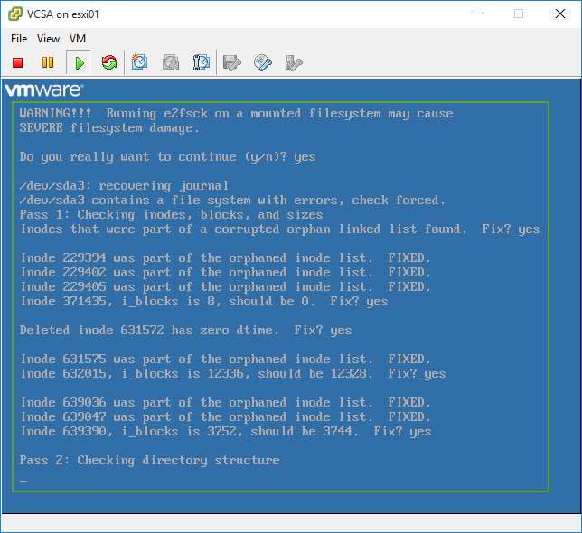

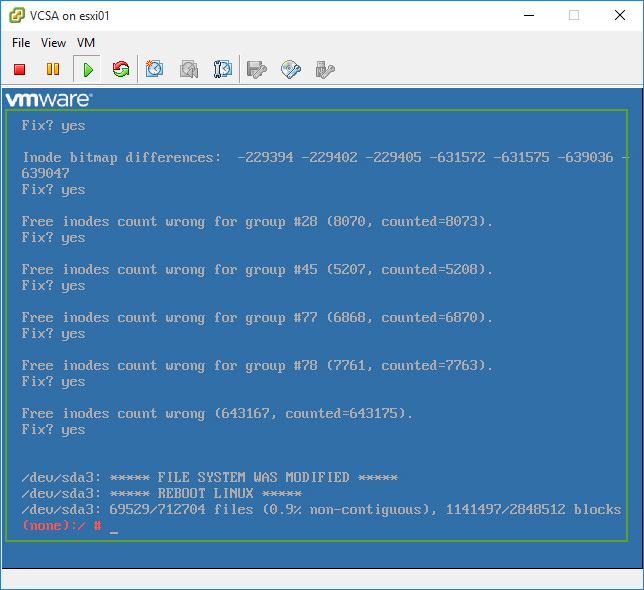

After completing I pressed Control + D to exit maintenance mode and rebooted the VCSA upon reboot was presented with a slightly different error message:

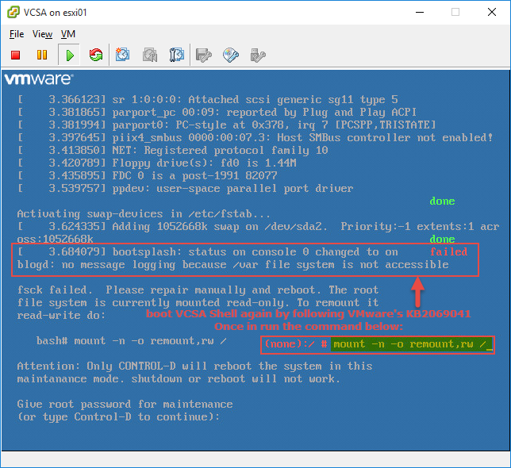

I booted back into the shell using [KB2069041](http://kb.vmware.com/selfservice/microsites/search.do?language=en_US&cmd=displayKC&externalId=2069041) and ran the `mount – n -o remount,rw /` again which thankfully completed successfully this time. I pressed Control+D to exit and rebooted the VCSA again this time to be greeted with a familiar screen:

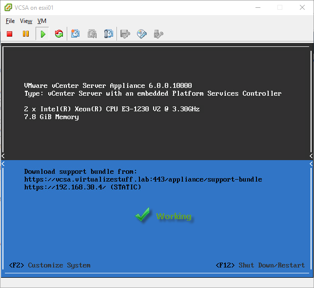

Moral of the story:

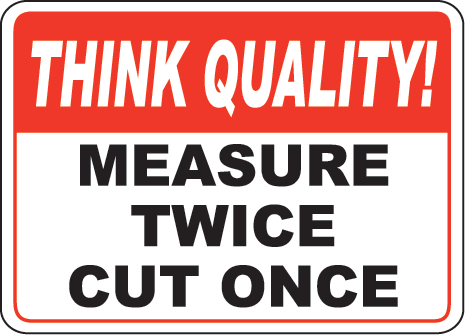

Don’t forget to migrate those VMKernels!

I hope this post help those who might run into a similar issue where the VCSA file system is mounted in a read-only state.
