The other day I was working on a project updating vApp components and after successfully upgrading vCenter, ESXi hosts, and NSX Managers it was time to upgrade the VMware Tools for all the VMs. I powered on the VMs and noticed that 8 of the 10 linux machines failed with the same error as shown in Figure-1. I will be the first one to admit that my linux-ninja skills are subpar at best. When I saw this error message I was excited because this gave me a chance to learn some new linux commands and gain some much needed experience points to level up my linux-ninja skills.


**Figure-1** Error upgrading Vmware Tools. Vix error code = 21009

I thought hmm that’s odd let’s take a look at the vmware-tools-upgrader.log file and see what’s going on. Typically when searching through log files I like to leverage egrep. Below is the command with some common verbiage typically found inside log files.

`egrep -wi ‘warning|fail|failure|error|cannot’ /var/log/vmware-tools-upgrader.log`

Egrep quickly returned results shown in Figure-2 and to confirm the current disk size I ran df-h on the server and noticed only 41M were available on the disk…YIKES, as shown in Figure-3. Then ran pvs to take a look at the physical volume and notice there is 0 space left to expand…OUCH shown in Figure-4. To get around this we need to create another physical volume. A useful command that can provide the current size of the disk is fdisk -l, notice in Figure-5 the disk size is 2GB. Before we proceed let’s take a look at the logical volumes and see how many we have on the disk using lvdisplay. As you can see in Figure-6, we have 2 logical volumes one is our OS/file (lv\_root) and the other is our swap (lv\_swap). In order to increase the disk size we need to first shutdown the VM. **Right click on the VM** -&gt; **Edit Settings** -&gt; **Virtual Hardware** -&gt; **Hard disk 1** and increase the size from 2GB to 3GB as shown in Figure-7. Once the change has been applied power on the VM and verify the disk size using fdisk -l as shown in Figure-8.

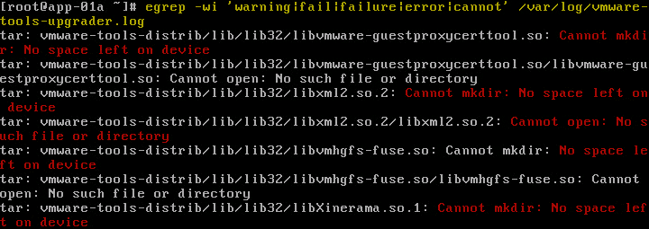

**Figure-2** Cannot mkdir: No Space left on device

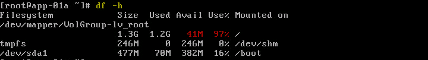

**Figure-3** Checking available space on disk

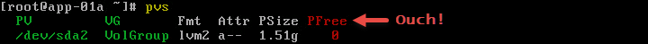

**Figure-4** Confirm physical volume free space

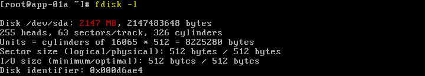

**Figure-5** Current disk size

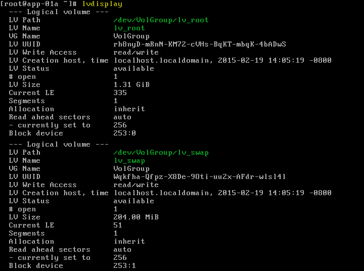

**Figure-6** Show all logical volumes

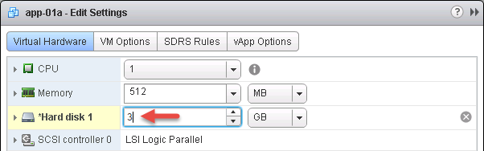

**Figure-7** Edit Settings for VM

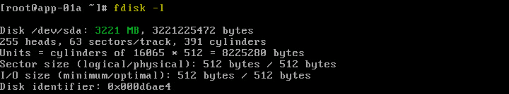

**Figure-8** Confirmation of increase in disk size

To begin the process of extending the disk space of this VM we need to issue the `cfdisk /dev/sda` command as shown in Figure-9 which launches cfdisk utility. Cfdisk is a partition editor and allows us to create both primary and logical partitions. In our case, we can see the newly added 1GB (1073.75MB) of disk space. Let’s create a new primary partition by highlighting the **Free Space at the bottom** -&gt; **New** -&gt; **Primary** -&gt; **accept default values** -&gt; press **Enter**. Once done notice in Figure-10 “sda3” appears. Next, lets write changes to disk by selecting **Write** -&gt; **read the warning** -&gt; type ‘**yes**‘. The VM will need to be rebooted in order for the changes to take affect.

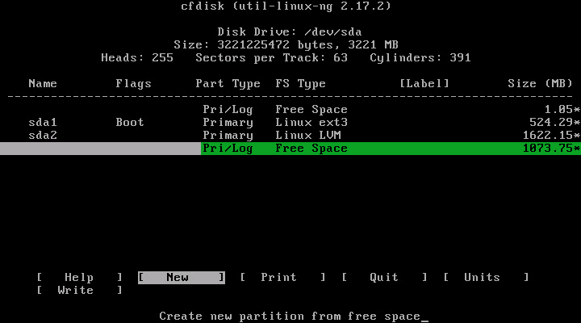

**Figure-9** Launch cfdisk utility

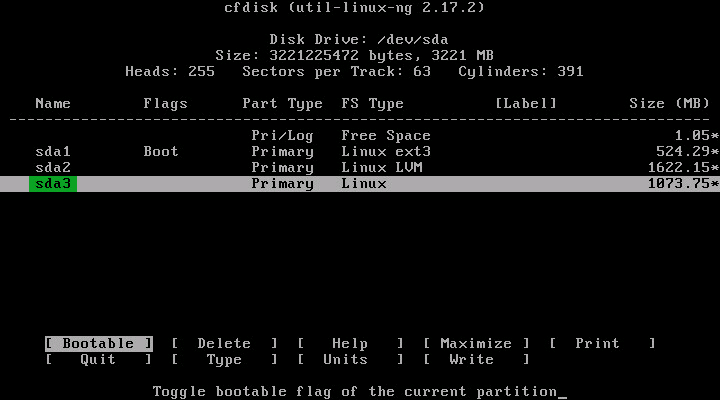

**Figure-10** Create primary partition with cfdisk utility

On to creating a physical volume using `pvcreate /dev/sda3` shown in Figure-11. If we run the `pvs` we should see the newly created physical volume shown in Figure-12. Let’s see the current volume group size by using `vgdisplay` as shown in Figure-13. Now to extend VolGroup using the newly created physical volume by issuing the command `vgextend VolGroup /dev/sda3` see Figure-14. To confirm the size we again run the `vgdisplay` command shown in Figure-15.


**Figure-11** Create new physical volume

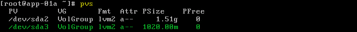

**Figure-12** Confirming physical volume creation

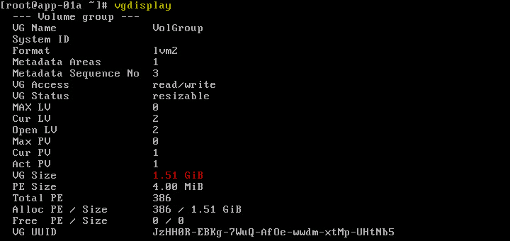

**Figure-13** vgdisplay


**Figure-14** Extend volume group VolGroup

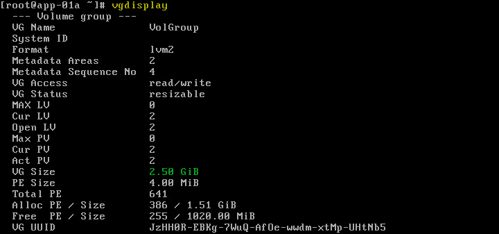

**Figure-15** After extending VolGroup

Now that VolGroup has been extended lets proceed with increasing lv\_root. Remember when we ran lvdisplay see Figure-6, we saw two logical volumes lv\_root followed by lv\_swap attempting to extend lv\_root in this current state will fail as shown in Figure-16 because lv\_swap is for a lack of a better term “in our way”. So we need to disable and remove lv\_swap by using the following commands shown in Figure-17:

1. swapoff /dev/VolGroup/lv\_swap
    
2. lvm lvremove /dev/VolGroup/lv\_swap
    

With lv\_swap gone lets extend lv\_root using lvextend -L+1G /dev/VolGroup/lv\_root as shown in Figure-18


**Figure-16** Insufficient free space


**Figure-17** Disable and remove lv\_swap

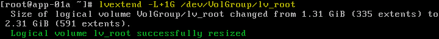

**Figure-18** Extending logical volume lv\_root

Great! Let’s confirm lv\_root has been increased by using `lvdisplay` shown in Figure-19. Ok, now that we have extended lv\_root all should be good, right? Not exactly because the file system isn’t aware of the increase we did in the previous step shown in Figure-20 using the `df -h` . To increase the file system let’s run `resize2fs /dev/VolGroup/lv_root` as shown in Figure-21 and again confirm by using `df -h` shown in Figure-22.

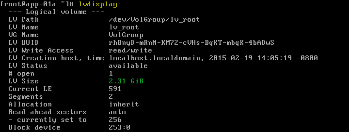

**Figure-19** lv\_root size increased

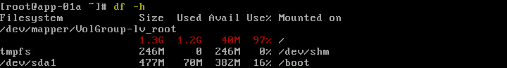

**Figure-20** Current file system size

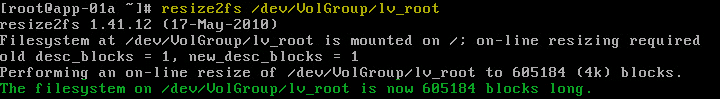

**Figure-21** Resizing the file system

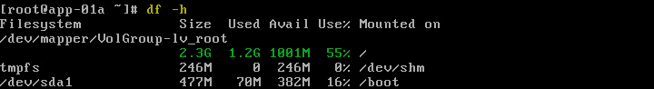

**Figure-22** File system size increased

What has been described to this point might seem like a lot but once you have done this a few time it goes really quick  😉 . We are entering the final stretch just need to recreate the lv\_swap we deleted earlier and activate it. As you can see in Figure-23 we issue the `lvm lvcreate VolGroup -n lv_swap -L 200M` command. Once done like everything else we have done up to this point we confirm lv\_swap was created by using our favorite `lvdisplay` command shown in Figure-24. Awesome, lv\_swap is created but we must not forget to activate it otherwise our swap cache won’t work. Let’s issue the following commands to ensure the lv\_swap is functioning shown in Figure-25:

1. `mkswap /dev/VolGroup/lv_swap`
    
2. `swapon /dev/VolGroup/lv_swap`
    
3. `swapon -s`
    

Hurray we successfully extended our disk inside our CentOS VM let’s do a quick cleanup of the temp directory using `rm -rf /tmp/*` shown in Figure-26 before attempting  the VMware Tools upgrade again. Success! We can now successfully upgrade VMware Tools on our CentOS VM as shown in Figure-27.


**Figure-23** Recreate lv\_swap logical volume

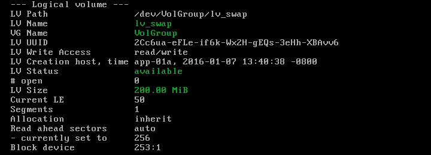

**Figure-24** Confirmation lv\_swap was created

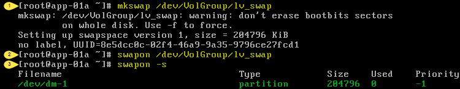

**Figure-25** Activate lv\_swap cache


**Figure-26** Cleaning up the temp directory

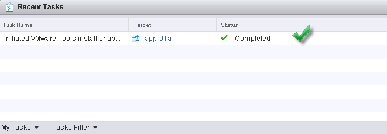

**Figure-27** VMware Tools successfully upgraded

# Command cheat sheet used to complete task:

```bash
CENTOS Command List
egrep -wi 'warning|fail|failure|error|cannot' /var/log/vmware-tools-upgrader.log (search log files)
fdisk -l
df -h
pvs
lvdisplay
cfdisk /dev/sda (create /dev/sda3) **Reboot**
pvcreate /dev/sda3
vgdisplay
vgextend VolGroup /dev/sda3
vgdisplay
swapoff /dev/VolGroup/lv_swap
lvm lvremove /dev/VolGroup/lv_swap
lvextend -L+1G /dev/VolGroup/lv_root
lvdisplay
resize2fs /dev/VolGroup/lv_root
df -h
lvm lvcreate VolGroup -n lv_swap -L 200M
mkswap /dev/VolGroup/lv_swap
swapon /dev/VolGroup/lv_swap
swapon -s
rm -rf /tmp/*
```
