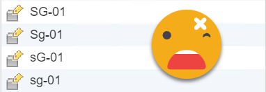
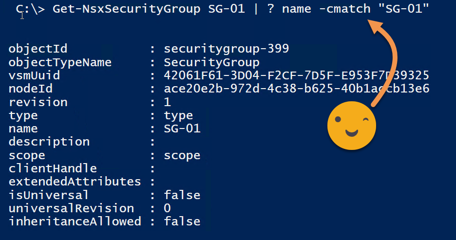

## Creating Security Groups

The example below is why NSX name fields should be case-insensitive. When creating security groups with the names: “SG-01”, “Sg-01”, “sG-01”, and “sg-01” one might think this won’t be allowed as they’re the same name. Actually, NSX allows this due to the fact that the name field is case-sensitive resulting in four security groups created as shown in *Figure-1*:

Figure-1

Again, the above example shows why NSX name fields should be case-insensitive. This would prevent such behavior, for example, security group “SG-01” already exists and when attempting to create another security group with the name “sg-01” would fail with a message similar to “Another object with the same name already exists in the current scope: Global”.

This issue also occurs in the following objects:

* Security Groups
    
* Security Policies
    
* Custom Services
    
* IP Sets
    
* MAC Sets
    
* Service Groups
    
* IP Pools
    
* Logical Switches
    
* Creating NSX Edges
    

Surprisingly, Security Tags prevents the above problem, as shown in *Figure-2*:

Figure-2

Granted, this issue “could” be resolved with standardized naming schemes, however, simply forgetting to capitalize or not capitalize a letter could accidentally create an unintended object. When attempting to filter for “SG-01” in the GUI or in PowerNSX all four security groups are returned, as seen in *Figure-3* which is not what the Emoji wants.

Luckily with PowerNSX, we can leverage PowerShell’s -cmatch comparison operator to help narrow down our selection as shown in *Figure-4*. That’s going to wrap up this post.

Figure-3

Figure-4
