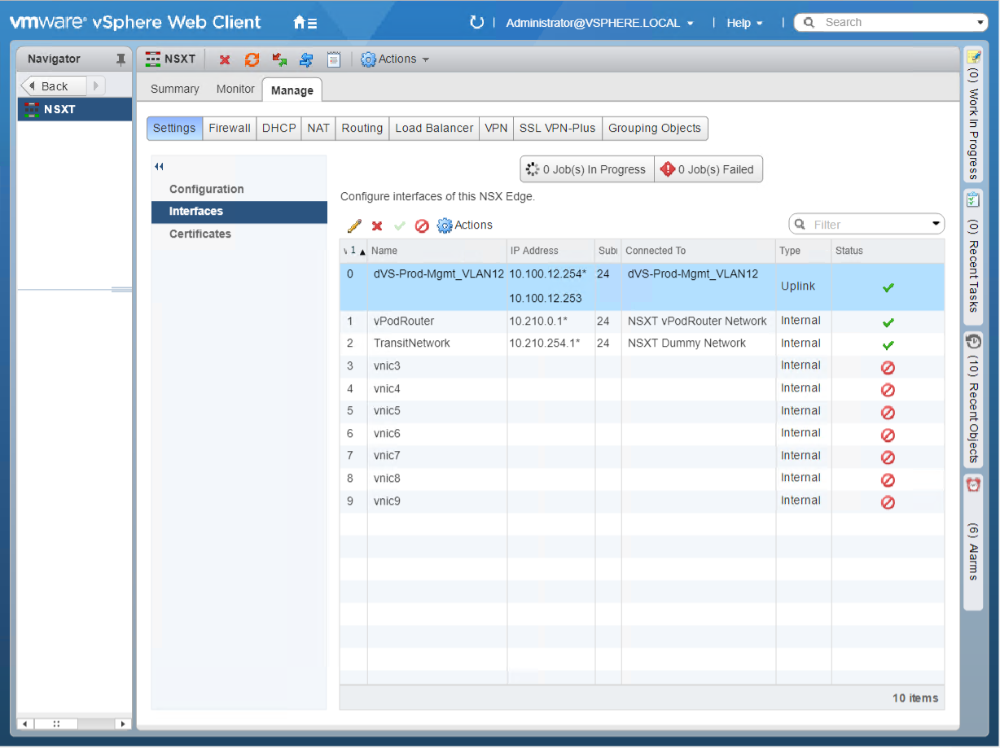
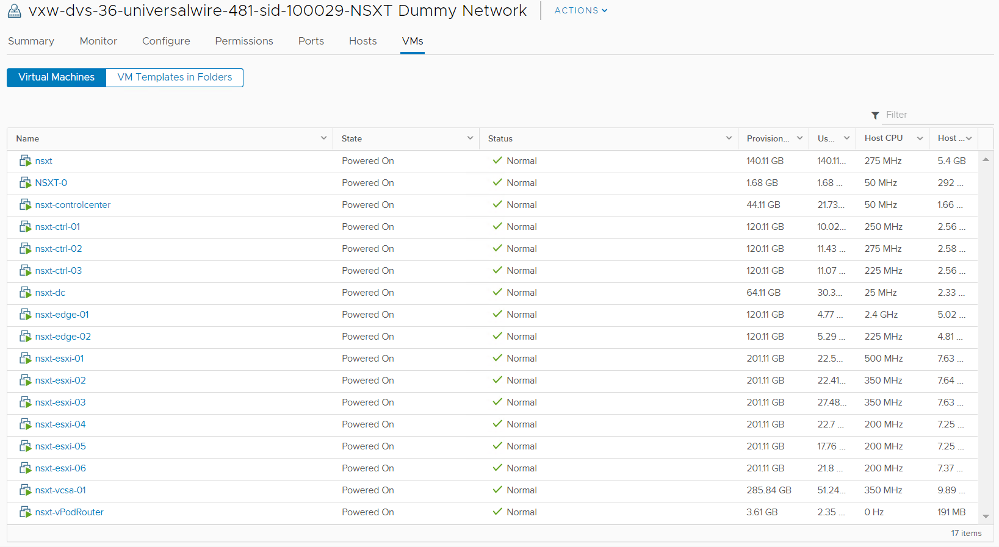
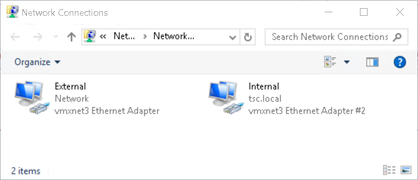
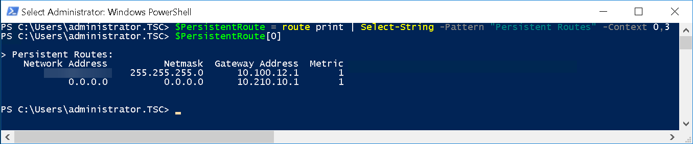
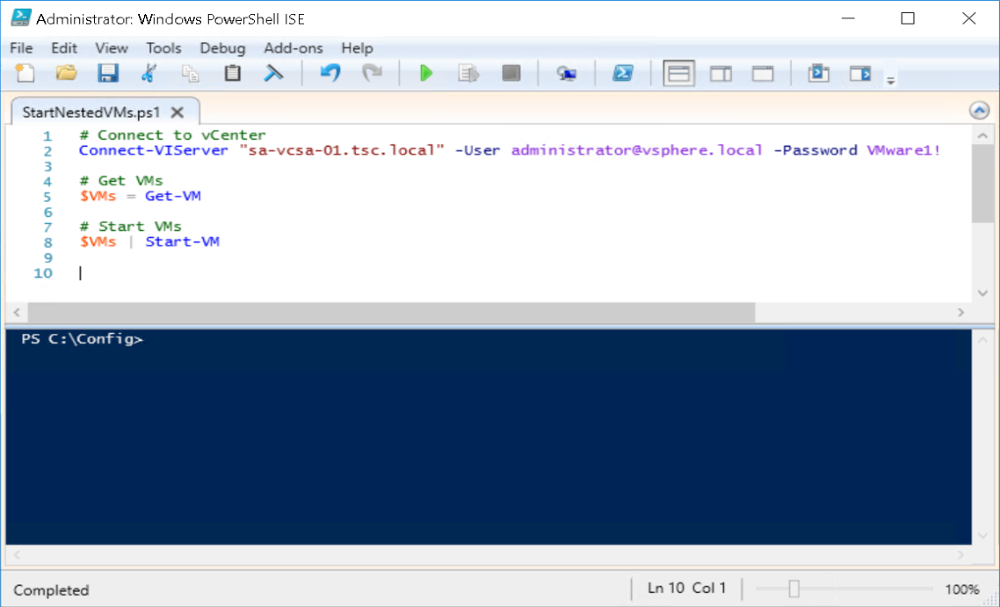
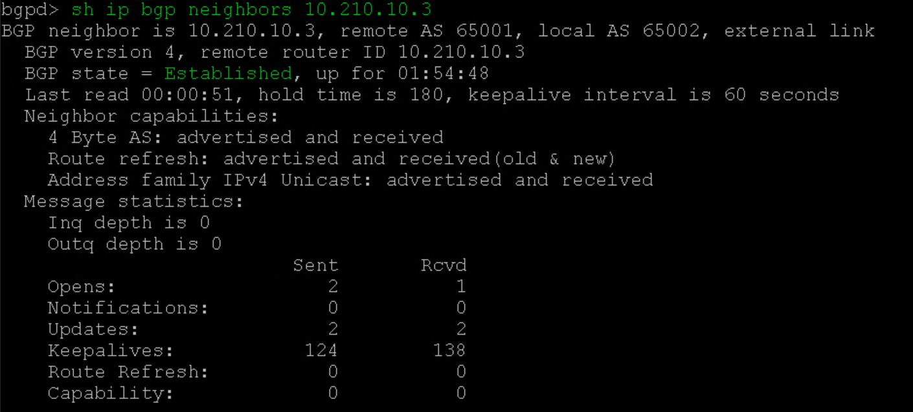
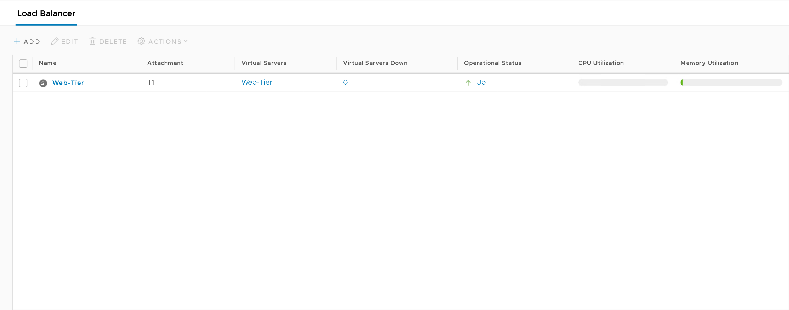
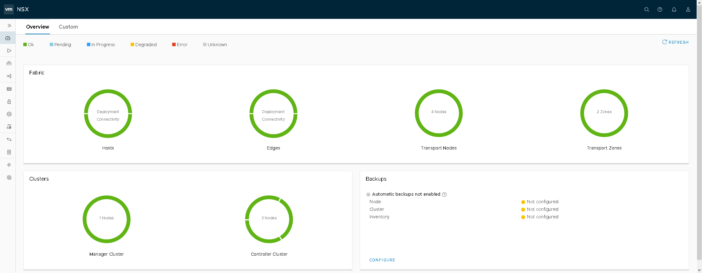
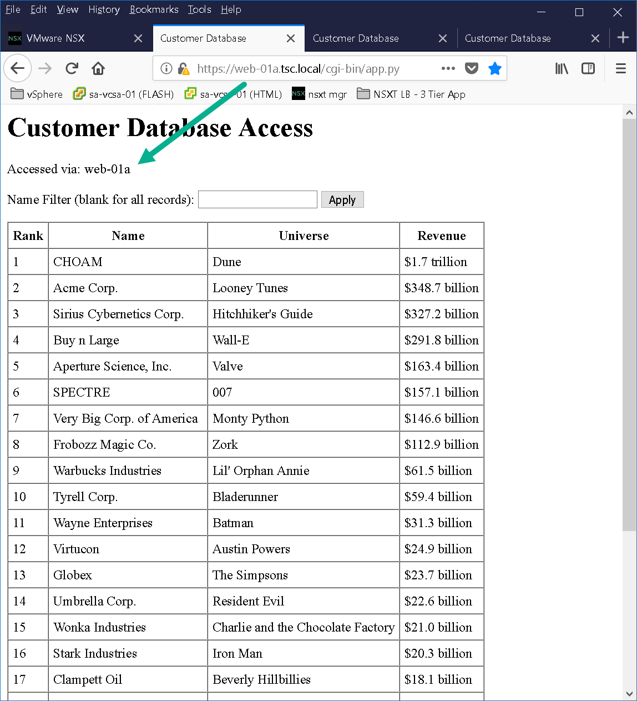

In today’s post, we will I’ll be talking about developing an NSX-T blueprint for vRealize Automation. Having developed live lab exams in the past using vCloud Director I figured it would be interesting to do the same thing but with vRealize Automation and NSX-V. I initially started simple creating a 3-node vSAN cluster blueprint to get my feet wet and work out any “gotchas”. After successfully deploying said blueprint I decided to take it further this time deploying a full NSX-T environment. NSX-T has been gaining traction in the enterprise space so it makes sense and would allow our organization to leverage it for training and demonstrations.

## Requirements

* Multiple deployments with repeatable results

* Dynamic routing (BGP)

* Allow for installation of solutions like PCF / PKS

* Demonstrate NSX-T capabilities

* 3 tier app deployed and operational

* Approval policy in place (due to the size of the blueprint)

* Lease duration

## NSX-T Blueprint Design

Figure1 – NSX-T Diagram

## Creating the Dev Environment

The diagram above (Figure1) shows the end game of the NSX-T blueprint but before we can build the vRA blueprint we need to create a development environment leveraging NSX-V components. I created NSX Edge called “NSXT” that has 3 interfaces connected to their respective port group / logical switches (Figure2) and NAT applied on the uplink interface (Figure3). This allows us to deploy our NSX-T environment in isolation. All virtual machines will be assigned to logical switch “NSXT Dummy Network” as shown in Figure4. The external interface of the vPodRouter will be connected to “NSXT vPodRouter Network” and the ControlCenter external interface will be connected to the vDS port group “dVS-Prod-Mgmt\_VLAN12” as illustrated in Figure1. We’ll have 16 total virtual machines that will make up the vRA NSX-T blueprint once everything is said and done.

---

**Important:**

1. Make sure *Promiscuous mode*, *MAC address change*, and *Forged transmit* have been set to “Accept” otherwise our nested virtual machines and the NSX-T Overlay won’t work properly.

2. Set the MTU size on the vDS that’s hosting the nested environment to 9000. In the dev environment, I couldn’t get jumbo frames (9000) to successfully work when testing with vmkping so I dropped the MTU down to 8000 for the nested vDS and VMkernel interfaces. I believe this has to do with VXLAN overhead but need to capture some packets to confirm.

Figure2 – NSX Edge Interfaces

Figure3 – NSX Edge NAT

Figure4 – NSXT Dummy Network

## Virtual Machine Configurations

To keep this post manageable I won’t be providing the step by step details as most folks are familiar with deploy vSphere components and the [NSX-T documentation](https://docs.vmware.com/en/VMware-NSX-T/2.1/com.vmware.nsxt.install.doc/GUID-3E0C4CEC-D593-4395-84C4-150CD6285963.html) is pretty good too. I will, however, provide screenshots of specific settings made to the NSX-T environment:

### DOMAIN CONTROLLER

* Update/Patch OS

* Install the following roles:

  * AD DS

  * DHCP

  * DNS

  * File and Storage Services (NFS)

### CONTROLCENTER

* Update/Patch OS

* Customize Windows Profile – This is why we don’t want to use a custom spec in vRA

  * SSH, WinSCP, RDCMan, Chrome, Firefox, and Map a Network Share

* Additional configurations:

  * vRA Configuration will be discussed in follow up post:

    * Install vRA guest agent

      * Change default route metric \[Software Component\]

      * Assign static IP Address \[Software Component\]

      * Bind IP Address to ControlCenter \[Bindings\]

  * Rename Network Adapters (Figure5)

  * Add persistent route to the network you will be RDPing from. (Figure6)

  * Start nested VMs via Task Scheduler during startup (Figure7)

        

        Figure5 – Rename Network Adapters

        

        Figure6 – Add Persistent Route

        

        Figure7 – Start Nested VMs

* Applications Installed:

  * mtputty

  * RDCMan

  * WinSCP

  * Chrome / Firefox

    * Bookmarks

### VCENTER (Nested)

* HA Advanced Settings:

  * `das.ignoreRedundantNetWarning: true`

  * `das.isolationaddress: 10.210.10.11` (DC)

  * `das.usedefaultisolationaddress: false`

* Alarm Definitions Disabled:

  * vSAN Build Recommendation Engine build recommendation

  * vSAN Performance service status

  * Registration/unregistration of third-party IO filter storage providers fails on a host

* vSAN Settings Silenced for both Clusters (RVC):

  * SCSI controller is VMware certified

### NSX-T

* #### **IP** Pools

  * ESXi-Pool:

    * IP Range: 10.210.13.21 – 10.210.13.26

    * Gateway: 10.210.13.1

  * CIDR: 10.210.13.0/24

  * DNS Servers: 10.210.10.11

  * \* DNS Suffix: tsc.local

  * Edge-Pool:

    * IP Range: 10.210.13.27 – 10.210.13.28

    * Gateway: 10.210.13.1

    * CIDR: 10.210.13.0/24

    * DNS Servers: 10.210.10.11

    * DNS Suffix: tsc.local

* #### **Fabric**

  * Transport Zones

    * TZ-Overlay

    * TZ-VLAN

  * Nodes

    * Hosts:

      * Prep only the Compute-PKS Cluster (Figure8)

    * Edges:

      * nsxt-edge-01

      * nsxt-edge-02 (Not added to edge cluster)

    * Transport Nodes:

      * sa-esxi-01

      * sa-esxi-02

      * sa-esxi-03

      * nsxt-edge-01

* #### Routing

  * Tier0 (Figure9)

    * T0 BGP neighbor with vPodRouter (Figure10a)

    * vPodRouter BGP neighbor with T0 (Figure10b)

    * Redistribute Routes: All Sources (Figure11)

  * Tier1 (Figure12)

    * Route Advertisement (Figure13)

* #### Load Balancing

  * Load Balancers (Figure14)

  * Virtual Servers (Figure15)

  * Server Pools (Figure16)

Figure8 – Compute-PKS Cluster

Figure9 – T0 Configuration

Figure10a – T0 BGP Configuration

Figure10b – vPodRouter neighbor

Figure11 – T0 Redistribution

Figure12 – T1 Configuration

Figure13 – T1 Route Advertisement

Figure14 – NSX-T WebTier LB

Figure15 – NSXT LB Virtual Server

Figure16 – NSXT LB Server Pool

Once you have gone through the configuration process for all your virtual machines it should look similar to Figure17.

Figure17 – Results

### THE NESTED ENVIRONMENT

Below are a couple screenshots of the NSX-T Dashboard (Figure18) and vCenter (Figure19). This environment should allow individuals the ability to deploy PKS with the management components deployed to the Mgmt cluster and the K8s clusters to the Compute-PKS cluster.

Figure18 – NSX-T Dashboard

Figure19 – vCenter Hosts / Clusters

Figure20 – vCenter Datastores

Figure21 – vCenter Networks

As you can see from Figure19 we have a basic 3 tier application deployed in order to test NSX-T load balancer. The 3 tier application was created using Doug Baer’s three-part series called “[HOL Three-Tier Application](https://blogs.vmware.com/hol/2017/01/hol-three-tier-application-part-1.html)“. Thank you, Doug, for the excellent post! Once the VMs were deployed I attached them to their respective logical switches. I confirmed both web tier VMs (Figure22 & Figure23) were accessible as well as the NSX-T LB VIP “webapp.tsc.local” (Figure24):

Figure22 – Web-01a

Figure23 – Web-02a

Figure24 – WebApp VIP

### CONVERT TO TEMPLATES

Create a temp vDS port group to put your virtual machines on before converting to templates. When I deployed the blueprint I realized some of my ESXi hosts were still attached to the original dev logical switch as shown in Figure25.

Figuer25 – Network Adapter 5 still attached to Dev LS

With testing complete and all virtual machine network adapters on a temp port group its now time to shut down the NSX-T dev environment and convert the virtual machines to templates save your wrist and use PowerCLI to accomplish this! That's going to wrap up this post stay tuned for the next [post](), where we will go through the process of creating our NSX-T vRA Blueprint!
