In the previous [post](), I discussed how to setup a development environment, configuration settings made to the virtual machines and converting virtual machines to templates. This post assumes vRA is operational as I'll be discussing the following topics as it relates to creating/publishing the NSX-T Blueprint that will be used to deploy PKS.

## Network Profiles & Reservation

Network profiles contain pre-defined IP information like gateway, subnet, DNS, and IP address ranges. When a virtual machine is provisioned vRA will assign an IP address based on the information in the network profile. There are three types of Network Profiles as depicted in Figure1. I have opted for NAT network profile (One-to-Many) in order to support multiple deployments. In Figure2 are the network profiles I created for the blueprint. Next, we have to tie the external network profile with our existing port group as shown in Figure3.

![Diagram depicting a virtual distributed switch network setup. It shows three sections: External Network Profile, Routed Network Profile, and NAT Network Profile. The first section features a VM linked to a port group. The second section includes perimeter edge and distributed logical router connections with blueprints and existing networks. The third section illustrates vRA Deploy NSX Edge with options for one-to-one or one-to-many IP assignment. A key clarifies symbols for components created in NSX and vRA.](image-01.jpeg)

Figure1 – vRA Network Profiles

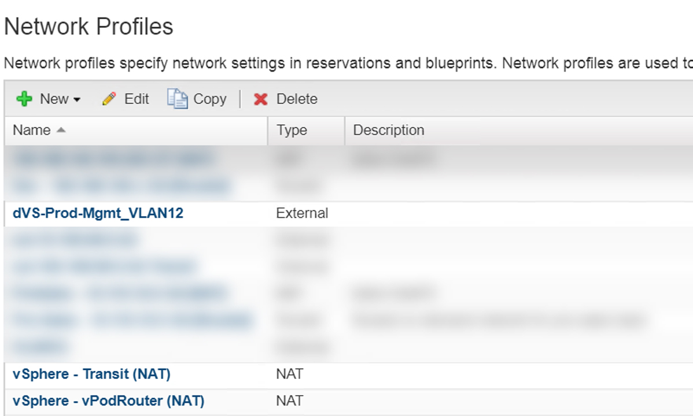

Figure2 – Network Profiles


Figure3 – Apply Network Profile to Network Adapter

## Software Component

Custom specification will destroy any user profile (tsc\\administrator) custom configurations we make like *MTputty, WinSCP, Chrome/Firefox bookmarks, desktop image, etc*. So in order to access the ControlCenter, we need a way to assign the IP address of the external interface.

During a Livefire training event for Hybrid Cloud in Boston a couple weeks ago I struck up a conversation with classmate [Chris Smith](https://www.linkedin.com/in/chris-smith-virt-arcade/) who focuses on the Cloud Automation. I explained the situation above to him and wanted to get his perspective. He mentioned the easiest way is to use Software Components with bindings. After the completing our session for the day I went back to the hotel and began playing with Software Components/bindings and to my surprise, it just worked! So a huge thank you to Chris for sharing the knowledge. Please check out his [site](http://virt-arcade.com/) here as he has excellent content around vRA.

#### SetExternalIP

The first software component I created was SetExternalIP and created a property called “cc\_ip”. We will use this property later when we configure binding. Then proceeded to Actions where I created a basic script that sets the IP address of the External interface. I take the IP address based on the cc\_ip property and assign it to \[string\]$IP. Line 1 of the code below ensure the variable is a string then passes it to the -IPAddress property of  New-NetIPAddress cmdlet. The -InterfaceAlias property references the network adapter “External” that was changed in the previous [post]().


Figure4 – SetExternalIP Software Component: Properties

```powershell
[string]$ip = $cc_ip
New-NetIPAddress –InterfaceAlias “External” -IPAddress $ip `
                 –PrefixLength 24 -DefaultGateway 10.100.12.x `
                 -AddressFamily IPv4 -Confirm:$false
```

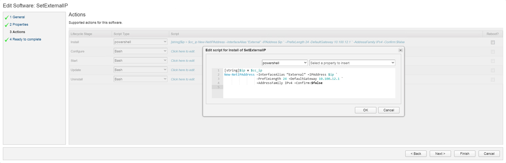

Figure5 – SetExternalIP Software Component: Action

**SetStaticRoute**

The SetStaticRoute software component is simpler only having an action that references the External interface again. I increased the metric to ensure traffic goes through the internal interface. During the Blueprint Design phase, we will attach both software components to the nsxt-controlcenter machine.

```powershell
Set-NetIPInterface -InterfaceAlias External -InterfaceMetric 2000
```


Figure6 – SetStaticRoute Software Component: Action

## Blueprint Design

With the networking and software component portion complete we can now start working on the blueprint design. To ensure our vSphere templates are imported into vRA lets perform an inventory sync as shown in Figure7. Now click on “Design” tab &gt; Blueprints &gt; New give the blueprint a name shown in Figure8. Select the transport zone and reservation policy Figure9.

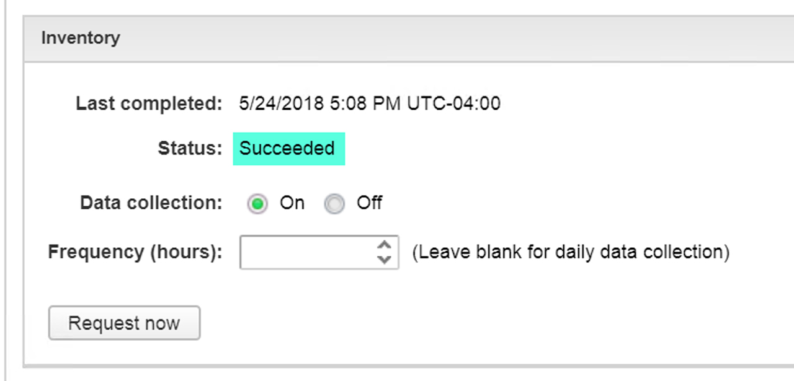

Figure7 – Sync Inventory


Figure8 – New Blueprint

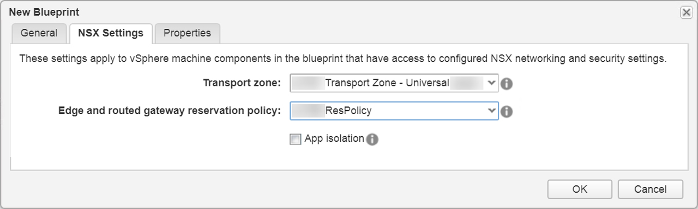

Figure9 – Select Transport Zone and Reservation

We’ll start with a blank canvas shown in **Figure10**.

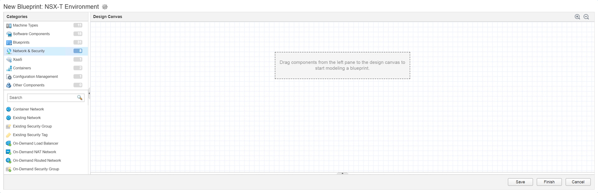

Figure10 – Blank canvas

The first thing to do is drag some network constructs to the canvas Figure11:

* 1 x Existing Network

* 2 x On-Demand NAT Network


Figure11 – Add Networks

Next up is the virtual machines we will focus on the vPodRouter and the ControlCenter VMs (Figure12 – Figure16) as all other VMs will be attached to the vSphereTransitNAT network. We drag over a vSphere (vCenter) Machine then configure the machine to use the vPodRouter template we created in the previous post and attach it to the required networks. We have two virtual machines attached to their corresponding networks (Figure17). Now to attach the software components we created earlier to nsxt-controlcenter machine (Figure18) and then bind property “cc\_ip” to “\_resource~nsxt-controlcenter~ip\_address” (Figure19). This will pass the IP address from the nsxt-controlcenter

#### vPodRouter


Figure12 – Create a vSphere (vCenter) Machine


Figure13 – Assign vSphere template nsxt-vPodRouter


Figure14 – Assign Networks to vPodRouter

#### ControlCenter


Figure15 – Assign vSphere template nsxt-ControlCenter


Figure 16 – Assign Networks to ControlCenter


Figure17 – Design canvas with 3 networks and 2 virtual machines


Figure18 – Attach SetExternalIP and SetStaticRoute to nsxt-controlcenter machine


Figure19 – Software Component Binding

#### Rinse and Repeat

Simply repeat the process for the remaining virtual machines that make up the NSX-T blueprint. Your design canvas should look similar to Figure20 once finished.


Figure20 – Design Canvas with all required networks, virtual machines and software components

Below is a breakdown of the dependency order for the virtual machines inside the blueprint:

1. nsxt-vPodRouter

2. nsxt-dc

    * nsxt-esxi-01

    * nsxt-esxi-02

    * nsxt-esxi-03

    * nsxt-esxi-04

    * nsxt-esxi-05

    * nsxt-esxi-06

3. nsxt-vcsa-01

4. nsxt

    1. nsxt-ctrl-01

    2. nsxt-ctrl-02

    3. nsxt-ctrl-03

        * nsxt-edge-01

        * nsxt-edge-02

5. nsxt-controlcenter

    * SetExternalIP

    * SetStaticRoute

## vRO PowerShell Host / Event Subscription

Since this is a nested environment we will need to enable the following security policies; *Promiscuous Mode*, *Forged Transits*, and *MAC Address Changes* in order for the virtual machines to communicate. To accomplish we will leverage Event Subscription to initiate a PowerCLI script via a Powershell host in VRO due to my lack of javascript experience but is something I’m working on it  ;).

1. Add PowerShell Host

    

2. Invoke an External Script  
    In our case, it’s just a simple .ps1 file with `Write-Output “Testing ;)”` to validate things work. You can see in the screenshot above Invoke an external script ran successfully.  
    **Important:** In order to get the scripts to execute successfully I had to update the PowerShell plugin from *1.0.11* to ***1.0.13*** after doing so the scripts ran without issue.

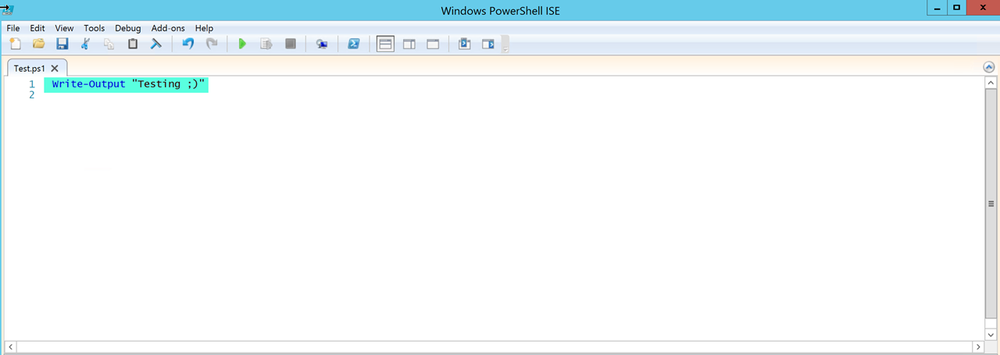

Figure22 – Simple script to test functionality

\* Create a vRO workflow that will process the vRA payload looking for the two on-demand networks by finding the port group ids then passing that information to the PowerCLI script that will enable Promiscuous Mode, Forged Transits, and MAC Address Change.


Figure23 – SetSecurityPolicyOnPortGroups Workflow – Attributes


Figure24 – SetSecurityPolicyOnPortGroups Workflow – Script to extract port group ids created by vRA


Figure25 – SetSecurityPolicyOnPortGroups Workflow – Visual Bindings from script to external script

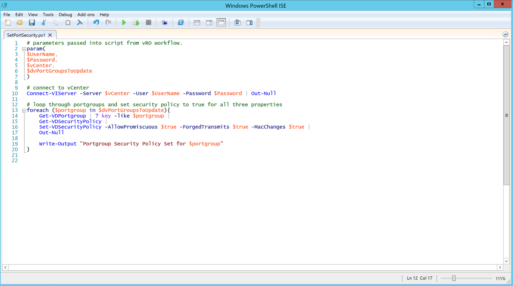

Figure26 – SetSecurityPolicyOnPortGroups Workflow – PowerCLI script used to change security policy settings on discovered port groups.

\* Create an Event Subscription making sure to define conditions, select workflow (SetSecurityPolicyOnPortGroups) and enable blocking.

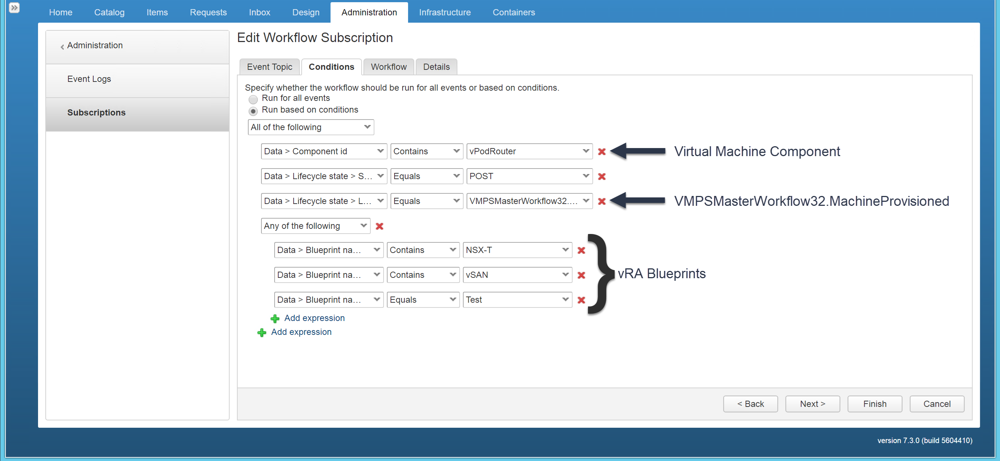

Figure27 – Event Subscription conditions. Only need to affect the vPodRouter logical switches (port groups) as all virtual traffic flows on these two networks.

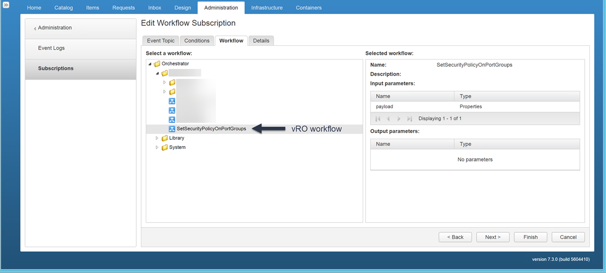

Figure28 – Select vRO workflows to execute


Figure29 – Set blocking and define priority

Confirm workflow executed successfully and settings have been changed.


Figure30 – vRO workflow success


Figure31 – Validate via PowerCLI

## Publishing Time

Our blueprint is ready to be published simply click Finish and click Publish (Figure21).

In order to be selectable from the catalog, we need to associate the blueprint with a service assuming Service and Entitlements have already been set up. Navigate to Administration &gt; Catalog Items &gt; Select NSX-T Environment &gt; Configure &gt; Service. In my case, the service is called “VMware \[Nested\]”.

**Note:** You can also add an icon here for your blueprint. 😉

If we go to our catalog &gt; VMware \[Nested\]  we should see our new shiny blueprint (Figure22). In our environment, this blueprint takes an hour to deploy (Figure23).

FYI the Blueprint name is “\[NAT\] NSX-T Environment” is the original blueprint. The “NSX-T Environment” blueprint was created for this post as you can see it’s a popular one (Figure24). 😉

To access the environment I simply get the IP address for the nsxt-controlcenter from the Items tab (Figure25).

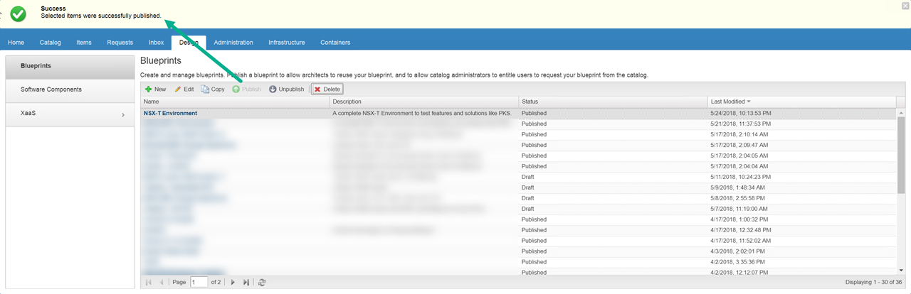

Figure32 – NSX-T Environment blueprint published

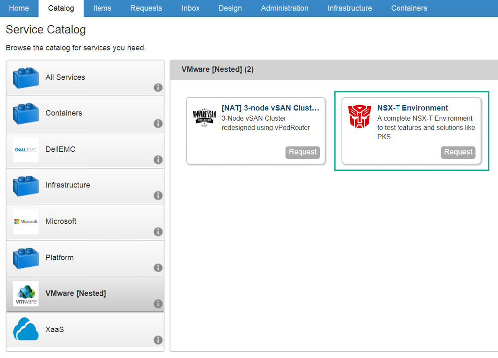

Figure33 – Published NSX-T Blueprint

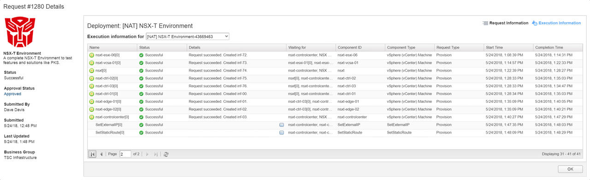

Figure34 – Deployment Time

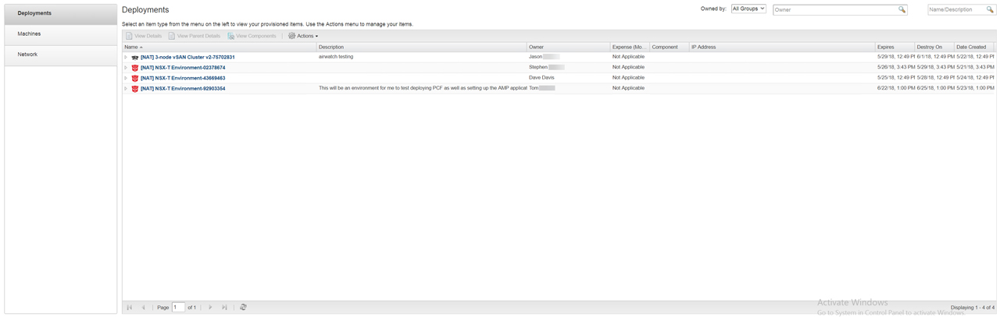

Figure35 – Popular Blueprint

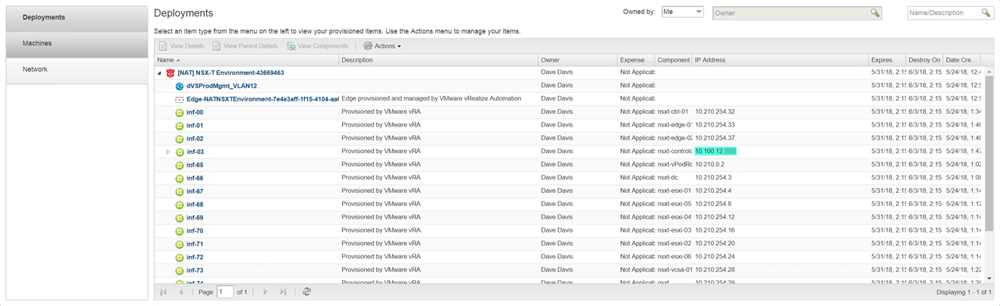

Figure36 – Get IP Address

## Results

Below are screenshots of various components vSphere, NSX-T, and PKS (Figure37 -Figure41). This has been an awesome learning experience I hope you enjoyed the two posts series on developing an NSX-T blueprint in vRealize Automation.

If your interested in seeing a video demonstration of the vRA/NSX-T environment just leave a comment below and I’d be happy to put something together.


Figure37 – ControlCenter Desktop


Figure38 – NSX-T Dashboard


Figure39 – NSX-T Routers


Figure40 – NSX-T Switches


Figure41 – vCenter and PKS components deployed with a functional application
