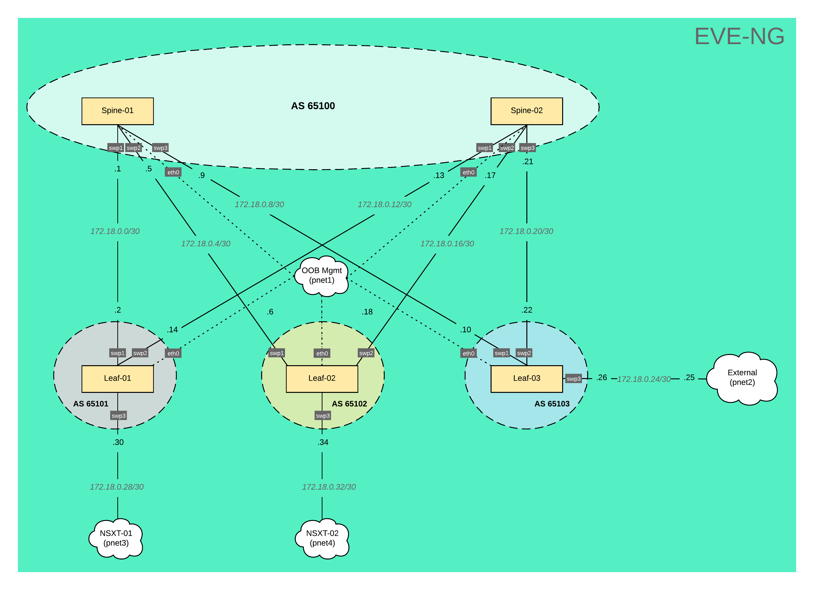

## Video Guide



## Text Guide

### Intro

Hey, what's up, engineers! Lately, I've wanted the ability to create network topologies quickly that I can use as an underlay network for NSX-T, allowing me to validate use cases or perform customer-specific demos. For example, the demo must utilize a Cumulus underlay network if the customer is a Cumulus shop. I understand that NSX-T doesn't care what the underlay is, but providing customer-specific demos like this goes a long way in building rapport with the networking team when attempting to pitch NSX-T. 😉

Purchasing physical switches was out of the question as they tend to be expensive, loud, and consume a lot of power. So, in my situation, I wanted to leverage some network emulators and decided on EVE-NG PRO because it supports multiple network vendors, has an excellent HTML5 interface, and is easy to use.

### Topology

*EVE-NG Topology*

So, before we jump into the EVE-NG, let’s quickly review the topology we are going to build. As you can see, we have a total of 5 Cumulus switches (2 spines and 3 leaves) connected to the OOB Mgmt network. This network provides IP addressing for the switches via DHCP server and is also where the Ansible server lives, allowing us to execute playbooks against the switches. Leaf-01 & Leaf-02 connect to the NSX-T edge nodes, while Leaf-03 provides access to external networks. In this lab, we will use /30 subnets to establish IP connectivity between the spine & leaf switches and BGP will handle all routing decisions. The spine switches will be in AS 65100 while each leaf switch will have it's own respective AS numbers. Now let’s jump into EVE-NG and begin building!

### EVE-NG

A quick note: I won't discuss how EVE-NG is deployed or configured in my environment. If this interests you, let me know in the comments below, and I can certainly make a follow-up video!

We have a blank canvas, so let's add some nodes and networks. Start with nodes by clicking Add an object in the upper left-hand corner and selecting Node. As you can see, we're presented with a list of templates. Notice a bunch is grayed out because we haven't added images for those specific templates. In the search box, type Cumulus and select it. We'll begin by increasing the number of nodes from 1 to 5. Then, we'll choose an image we want to use, in this case, 3.7.7. Leave the default name for now, as we will change this later. Finally, let's increase the CPU count to 2, RAM to 512 MB, and Ethernet ports to 5, and click Save.

Woohoo! We have five switches on the canvas. Now, let's add the four networks by heading back up to Add an object, this time selecting a network.

The 1st network we'll create is the OOB Mgmt for our switches. Let's name it OOB Mgmt; we have a type dropdown below that. Depending on how you deployed EVE-NG, your selection might be different. In my environment, I will select Cloud1 and click Save. Now, we can rinse and repeat these steps a few times. One is for an external connection to Cloud2, one is for NSXT-01 connecting to Cloud3, and finally, one is for NSXT-02 connecting to Cloud4. For the sake of time, I'll speed up the creation of these three new networks. With everything on the canvas, let's organize the objects to replicate what was shown in the diagram earlier and connect the switches.

We'll start by connecting eth0 for all the switches to the OOB Mgmt network:

* *Spine-01, swp1 to Leaf-01, swp1*
    
* *Spine-01, swp2 to Leaf-02, swp1*
    
* *Spine-01, swp3 to Leaf-03, swp1*
    
* *Spine-02, swp1 to Leaf-01, swp2*
    
* *Spine-02, swp2 to Leaf-02, swp2*
    
* *Spine-02, swp3 to Leaf-03, swp2*
    
* *Leaf-01, swp3 to Cloud NSXT-01*
    
* *Leaf-02, swp3 to Cloud NSXT-02*
    
* *Leaf-03, swp3 to Cloud External*
    

Awesome, now that all our switches are connected, we can power them on by selecting More actions and clicking Start all nodes. I’ll open the console for Spine-01 and login with cumulus and the default password of CumulusLinux!. To confirm it has received an IP address I’ll run “net show interface" and as you can see, we have an IP address. I’ll quickly repeat this process for the other switches.

That’s it! That’s all we need to do from an EVE-NG perspective; let's look at the ansible-playbook responsible for configuring the switches.

### Ansible

Let’s switch to VSCode and review the directory structure for the playbook. As you can see, it's a basic Ansible folder structure. Let’s start from the bottom and work our way up:

* The [**readme.md**](http://readme.md) provides a high-level overview of the topology.
    
* The **lab01.yml** is our playbook that runs a single play called Underlay Network Configuration, which executes two roles routing and common.
    
* The **hosts** file is our Ansible inventory file broken into two groups leaf and spine. These are then added as children objects to the network group. Note, the playbook calls the network group as this ensures Ansible runs against all switches.
    
* The **ansible.cfg** sets default settings for the ansible environment.
    
* The **roles** folder contains two subfolders common and routing. These folders essential contain tasks that run against the switches. For example, if we look at common/tasks folder, we can see we have three tasks that will run. The first sets the hostname, the second copies over the ssh keys and the last one changes the default password. In the routing/files directory, we can see each switch has a folder containing the configuration files for the daemon, BGP, and interfaces.
    
* The **group\_vars** folder contains a file called all, which is the global variables file. The vault folder contains our encrypted password variable my\_password used to change the switches default password.
    
* Finally, we have the **docs** folder that contains any relevant documentation related to the playbook. In this case, we have a topology diagram of our lab.
    

Now for the moment of truth, let's kick off this playbook by running the following command: `ansible-playbook lab01.yml -i hosts -ask-vault-pass -k`*.* Will prompted us for the SSH and Vault passwords and once I hit enter the playbook will execute against all the switches and you will see a Play Recap at the end. We can switch back to EVE-NG and perform some tests.

### EVE-NG

Let’s open the console for Leaf-01 and run the same command we ran earlier “net show interface” before we only had an IP address for eth0 now you can see we have multiple interfaces with IP addresses. Next, we’ll look at the BGP status and the route table by running the following commands:

* `net show BGP summary`
    
* `net show route ipv4 | less`
    

And as you can see, we three neighbors that established connectivity. We can see Leaf-01 has learned the default route from Leaf-03 as well as subnet 172.18.48.0/24 was learned from the NSX-T environment. We can confirm external connectivity by pinging 1.1.1.1, which we can successfully do. Now we test connectivity to the NSX-T environment by pinging 172.18.48.100, which is a VM attached to T1 logical router in the NSX-T domain and voila we have communication!

### Wrap it up already!

Remember in the begin when I mentioned customer-specific demos well in EVE-NG you can create multiple labs. If I power down all nodes and close out of the current lab. I can navigate to a Cisco specific environment that we can easily use with NSX-T. That’s going to wrap up this video as you’ve seen utilizing EVE-NG gives us the ability to swap out the underlay networking to meet our needs quickly. If you have any question, drop them down in the comments below. If you enjoyed this video make sure to hit that like button and consider subscribing to my channel. See you in the next video!

