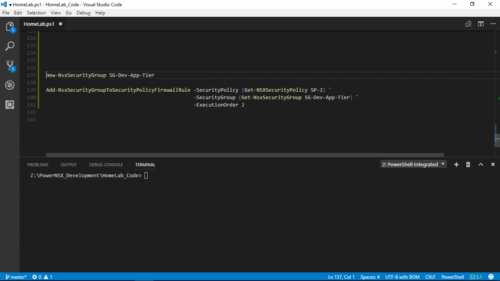

## Text Guide

The other day after adjusting the weight of a Security Policy I noticed this lovely message, see *in the Cover Image* above.

I thought this was odd as I hadn’t deleted any Security Group(s). After talking with my colleagues, this particular Security Group was recently decommissioned. We opened a support ticket with VMware and they mentioned this occurs when the Security Group is not properly deleted and suggested removing the Security Group from all associated Security Policies before deletion.

Since NSX Service Composer can’t synchronize with the DFW we’re unable to edit the Security Policy and remove the “bad” Security Group. While we can’t synchronize anything, the environment is still functioning we just can’t make changes to Security Policies until the issue is resolved.

How do we quickly resolve this issue with affecting the production environment? Your first thought might be to go directly to the DFW and edit the rule directly but unfortunately, this is not allowed since the rule is managed by Service Composer as shown in *Figure-2*.

Figure-2

Then you might think to create the same rules directly in DFW just without the “bad” Security Group? DOH! We can’t publish changes while in this degraded state as shown in *Figure-3* below.

Figure-3

Ok, let’s delete the Security Policy or the affected rule in that Policy with some API wizardry but this would cause a temporary outage as other Security Groups are associated with the rule. VMware suggested deleting the rule and recreating it during a maintenance window. While everyone continued discussions, I was able to duplicate the issue in my homelab. Then I had a thought, “*Why not just recreate the missing Security Group (empty) and then assign it back to the affected Security Policy – Firewall Rule?*“. I quickly banged out a couple PowerNSX commands:

* New-NsxSecurityGroup -Name SG-Dev-App-Tier
    
* Add-NsxSecurityGroupToSecurityPolicyFirewallRule -SecurityPolicy (Get-NSXSecurityPolicy SP-2) -SecurityGroup (Get-NsxSecurityGroup SG-Dev-App-Tier) -ExecutionOrder 2
    

A few seconds later the Synchronization Status changed to Green, Eureka! 

Figure-4

After successfully syncing I said, “*Hey! Let’s create an empty Security Group and assign it to the appropriate Security Policy – Firewall Rule.*” A few seconds of silence went by then I said “*I can demo it if you like.*” as I could tell everyone was a bit hesitant. At the end of the quick demo, everyone agreed it was the least impactful solution. We performed the fix in both production environments without a hitch!

Below is a video demoing 3 separate techniques to resolve this particular issue:

1. Remove entire Security Policy
    
2. Remove the specific rule in the Security Policy
    
3. Recreating the Security Group and assigning it to the same Security Policy and rule.
    

## Video Guide


