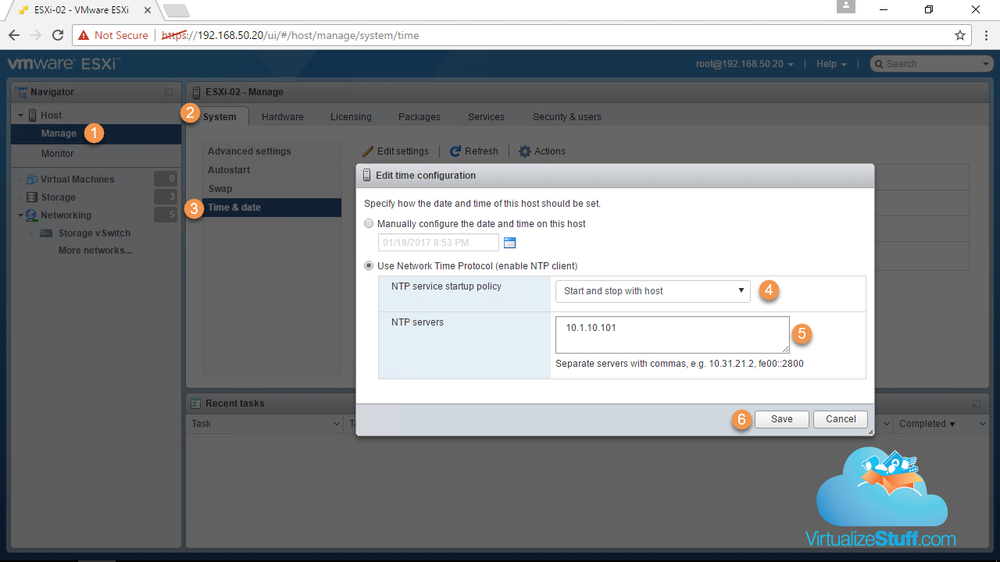
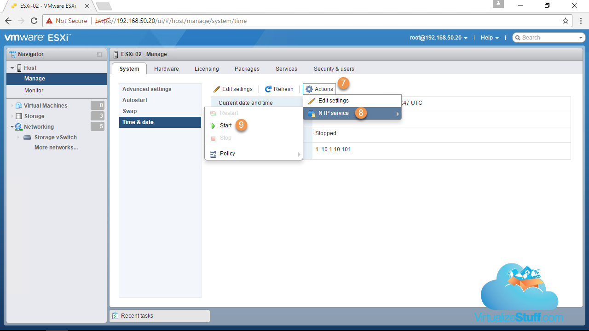
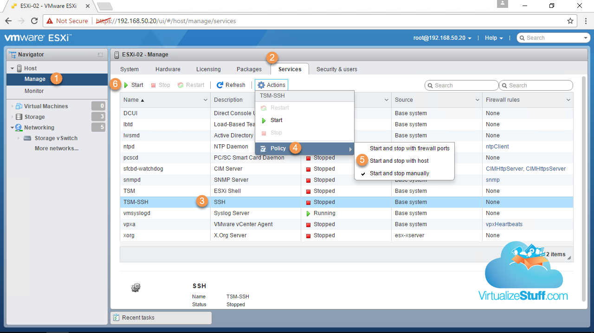
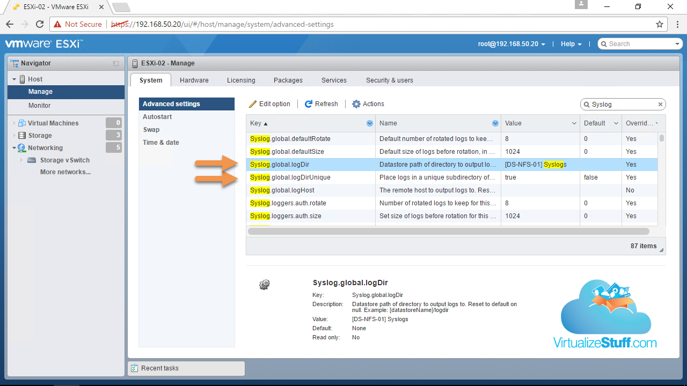

## Video Guide



Above is a demonstration video of the topics discussed in this post. The video contains a built in table of contents making it easier to see specific sections of the demo. Enjoy and if you have any feedback, I’d love to hear about it (good or bad). 🙂

## Text Guide

Ok, ESXi is installed on our server and has an IP address, now what? There’s a few more configuration changes that we should make before we start deploying VMs.

### Configure NTP Server

Troubleshooting can be a difficult task all by its self, throw in time sync issues only exasperates the situation. Ensuring correct time sync is critical without it things tend to break, examples of this might be:

* Authentication issues

* Communication issues between ESXi host(s) and vCenter

* SSO lookup service issues between NSX Manager and vCenter

* Difficulties interpreting syslog files due to accurate times

To resolve this we’ll configure all ESXi hosts to point to the same NTP Server, in my case it’s the Synology NAS (10.1.10.101). Once the Domain Controller (DC) is deployed we might go back and re-point ESXi hosts to the DC or simply point the DC to the same external source the Synology NAS is using: time.google.com. *Figure-1* & *Figure-2* provides the steps required to configure the NTP Server.

Figure-1

Figure-2

### Configure SSH Service

Next let’s enable the SSH service on the host(s) as shown in *Figure-3*. This will allow us to easily SSH into our hosts for additional troubleshooting should an issue arise like the one I recently about [here](http://www.virtualizestuff.com/2017/01/02/iscsi-binding-dude-where-is-unused-adapters/):

Figure-3

### Add Uplink to Management vSwitch

It’s important to have redundant uplinks, preferably on separate physical nics to provide high availability for the management vSwitch. After the initial installation of ESXi only a single physical uplink (vmnic0) is used for management. To add resiliency let’s add another uplink (vmnic4) as shown in *Figure-4*. In future posts we’ll discuss steps to ensure your network doesn’t have a single point of failure.

Figure-4

### Create Storage vSwitch and Mount a NFS Datastore

Now we need a place to store ISO images and VMs, in this section we’ll focus on NFS datastore. I’ve pre-configured the NFS share on the Synology NAS with two IP interfaces and permissions only allow the 192.168.60.0/24 network access.

* Synology LAN3: *192.168.60.100*

* Synology LAN4: *192.168.60.101*

* VLAN: *60*

With everything setup on the storage side let’s turn our attention to the ESXi host where we’ll create a vswitch, VMkernels interfaces, and a portgroup using the information below:

* New vSwitch: *Storage vSwitch*

* Uplinks: vmnic1 & vmnic5

* VMkernal interface: *192.168.60.22*

* VLAN: *60*

* Portgroup name: *NFS*

Then we will mount the pre-created NFS share using the information below:

* Name: *DS-NFS-01*

* NFS Server: *192.168.60.100*

* NFS Share: */volume2/NFS01*

* NFS Version: *NFS 3*

Instead of creating boring screenshots I thought it would be more enjoyable to watch a quick demonstration video using the information above. The video can be found in \[Demo\]\[6\] section below simply click “4. Create Storage vSwitch & Mount a NFS Datastore” to view that section of the video.

### Configure Scratch & Syslog Locations

When installing ESXi on a USB or SD card by default the scratch and syslogs are stored in ramdisk (/tmp directory). The scratch location is used to store vm-support information when a support bundle is generated and by default is located here: /tmp/scratch. The syslog contains various log files and can be found here: \[\] /scratch/log. Below are a few examples of the files contained in the log folder:

* auth.log – Contains authentication events

* vmkernel.log – Activities related to virtual machines and the host

* shell.log – Contains all commands typed into the ESXi Shell

Anything stored in the /tmp directory is lost after a reboot! So it’s highly suggested to relocating both the scratch and syslog locations to a datastore that is available to all ESXi hosts, making the log files persistent across reboots. In my case I’ll use the Synology NFS datastore that we created earlier. Below are a few advanced settings that need to be adjusted:

* Scratch:

  * `ScratchConfigu.ConfiguredScratchLocation: /vmfs/volumes/efbd86e8-3adad05d/Scratch/ESXi-02`

* Syslog:

  * `Syslog.global.logDir: [DS-NFS-01] Syslogs`

  * `Syslog.global.logDirUnique: True` (creates unique directory for each host)

*Figure-5* and *Figure-6* provide the location of the advanced settings that need to be changed.

Figure-5

Figure-6

Once we have vSAN configured we’ll circle back and to create a vSAN coredump object for our ESXi host(s).

In [Part 2]() we look at configuring iSCSI with redundancy as well as create a VMFS6 datastore so stay tuned!
