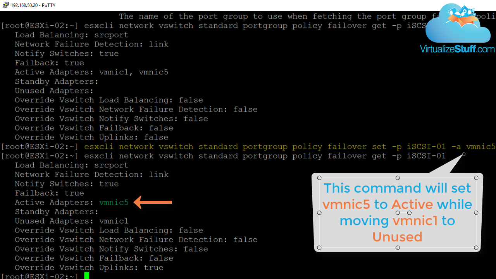
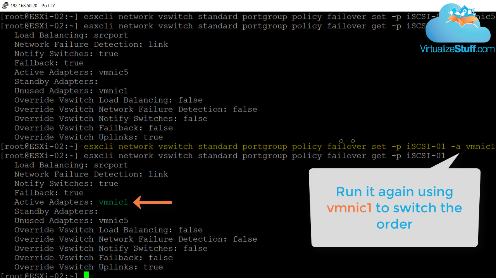
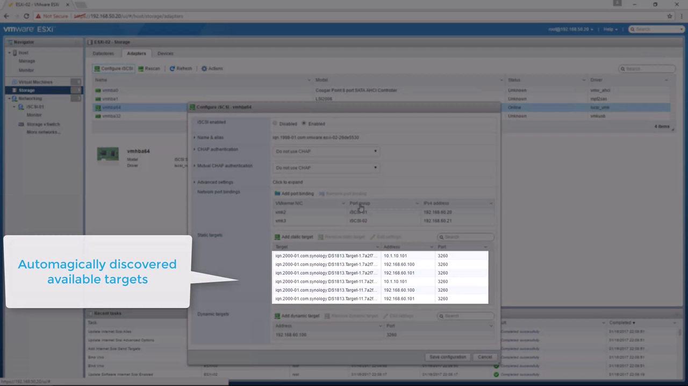
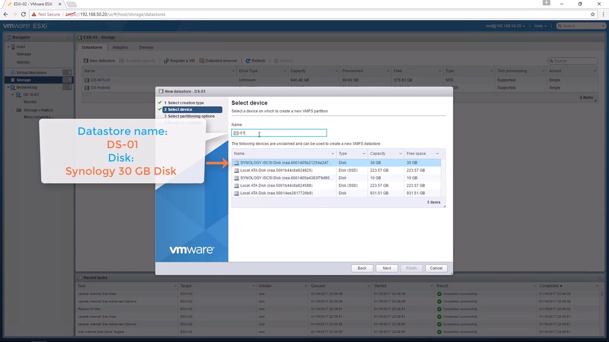

## Video Guide



## Text Guide

In [part 1]() of Configure a vSphere 6.5 Host, we configured NTP Server, SSH Service, created a vSwitch, mounted a NFS share, and redirected the scratch and syslog files. In part 2 we're going to configure iSCSI software adapter with port binding and create a VMFS6 datastore. The demo section provides video demonstration of everything discussed in this post.

### Create Two VMKernal interfaces

To begin we need to create two VMkernel interfaces using the information below, *Figure-1* provides the steps required to create a VMkernel:

**1st VMkernel:**

* Port group name: *iSCSI-01*

* Virtual Switch: *Storage vSwitch*

* VLAN ID: *60*

* IPv4 Setting:

  * Configuration: *Static*

  * Address: *192.168.60.20*

  * Subnet mask: *255.255.255.0*

**2nd VMkernel:**

* Port group name: *iSCSI-02*

* Virtual Switch: *Storage vSwitch*

* VLAN ID: *60*

* IPv4 Setting:

  * Configuration: *Static*

  * Address: *192.168.60.21*

  * Subnet mask: *255.255.255.0*

Figure-1

### Set vmnics to Unused

In order to perform iSCSI binding (Next Step) we need to ensure both iSCSI-01 & iSCSI-02 port groups have a single vmnic as its active adapter and the other vmnic set to unused. Currently this must be done using ESXCLI running the commands below:

The command below provides a look at the current failover configuration:  
`esxcli network vswitch standard portgroup policy failover get -p iSCSI-01`

Figure-2

Using the command below will set vmnic5 to active resulting in vmnic1 to be set to unused:  
`esxcli network vswitch standard portgroup policy failover set -p iSCSI-01 -a vmnic5`

Figure-3

Running command again but with vmnic1 will reverse the order as vmnic1 should be the active adapter for  iSCSI-01 portgroup:  
`esxcli network vswitch standard portgroup policy failover set -p iSCSI-01 -a vmnic1`

Figure-4

Simply repeat the above steps for iSCSI-02 portgroup ensuring vmnic5 is the active adapter.

### Creating iSCSI Software Adapter

Next is to enable an iSCSI Software adapters and configure iSCSI binding. This allows our ESXi host(s) to have multiple paths back to the storage array. Both port groups now have a single active adapter, let’s add both VMkernels to the Network port bindings section of the iSCSI Software adapter and add a dynamic target using IP address 192.168.60.100, as shown in *Figure-5.* This allows the host to dynamically discover iSCSI targets from storage array, as shown in *Figure-6*.

Figure-5

Figure-6

### Creating a VMFS Datastore

Completing the previous step allows the LUNs from the storage array to be seen by the ESXi host. Now its time to create a VMFS6 datastore which is a simple process of following the wizard. In this example we’ll use the Synology 30 GB disk, utilizing the full partition, and selecting VMFS version 6. *Figure-7* provides the steps needed to launch the wizard while Figure-8 shows the disk used. The video below provides all the steps.

Figure-7

Figure-8

That’s a wrap…stay tuned for the next post where we’ll deploy a 2016 server with the following roles:

* Active Directory

* DHCP

* DNS
