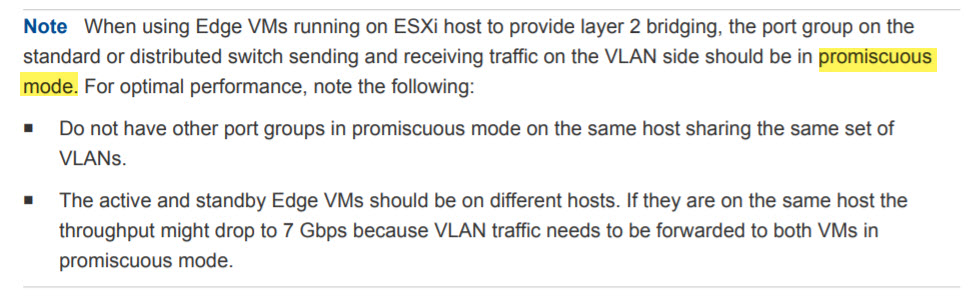
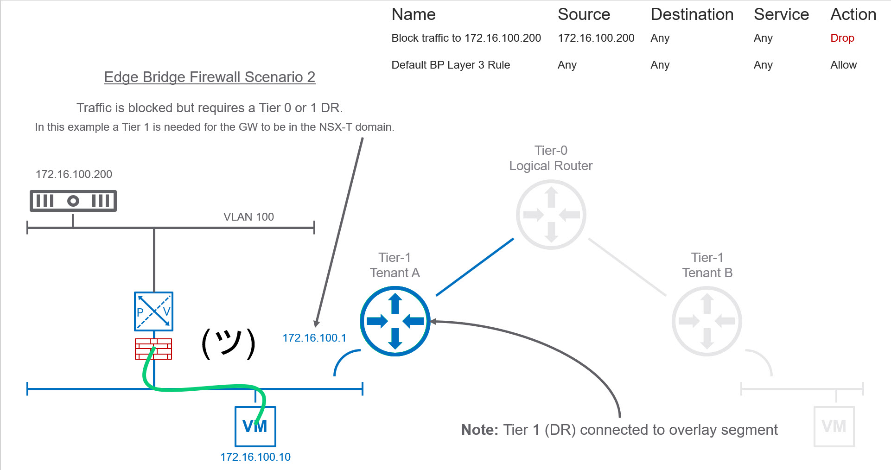

## Video Guide



The above video demonstrate the bug and provides a workaround. 😉

## Text Guide

FYI, the bug mentioned in this post should be resolved in the next release of NSX-T which I believe is 2.4.

The objective of this post is to provide additional details around NSX-T Edge Bridge Profiles and hopefully, prevent others from banging their heads against the wall when it comes to the Bridge Firewall not working. NSX-T 2.3 offers a couple L2 bridging options:

* **Option 1:** ESXi Bridge Cluster which leverages two ESXi hosts in a cluster to perform the L2 bridging.
    
* **Option 2:** Edge Bridge Profiles which leverage two Edge Nodes (EN) in an Edge Cluster to perform L2 bridging.
    

### Edge Bridge Profiles

I’ll focus on Option 2 involving Edge Bridge Profiles. VMware provides instruction on how to implement it [here](https://docs.vmware.com/en/VMware-NSX-T-Data-Center/2.3/com.vmware.nsxt.admin.doc/GUID-7B21DF3D-C9DB-4C10-A32F-B16642266538.html) as well as a great [demo video](https://www.youtube.com/watch?v=IwpujflzJhY) by Francois Tallet on L2 Bridging. The documentation does a decent job of explaining the components as well as some of the requirements as seen below:

One requirement that is missing from the above documentation is that **Forged Transmits** must be enabled on the same port group otherwise traffic will not flow. I’d also like to see use cases added around choosing ESXi Bridge Cluster vs Edge Bridge Profile.

**Note:** If your running vSphere 6.7 you could leverage native MAC learning capability which William covers over at [virtuallyGhetto](https://www.virtuallyghetto.com/2018/04/native-mac-learning-in-vsphere-6-7-removes-the-need-for-promiscuous-mode-for-nested-esxi.html). I leveraged his MacLearn functions and confirmed it works with Edge Bridge.

**Disclaimer:** Use of MAC learning I don’t believe is officially supported by VMware. Therefore I don’t recommend using in a production environment.

Even though it might not be supported officially, I’m curious to see if there is a performance gain over Promiscuous Mode, so stay tuned for a future post 😉

### Bridge Firewall Bug

In order to leverage NSX-T Bridge Firewall, you must be utilizing the Edge Bridge Profiles. That being said, I attempted to replicate Francois setup in my environment but was struggling to get Bridge firewall to work. I created a bridge firewall rule that should prevent the virtual machine from pinging the physical server (192.168.11.20 – VLAN11). However, communication continued to work which was odd.

I decided to create a separate Edge Bridge Profile for VLAN 100 on a separate logical switch. In this test, I was going to bridge a physical workload that had its gateway pointing to a Tier-1 Distributed Router (DR) within the NSX-T domain. When I created the Bridge Firewall to block traffic it worked as expected.

### Workaround for Scenario 1

I decided to contact VMware to see if they were aware of this situation. They informed me that this was indeed a bug and will be fixed in the upcoming 2.4 release. They also mentioned a DR needs to be attached to the overlay LS where you want to leverage bridge firewall as a workaround. In scenario 1, above our LS does not have a Tier 0 or Tier 1 DR. The moment I add a Test-T1 DR with a fake GW address of 1.2.3.4/24 our bridge firewall rule function correctly.

I hope you found this post helpful. Stay tuned for a post where I’ll discuss my NSX-T homelab until then if you have any questions don’t hesitate to reach out.
