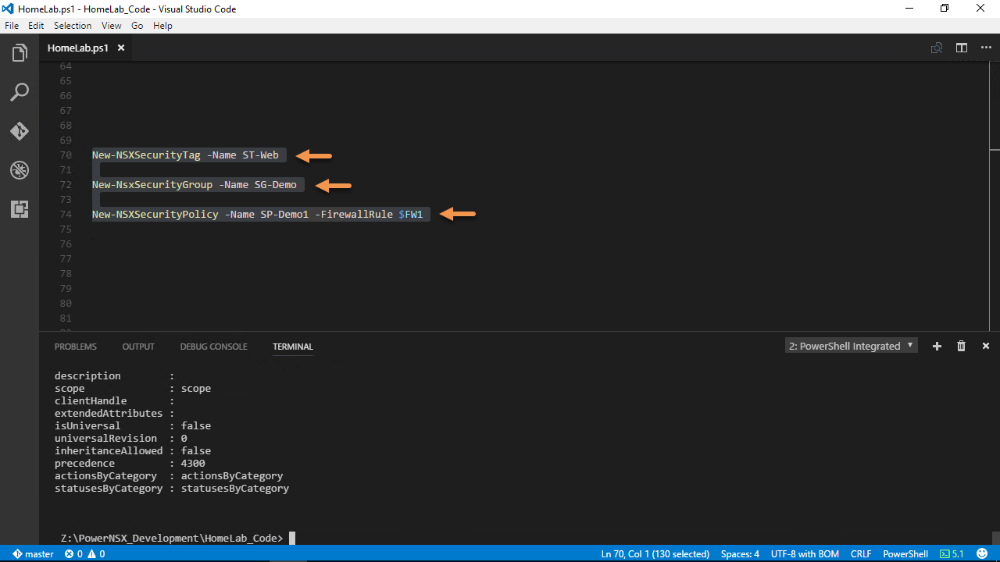
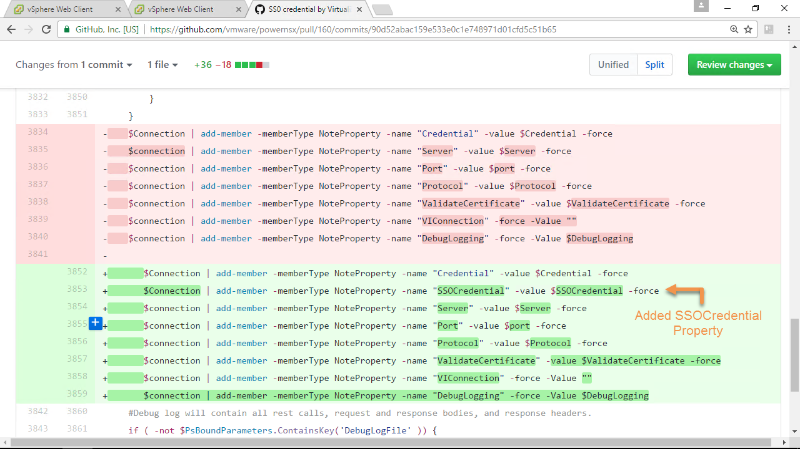
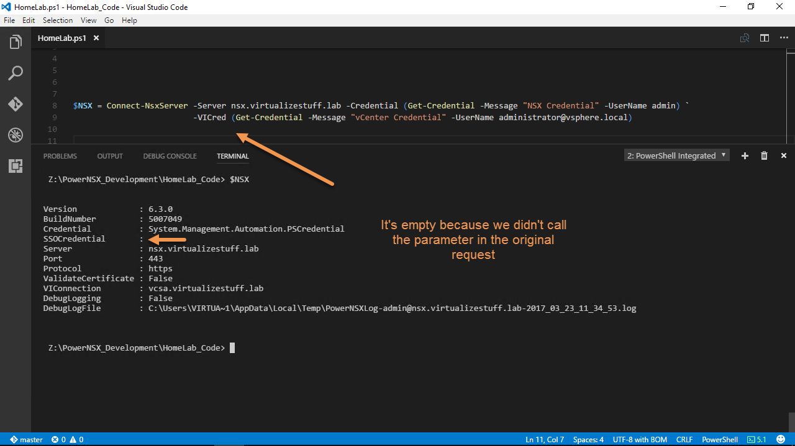
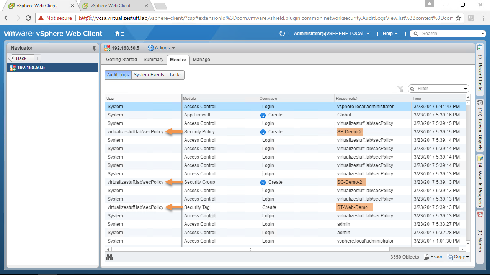

## Video Guide



## Text Guide

**Important:**  
The code discussed in this post is an attempt to provide the ability to SSO credentials and can be obtained from [here](https://github.com/vmware/powernsx/pull/160/files).

After demoing the capabilities of PowerNSX to my colleagues and deploying it into the production environment. A question that popped up in my head was how do we track/audit who creates objects via API when using PowerNSX? Typically when you want to connect to NSX Manager via PowerNSX you leverage the Connect-NsxServer cmdlet as seen in *Figure-1* below:

Figure-1

Once connected all proceeding API request will use the NSX credentials. The sharing of this account is a BIG no-no from an auditing/security standpoint. *Figure-2* & *Figure-3* shows the creation of Security Tags, Groups, and Policies and as you can see they are all done with the NSX credential (admin).

Figure-2

Figure-3

Users should have their own individual credentials with appropriate NSX role to perform their job duties this allows for an audit trail. My first thought was to create multiple CLI accounts on NSX Manager and this is a valid solution but a nightmare to manage. A simpler way is to leverage the user’s existing SSO credentials used for vCenter provided they have been assigned one of the NSX roles.

I began by diagnosing the functions below using *Write-Verbose* and *Set-Variable -Scope Global* to gain a better understanding of how they work:

* Connect-NsxServer
    
* Invoke-NsxRestMethod
    
* Invoke-NsxWebRequest
    

The first step was to add a new parameter to Connect-NsxServer called *SSOCredential* and a NoteProperty to the $connection called *SSOCredential*, *Figure-5* & *Figure-6* provides a visual:

Figure-5

Figure-6

As well as added logic to both Invoke functions to check if the following API calls are made:

1. /api/1.0/appliance-management/global/info
    
    * Requires ***local*** NSX Manager account with ***web-interface*** privilege (i.e. admin)
        
2. /api/2.0/services/vcconfig
    
    * Requires ***super\_user*** (System Administrator) assigned via API only or ***enterprise\_admin*** (Enterprise Administrator) or ***vshield\_admin*** (NSX Administrator)
        

**Note:** Removing this */api/1.0/appliance-management/global/info* call would allow the use of only SSO credentials, however, the \*/api/2.0/services/\*vcconfig would still require an account with at least NSX Administrator or higher role.

If we look at *Figure-7*, the $NSX variable contains our connection information notice the new SSOCredential property, it’s empty because we didn’t call the SSOCredential parameter.

Figure-7

Let’s disconnect from the NSX Server and reconnect using the SSOCredential parameter. We’ll create some NSX objects using the same commands from earlier, see *Figures 8 – 11*. The benefit of using SSOCredential parameter is that we can now use SSO accounts with any NSX role assigned to them. If a user attempts to run a command that he/she doesn’t have permissions to an HTTP status of 403 will be returned.

**Note:** The ***secPolicy@virtualizestuff.lab*** account has a role of ***Security Administrator*** which is allowed to create Security Tags, Groups, and Policies.

Figure-8

Figure-9

Figure-10

Figure-11

The SSOCredential parameter is not mandatory so if your use case doesn’t require it simply don’t use that parameter. Hope this post was informative and if you have any questions please don’t hesitate to post a comment.