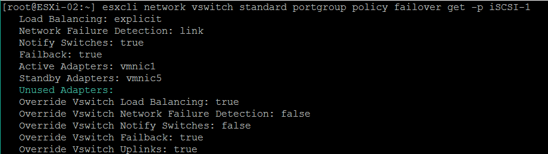
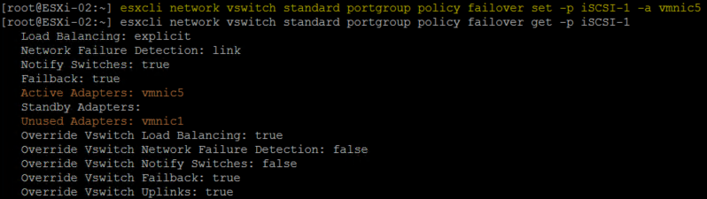
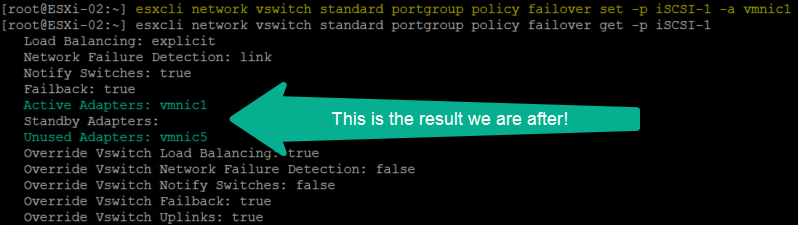

## Video



## Problem

Tonight I was going through an install of ESXi 6.5 (No vCenter yet) and I wanted to setup iSCSI binding to provide multiple paths to the iSCSI array. This requires setting the other vmnic into an “Unused” State. I need to set vmnic5 to unused, however I quickly realized there was no Unused Adapter option in the GUI as shown in *Figure-1*, only Mark Active or Standby.

Figure-1

I then SSH into the host and ran the following command:  
`esxcli network vswitch standard portgroup policy failover get -p iSCSI-1`

Notice in *Figure-2,* there is an “Unused Adapter” so I thought maybe there is an ESXCLI command to set the vmnic adapter to “Unused” so I ran the following command:  
`esxcli network vswitch standard portgroup policy failover set –help`  
As you can see in *Figure-3* there is only “active-uplink” and “standby-uplink”.

Figure-2

Figure-3

Like most I googled it and came across a bug report on VMware’s Fling site found [here](https://labs.vmware.com/flings/esxi-embedded-host-client/bugs/298) were other users experienced the same issue.

---

## Workaround

Continuing to troubleshooting the issue and stumbled across a workaround and figured why not share it. To workaround this issue we need to set the standby adapter (vmnic5) to Unused by issuing the following ESXCLI command:  
`esxcli network vswitch standard portgroup policy failover set -p iSCSI-1 -a vmnic5`. The results are shown in *Figure-4*. This moves vmnic5 to active while also moving vmnic1 to Unused. In my case I need to have vmnic5 set to Unused so I run the command again but this time using vmnic1, as shown in *Figure-5*.

Figure-4

Figure-5

There you have it a quick workaround around for this issue! If you found this helpful please share it.

